# 🗺️ Michi App: Mukammal Kodlar Bazasi Xaritasi (Codebase Map Skill)

> **Maqsad:** Har bir agent va dasturchi loyihaning istalgan qismini bir zumda topishi, tushunishi va xavfsiz o'zgartirishi uchun yagona, yashash huquqiga ega (living), universal ma'lumotnoma.

> [!IMPORTANT]
> **MAJBURIY QOIDALAR:**
> 1. Har bir agent ish boshlashdan oldin ushbu SKILL.md ni o'qishi **SHART**.
> 2. Har bir kod o'zgarishidan keyin ushbu fayl yangilanishi **MAJBURIY**.
> 3. `npm run validate` buyrug'i avtomatik `codebase_map.md` ni yangilaydi, lekin ushbu SKILL.md faylini agent **qo'lda** yangilashi kerak.
> 4. O'zgarish kiritilgan komponent, utility yoki CSS fayli haqidagi ma'lumot yangilanmasa, keyingi agentlar eskirgan ma'lumot bilan ishlaydi va xatolar yuzaga keladi.

---

## 📐 Loyiha Arxitekturasi Umumiy Ko'rinishi

```
michi-app/                          ← Root
├── .agents/                        ← Agent qoidalari va skilllar
│   ├── AGENTS.md                   ← 10 ta asosiy qoida
│   ├── rules/past_mistakes.md      ← 7 ta tarixiy xato va yechimlar
│   └── skills/                     ← 33+ agent skill papkalari
├── public/                         ← Statik fayllar (font, rasm, ikon)
├── scripts/                        ← Build va validation skriptlari
├── src/                            ← Asosiy manba kodi
│   ├── App.jsx                     ← ROOT komponent (1,336 qator)
│   ├── App.css                     ← Root stillar (235 qator)
│   ├── main.jsx                    ← Entry point (69 qator)
│   ├── i18n.js                     ← i18next konfiguratsiya (13 qator)
│   ├── index.css                   ← Global CSS + design tokens (295+ qator)
│   ├── components/                 ← 20 ta React komponent + 16 CSS + 7 test
│   ├── locales/                    ← 7 tilda tarjimalar (uz/ja/en/vi/zh/ne/ru)
│   └── utils/                      ← 15 ta utility modul + 6 ta test
├── package.json                    ← Dependencies va scriptlar
├── vite.config.js                  ← Vite + PWA + Capacitor konfig (166 qator)
├── MUNDARIJA.md                    ← Loyiha mundarijasi
└── codebase_map.md                 ← Avtomatik generatsiya xaritasi
```

**Tech Stack:** React 19 · Vite 8 · MapLibre GL JS 6 · Capacitor 8 · i18next · pdfMake · Vitest · Playwright

**Deployment:** GitHub Pages (gh-pages) · Capacitor (Android/iOS) · PWA (vite-plugin-pwa)

---

## 🧬 Komponent Bog'liqlik Grafi (Dependency Graph)

```mermaid
graph TD
  App["🏠 App.jsx<br/>(1,336 qator)"]
  
  subgraph onboarding["🚪 Onboarding"]
    Splash["Splash<br/>(22)"]
    LangSelect["LanguageSelect<br/>(61)"]
    RoleSelect["RoleSelect<br/>(1,132)"]
    MichiLogo["MichiLogo<br/>(28)"]
  end
  
  subgraph main_tabs["📱 Asosiy Tablar"]
    Dashboard["Dashboard<br/>(605)"]
    DriverFeed["DriverFeed<br/>(841)"]
    DrivingAcademy["DrivingAcademy<br/>(722)"]
    Profile["Profile<br/>(4,799)"]
  end
  
  subgraph overlays["🪟 Overlay/Modal"]
    JobDetail["JobDetail<br/>(406)"]
    JDMNav["JDMNavigation<br/>(4,952)"]
    VoiceAssist["VoiceAssistant<br/>(3,188)"]
    AssistHero["AssistHeroShowcase<br/>(285)"]
    AdminDash["AdminDashboard<br/>(93)"]
    CompanyHome["CompanyHome<br/>(1,589)"]
    ResumeBuilder["ResumeBuilder<br/>(1,271)"]
  end
  
  subgraph ui_shared["🧩 Umumiy UI"]
    BottomNav["BottomNav<br/>(161)"]
    RobotAvatar["RobotAvatar<br/>(44)"]
    ErrorBoundary["ErrorBoundary<br/>(77)"]
    VerifiedBadge["VerifiedBadge<br/>(29)"]
    LaneIndicator["LaneIndicator<br/>(90)"]
    ServiceCS["ServiceComingSoon<br/>(21)"]
  end
  
  App --> Splash --> MichiLogo
  App --> LangSelect --> MichiLogo
  App --> RoleSelect
  App --> BottomNav
  App --> Dashboard
  App --> DriverFeed
  App --> DrivingAcademy
  App --> Profile
  App --> JobDetail
  App --> JDMNav
  App --> VoiceAssist
  App --> AssistHero
  App --> AdminDash
  App --> CompanyHome
  App --> RobotAvatar
  App --> ErrorBoundary
  
  Profile --> CompanyHome
  Profile --> DrivingAcademy
  Profile --> ResumeBuilder
  Profile --> VerifiedBadge
  
  DriverFeed --> VerifiedBadge
  DrivingAcademy --> VerifiedBadge
  JobDetail --> VerifiedBadge
  CompanyHome --> VerifiedBadge
  JDMNav --> LaneIndicator
  
  style App fill:#5E5CE6,stroke:#333,stroke-width:3px,color:#fff
  style JDMNav fill:#0A84FF,stroke:#333,stroke-width:2px,color:#fff
  style Profile fill:#FF9F0A,stroke:#333,stroke-width:2px,color:#fff
  style VoiceAssist fill:#34C759,stroke:#333,stroke-width:2px,color:#fff
```



---

## 🧩 KOMPONENTLAR TO'LIQ MA'LUMOTNOMASI

### 📱 ROOT: App.jsx
| Xususiyat | Qiymat |
|-----------|--------|
| **Yo'l** | [`src/App.jsx`](file:///Users/kanoatovfarrux/.gemini/antigravity/scratch/michiappforjapan/src/App.jsx) |
| **Stil** | [`src/App.css`](file:///Users/kanoatovfarrux/.gemini/antigravity/scratch/michiappforjapan/src/App.css) (235 qator) |
| **Qator** | ~1,336 |
| **Vazifa** | Root komponent. Barcha app state, tab navigatsiya, role auth (driver/company/admin/guest), notification tizimi, dark mode, musik player |
| **Importlar** | 19 ta child komponent + `MOCK_JOBS`, `MOCK_SCHOOLS` data |
| **State** | ~40+ useState hook: jobs, schools, applications, profile, voice, navigation, dark mode, notifications va h.k. |
| **Xususiy mantiq** | `unreadCount` hisoblash, notification yaratish (accepted/interview/reviewed/rejected), `showProfileBadges` toggle |

---

### 🧭 JDMNavigation.jsx — ENG KATTA KOMPONENT
| Xususiyat | Qiymat |
|-----------|--------|
| **Yo'l** | [`src/components/JDMNavigation.jsx`](file:///Users/kanoatovfarrux/.gemini/antigravity/scratch/michiappforjapan/src/components/JDMNavigation.jsx) |
| **Stil** | [`JDMNavigation.css`](file:///Users/kanoatovfarrux/.gemini/antigravity/scratch/michiappforjapan/src/components/JDMNavigation.css) (~95KB) |
| **Test** | [`JDMNavigation.test.jsx`](file:///Users/kanoatovfarrux/.gemini/antigravity/scratch/michiappforjapan/src/components/JDMNavigation.test.jsx), [`JDMNavigationSearch.test.jsx`](file:///Users/kanoatovfarrux/.gemini/antigravity/scratch/michiappforjapan/src/components/JDMNavigationSearch.test.jsx) |
| **Qator** | ~4,952 (229KB) |
| **Props** | `onBack`, `showJDMNavigation`, `darkMode` |
| **Vazifa** | To'liq yuk mashinasi GPS navigatsiya — MapLibre GL JS, OSRM + Valhalla routing, 3D/2D kamera, yo'l cheklovlari tekshiruvi, real-time GPS, offline qo'llab-quvvatlash, tunnel dead reckoning, lane guidance HUD, POI qidiruv, bookmarks |
| **Importlar** | `maplibre-gl`, `react-map-gl`, 12 ta utility modul (pastda keltirilgan) |
| **z-index** | 1000 |

**JDMNavigation utility bog'liqliklari:**
```
JDMNavigation.jsx
├── maplibre-gl           (Xarita rendering)
├── react-map-gl/maplibre (React wrapper)
├── haptics.js            (Tovush feedback)
├── mlitRestrictions.js   (Statik MLIT cheklovlar)
├── turnInstructions.js   (Yo'nalish ko'rsatmalari)
├── overpassRestrictions.js (Live Overpass API)
├── offlineTileDownloader.js (Tile yuklab olish)
├── deadReckoning.js      (Tunnel ichida pozitsiya)
├── voiceGuidance.js      (Ovozli ko'rsatma)
├── offlineManager.js     (IndexedDB kesh)
├── gpsMatching.js        (Yo'lga yopishtirish)
├── bookmarkManager.js    (Saqlangan joylar)
├── poiSearch.js          (Yonilg'i/dam olish qidiruv)
└── LaneIndicator.jsx     (SVG lane strelkalari)
```

---

### 👤 Profile.jsx — 2-KATTA KOMPONENT
| Xususiyat | Qiymat |
|-----------|--------|
| **Yo'l** | [`src/components/Profile.jsx`](file:///Users/kanoatovfarrux/.gemini/antigravity/scratch/michiappforjapan/src/components/Profile.jsx) |
| **Stil** | [`Profile.css`](file:///Users/kanoatovfarrux/.gemini/antigravity/scratch/michiappforjapan/src/components/Profile.css) (~31KB) |
| **Qator** | ~4,799 (255KB) |
| **Props** | 38+ props (notifications, applications, darkMode, soundSettings, companyEmployees, va h.k.) |
| **Vazifa** | Mega profil sahifasi: sozlamalar, bildirishnomalar, arizalar boshqaruvi, kompaniya paneli, xodimlar boshqaruvi, resume builder, avtomaktab |
| **Ichki sahifalar** | `notifications`, `settings`, `applications`, `saved`, `resume_builder`, `company_home`, va h.k. |
| **Importlar** | `imageCompressor`, `DriverFeed`, `DrivingAcademy`, `VerifiedBadge`, `CompanyHome`, `ResumeBuilder` |

**Notification tizimi (Profile ichida):**
- `showProfileBadges` toggle — badge ko'rinishini boshqaradi
- `notificationSound` toggle — ovozli bildirishnoma
- `unreadCount` → BottomNav badge va ichki menu badge
- Notification turlari: `accepted`, `interview`, `reviewed`, `rejected`, `shoukai_paid`, `employee_request`

---

### 🎤 VoiceAssistant.jsx — 3-KATTA KOMPONENT
| Xususiyat | Qiymat |
|-----------|--------|
| **Yo'l** | [`src/components/VoiceAssistant.jsx`](file:///Users/kanoatovfarrux/.gemini/antigravity/scratch/michiappforjapan/src/components/VoiceAssistant.jsx) |
| **Stil** | [`VoiceAssistant.css`](file:///Users/kanoatovfarrux/.gemini/antigravity/scratch/michiappforjapan/src/components/VoiceAssistant.css) (~30KB) |
| **Qator** | ~3,188 (142KB) |
| **Props** | 30+ props |
| **Vazifa** | Gemini AI ovozli yordamchi — ko'p tildagi ovozli buyruqlar, ish/maktab qidiruv, navigatsiya, filtr |
| **Importlar** | `voiceLexicon` |

---

### 📋 BOSHQA KOMPONENTLAR QISQACHA JADVALI

| Komponent | Fayl | Qator | CSS | Test | Props | Vazifa |
|-----------|------|-------|-----|------|-------|--------|
| **Dashboard** | [`Dashboard.jsx`](file:///Users/kanoatovfarrux/.gemini/antigravity/scratch/michiappforjapan/src/components/Dashboard.jsx) | 605 | ✅ 29KB | — | 12 | Bosh sahifa, feature kartochkalari, tezkor amallar |
| **CompanyHome** | [`CompanyHome.jsx`](file:///Users/kanoatovfarrux/.gemini/antigravity/scratch/michiappforjapan/src/components/CompanyHome.jsx) | 1,589 | — | ✅ | 16 | Kompaniya portali — ish/maktab joylash va boshqarish |
| **RoleSelect** | [`RoleSelect.jsx`](file:///Users/kanoatovfarrux/.gemini/antigravity/scratch/michiappforjapan/src/components/RoleSelect.jsx) | 1,132 | ✅ 16KB | — | 3 | Ro'yxatdan o'tish/onboarding |
| **ResumeBuilder** | [`ResumeBuilder.jsx`](file:///Users/kanoatovfarrux/.gemini/antigravity/scratch/michiappforjapan/src/components/ResumeBuilder.jsx) | 1,271 | ✅ 18KB | — | 7 | 履歴書 PDF resume yaratuvchi |
| **DriverFeed** | [`DriverFeed.jsx`](file:///Users/kanoatovfarrux/.gemini/antigravity/scratch/michiappforjapan/src/components/DriverFeed.jsx) | 841 | ✅ 20KB | ✅ | — | Ish e'lonlari lentasi. Eksport: `MOCK_JOBS` |
| **DrivingAcademy** | [`DrivingAcademy.jsx`](file:///Users/kanoatovfarrux/.gemini/antigravity/scratch/michiappforjapan/src/components/DrivingAcademy.jsx) | 722 | ✅ 18KB | ✅ | 17 | Avtomaktab ro'yxati. Eksport: `MOCK_SCHOOLS` |
| **JobDetail** | [`JobDetail.jsx`](file:///Users/kanoatovfarrux/.gemini/antigravity/scratch/michiappforjapan/src/components/JobDetail.jsx) | 406 | ✅ 16KB | — | 9 | Ish batafsil ko'rinish (z-index: 200) |
| **AssistHeroShowcase** | [`AssistHeroShowcase.jsx`](file:///Users/kanoatovfarrux/.gemini/antigravity/scratch/michiappforjapan/src/components/AssistHeroShowcase.jsx) | 285 | ✅ 11KB | — | — | AI demo widget (z-index: 9000) |
| **BottomNav** | [`BottomNav.jsx`](file:///Users/kanoatovfarrux/.gemini/antigravity/scratch/michiappforjapan/src/components/BottomNav.jsx) | 161 | ✅ 7KB | — | 7 | Tab bar + haptic + drag indicator |
| **AdminDashboard** | [`AdminDashboard.jsx`](file:///Users/kanoatovfarrux/.gemini/antigravity/scratch/michiappforjapan/src/components/AdminDashboard.jsx) | 93 | ✅ 2KB | — | 6 | Admin panel — kompaniya tasdiqlash |
| **LaneIndicator** | [`LaneIndicator.jsx`](file:///Users/kanoatovfarrux/.gemini/antigravity/scratch/michiappforjapan/src/components/LaneIndicator.jsx) | 90 | — | — | 2 | SVG lane strelkalari (nav HUD) |
| **ErrorBoundary** | [`ErrorBoundary.jsx`](file:///Users/kanoatovfarrux/.gemini/antigravity/scratch/michiappforjapan/src/components/ErrorBoundary.jsx) | 77 | ✅ 3KB | — | — | React class error boundary |
| **LanguageSelect** | [`LanguageSelect.jsx`](file:///Users/kanoatovfarrux/.gemini/antigravity/scratch/michiappforjapan/src/components/LanguageSelect.jsx) | 61 | ✅ 3KB | — | 1 | 6 tilli tanlagich |
| **RobotAvatar** | [`RobotAvatar.jsx`](file:///Users/kanoatovfarrux/.gemini/antigravity/scratch/michiappforjapan/src/components/RobotAvatar.jsx) | 44 | ✅ 8KB | — | 3 | Animatsion robot yuzi |
| **VerifiedBadge** | [`VerifiedBadge.jsx`](file:///Users/kanoatovfarrux/.gemini/antigravity/scratch/michiappforjapan/src/components/VerifiedBadge.jsx) | 29 | — | — | 1 | SVG tasdiqlangan nishoni |
| **MichiLogo** | [`MichiLogo.jsx`](file:///Users/kanoatovfarrux/.gemini/antigravity/scratch/michiappforjapan/src/components/MichiLogo.jsx) | 28 | — | — | 4 | 道 logo |
| **Splash** | [`Splash.jsx`](file:///Users/kanoatovfarrux/.gemini/antigravity/scratch/michiappforjapan/src/components/Splash.jsx) | 22 | ✅ 1KB | — | 1 | 2.5s splash ekran |
| **ServiceComingSoon** | [`ServiceComingSoon.jsx`](file:///Users/kanoatovfarrux/.gemini/antigravity/scratch/michiappforjapan/src/components/ServiceComingSoon.jsx) | 21 | ✅ 1KB | — | — | Placeholder sahifa |

---

## 🛠️ UTILITY MODULLARI TO'LIQ KATALOGI

### Navigatsiya Tizimlari

| Modul | Yo'l | Qator | Eksportlar | Vazifa |
|-------|------|-------|------------|--------|
| **turnInstructions** | [`src/utils/turnInstructions.js`](file:///Users/kanoatovfarrux/.gemini/antigravity/scratch/michiappforjapan/src/utils/turnInstructions.js) | 698 | `translateJaInstructionToUz`, `calculateBearing`, `classifyTurnAngle`, `formatDistanceJa`, `parseOSRMSteps`, `getRemainingMetrics`, `getCountdownText`, `mapValhallaTypeToOSRM`, `parseValhallaSteps`, `decodePolyline6` | OSRM/Valhalla qadam → Yapon/O'zbek ko'rsatmalari |
| **turnRadiusPhysics** | [`src/utils/turnRadiusPhysics.js`](file:///Users/kanoatovfarrux/.gemini/antigravity/scratch/michiappforjapan/src/utils/turnRadiusPhysics.js) | 410 | `calculateInnerWheelDiff`, `calculateOutswing`, `calculateSweptPathWidth`, `evaluateTurnFeasibility`, `VEHICLE_PHYSICS` | Transport vositasi burilish fizikasi (6 tip) |
| **voiceGuidance** | [`src/utils/voiceGuidance.js`](file:///Users/kanoatovfarrux/.gemini/antigravity/scratch/michiappforjapan/src/utils/voiceGuidance.js) | 274 | `initVoiceGuidance`, `speak`, `speakManeuver`, `speakWarning`, `speakArrival`, `speakRerouting`, `toggleMute`, `isSpeechMuted`, `stopSpeech`, `setSpeechLanguage/Volume/Rate/Pitch`, `setWarningOnlyMode`, `translateWarningToUz` | Web Speech API TTS — nav uchun ovoz |
| **laneGuidance** | [`src/utils/laneGuidance.js`](file:///Users/kanoatovfarrux/.gemini/antigravity/scratch/michiappforjapan/src/utils/laneGuidance.js) | 181 | `parseTurnLanes`, `evaluateLaneValidity`, `getLaneArrowPath`, `getLaneGuidanceForStep`, `estimateLanesFromStep` | OSM turn:lanes parser + SVG yo'lak strelka |
| **gpsMatching** | [`src/utils/gpsMatching.js`](file:///Users/kanoatovfarrux/.gemini/antigravity/scratch/michiappforjapan/src/utils/gpsMatching.js) | 135 | `getDistance`, `projectPointOnSegment`, `snapToRoute`, `smoothBearing`, `isOffRoute` | Yo'lga yopishtirish + off-route aniqlash |
| **deadReckoning** | [`src/utils/deadReckoning.js`](file:///Users/kanoatovfarrux/.gemini/antigravity/scratch/michiappforjapan/src/utils/deadReckoning.js) | 144 | `getDistanceMeters`, `findClosestSegmentIndex`, `extrapolatePositionAlongRoute`, `isPositionInTunnel` | Tunnel ichida GPS-loss pozitsiya taxmin |

### Cheklov va Xavfsizlik

| Modul | Yo'l | Qator | Eksportlar | Vazifa |
|-------|------|-------|------------|--------|
| **overpassRestrictions** | [`src/utils/overpassRestrictions.js`](file:///Users/kanoatovfarrux/.gemini/antigravity/scratch/michiappforjapan/src/utils/overpassRestrictions.js) | 469 | `checkOverpassRestrictions`, `mergeRestrictionResults` | Live Overpass API yo'l cheklovlari |
| **mlitRestrictions** | [`src/utils/mlitRestrictions.js`](file:///Users/kanoatovfarrux/.gemini/antigravity/scratch/michiappforjapan/src/utils/mlitRestrictions.js) | 157 | `MLIT_RESTRICTIONS`, `checkClearanceLimits` | Statik MLIT ko'prik/tunnel cheklov DB (7 ta yozuv) |

### Offline va Kesh

| Modul | Yo'l | Qator | Eksportlar | Vazifa |
|-------|------|-------|------------|--------|
| **offlineTileDownloader** | [`src/utils/offlineTileDownloader.js`](file:///Users/kanoatovfarrux/.gemini/antigravity/scratch/michiappforjapan/src/utils/offlineTileDownloader.js) | 148 | `generateRegionTileUrls`, `downloadRegionTiles`, `isRegionCached`, `getPrefectureTilePresets` | Prefektura tile yuklab olish |
| **offlineManager** | [`src/utils/offlineManager.js`](file:///Users/kanoatovfarrux/.gemini/antigravity/scratch/michiappforjapan/src/utils/offlineManager.js) | 120 | `generateRouteKey`, `cacheRoute`, `getCachedRoute`, `getPrefectureTilePresets` | IndexedDB marshrut kesh (30 kunlik TTL) |
| **bookmarkManager** | [`src/utils/bookmarkManager.js`](file:///Users/kanoatovfarrux/.gemini/antigravity/scratch/michiappforjapan/src/utils/bookmarkManager.js) | 139 | `loadBookmarks`, `addBookmark`, `removeBookmark`, `updateBookmark`, `getBookmarksByCategory`, `exportBookmarks`, `importBookmarks`, `BOOKMARK_CATEGORIES` | Saqlangan joylar CRUD (localStorage) |

### Qidiruv va POI

| Modul | Yo'l | Qator | Eksportlar | Vazifa |
|-------|------|-------|------------|--------|
| **poiSearch** | [`src/utils/poiSearch.js`](file:///Users/kanoatovfarrux/.gemini/antigravity/scratch/michiappforjapan/src/utils/poiSearch.js) | 134 | `searchNearbyPOI`, `searchMultiplePOI`, `getAvailablePOITypes` | Overpass POI qidiruv (yonilg'i/dam olish/parking) |

### Ovoz va AI

| Modul | Yo'l | Qator | Eksportlar | Vazifa |
|-------|------|-------|------------|--------|
| **voiceLexicon** | [`src/utils/voiceLexicon.js`](file:///Users/kanoatovfarrux/.gemini/antigravity/scratch/michiappforjapan/src/utils/voiceLexicon.js) | 384 | `getSimilarity`, `VOICE_LEXICON`, `matchLexiconCommand` | Fuzzy ovoz buyruq moslashtirish (Levenshtein) |

### Yapon Tizimlari

| Modul | Yo'l | Qator | Eksportlar | Vazifa |
|-------|------|-------|------------|--------|
| **japaneseEra** | [`src/utils/japaneseEra.js`](file:///Users/kanoatovfarrux/.gemini/antigravity/scratch/michiappforjapan/src/utils/japaneseEra.js) | 97 | `getEraInfo`, `toJapaneseEra`, `calculateAge`, `toJapaneseEraYear` | 令和/平成/昭和 konvertatsiya |
| **resumeGenerator** | [`src/utils/resumeGenerator.js`](file:///Users/kanoatovfarrux/.gemini/antigravity/scratch/michiappforjapan/src/utils/resumeGenerator.js) | 554 | `initFonts()`, PDF generation | pdfMake asosidagi 履歴書 PDF yaratuvchi |

### UI Yordamchi

| Modul | Yo'l | Qator | Eksportlar | Vazifa |
|-------|------|-------|------------|--------|
| **haptics** | [`src/utils/haptics.js`](file:///Users/kanoatovfarrux/.gemini/antigravity/scratch/michiappforjapan/src/utils/haptics.js) | 38 | `playHapticClick` | Web Audio API bosish ovozi |
| **imageCompressor** | [`src/utils/imageCompressor.js`](file:///Users/kanoatovfarrux/.gemini/antigravity/scratch/michiappforjapan/src/utils/imageCompressor.js) | 62 | `compressImage` | Canvas JPEG siqish |

### Utility Bog'liqlik Zanjiri

```
turnInstructions.js ←── turnRadiusPhysics.js
                    ←── laneGuidance.js

voiceGuidance.js   ←── turnInstructions.js

resumeGenerator.js ←── japaneseEra.js
                   ←── pdfmake
```

---

## 🧪 TESTLAR XARITASI

| Test Fayli | Sinovlar | Vazifa |
|------------|----------|--------|
| [`JDMNavigation.test.jsx`](file:///Users/kanoatovfarrux/.gemini/antigravity/scratch/michiappforjapan/src/components/JDMNavigation.test.jsx) | 2 | Komponent render sinovi |
| [`JDMNavigationSearch.test.jsx`](file:///Users/kanoatovfarrux/.gemini/antigravity/scratch/michiappforjapan/src/components/JDMNavigationSearch.test.jsx) | 2 | Nominatim qidiruv integratsiyasi |
| [`CompanyHome.test.jsx`](file:///Users/kanoatovfarrux/.gemini/antigravity/scratch/michiappforjapan/src/components/CompanyHome.test.jsx) | 2 | Komponent render sinovi |
| [`DriverFeed.test.jsx`](file:///Users/kanoatovfarrux/.gemini/antigravity/scratch/michiappforjapan/src/components/DriverFeed.test.jsx) | 2 | Komponent render sinovi |
| [`DrivingAcademy.test.jsx`](file:///Users/kanoatovfarrux/.gemini/antigravity/scratch/michiappforjapan/src/components/DrivingAcademy.test.jsx) | 2 | Komponent render sinovi |
| [`deadReckoning.test.js`](file:///Users/kanoatovfarrux/.gemini/antigravity/scratch/michiappforjapan/src/utils/deadReckoning.test.js) | 6 | GPS-loss pozitsiya hisoblash |
| [`bookmarkManager.test.js`](file:///Users/kanoatovfarrux/.gemini/antigravity/scratch/michiappforjapan/src/utils/bookmarkManager.test.js) | 14 | CRUD + import/export |
| [`offlineTileDownloader.test.js`](file:///Users/kanoatovfarrux/.gemini/antigravity/scratch/michiappforjapan/src/utils/offlineTileDownloader.test.js) | 6 | Tile URL generatsiyasi |
| [`overpassRestrictions.test.js`](file:///Users/kanoatovfarrux/.gemini/antigravity/scratch/michiappforjapan/src/utils/overpassRestrictions.test.js) | 5 | Cheklov tekshiruvi |
| [`turnInstructions.test.js`](file:///Users/kanoatovfarrux/.gemini/antigravity/scratch/michiappforjapan/src/utils/turnInstructions.test.js) | 3 | Burilish ko'rsatmalari |
| [`japaneseEra.test.js`](file:///Users/kanoatovfarrux/.gemini/antigravity/scratch/michiappforjapan/src/utils/japaneseEra.test.js) | 7 | Era konvertatsiya |
| **JAMI** | **51 ta test** | 11 ta test fayl |

---

## 🎨 CSS DESIGN TOKEN MA'LUMOTNOMASI

### Global Tokenlar ([`index.css`](file:///Users/kanoatovfarrux/.gemini/antigravity/scratch/michiappforjapan/src/index.css))

| Token | Qiymat | Ishlatilish |
|-------|--------|-------------|
| `--primary` | `#5E5CE6` | Asosiy brand rangi |
| `--primary-hover` | `#4e4cd4` | Hover holat |
| `--primary-light` | `rgba(94, 92, 230, 0.08)` | Yengil fon |
| `--accent` | `#0A84FF` | iOS ko'k aksent |
| `--accent-light` | `rgba(10, 132, 255, 0.08)` | Aksent fon |
| `--success` | `#30D158` | Muvaffaqiyat |
| `--warning` | `#FF9F0A` | Ogohlantirish |
| `--danger` | `#FF453A` | Xato/xavf |
| `--danger-hover` | `#e03227` | Xato hover |
| `--danger-light` | `rgba(255, 69, 58, 0.08)` | Xato fon |

### z-index Ierarxiyasi

| Qatlam | z-index | Element |
|--------|---------|---------|
| Background blobs | -1 | `.glassmorphism-blob-*` |
| Content | 1-10 | Tab content, cards |
| Header | 100 | `.global-header` |
| JobDetail overlay | 200 | `.job-detail-overlay` |
| BottomNav | 300 | `.bottom-nav` |
| JDM Navigation | 1000 | JDMNavigation overlay |
| AssistHeroShowcase | 9000 | AI demo overlay |

### Badge Dizayn Tizimlari

| Badge | Klass | Ishlatilish joyi | Stil |
|-------|-------|-------------------|------|
| Nav badge | `.nav-badge` | BottomNav → Profile tab | Glass red gradient + pop-in animatsiya |
| Menu badge | `.menu-badge` | Profile menyu elementlari | Blue squircle |
| Notif badge | `.menu-badge.notif-badge` | Profile → Notifications menu | Red variant |
| New badge | `.notif-new-badge` | Notifications sahifa | "New" matn badge |
| Type badge | `.job-type-badge` | DriverFeed | Ish turi ko'rsatkichi |
| Step badge | `.step-badge` | ResumeBuilder | Qadam raqami |

---

## 🌐 i18n TIZIMI

### Konfiguratsiya ([`src/i18n.js`](file:///Users/kanoatovfarrux/.gemini/antigravity/scratch/michiappforjapan/src/i18n.js))
- Default til: `ja` (localStorage `michi_lang` kalitidan)
- Fallback: `en`
- Hook: `useTranslation()` → `t('key')`

### Tillar Jadvali

| Til | Fayl | Qator | Holat |
|-----|------|-------|-------|
| 🇺🇿 O'zbek | [`locales/uz.js`](file:///Users/kanoatovfarrux/.gemini/antigravity/scratch/michiappforjapan/src/locales/uz.js) | 628 | ✅ To'liq |
| 🇯🇵 Yapon | [`locales/ja.js`](file:///Users/kanoatovfarrux/.gemini/antigravity/scratch/michiappforjapan/src/locales/ja.js) | 714 | ✅ To'liq |
| 🇬🇧 Ingliz | [`locales/en.js`](file:///Users/kanoatovfarrux/.gemini/antigravity/scratch/michiappforjapan/src/locales/en.js) | 624 | ✅ To'liq |
| 🇻🇳 Vetnam | [`locales/vi.js`](file:///Users/kanoatovfarrux/.gemini/antigravity/scratch/michiappforjapan/src/locales/vi.js) | 522 | ✅ To'liq |
| 🇨🇳 Xitoy | [`locales/zh.js`](file:///Users/kanoatovfarrux/.gemini/antigravity/scratch/michiappforjapan/src/locales/zh.js) | 510 | ✅ To'liq |
| 🇳🇵 Nepal | [`locales/ne.js`](file:///Users/kanoatovfarrux/.gemini/antigravity/scratch/michiappforjapan/src/locales/ne.js) | 505 | ✅ To'liq |
| 🇷🇺 Rus | [`locales/ru.js`](file:///Users/kanoatovfarrux/.gemini/antigravity/scratch/michiappforjapan/src/locales/ru.js) | 70 | ⚠️ Qisman (faqat resume) |

### Lokalizatsiya index ([`locales/index.js`](file:///Users/kanoatovfarrux/.gemini/antigravity/scratch/michiappforjapan/src/locales/index.js))
```javascript
export { default as uz } from './uz.js';
export { default as ja } from './ja.js';
export { default as en } from './en.js';
export { default as vi } from './vi.js';
export { default as zh } from './zh.js';
export { default as ne } from './ne.js';
export { default as ru } from './ru.js';
```

---

## ⚙️ KONFIGURATSIYA FAYLLARI

### package.json Skriptlari
| Skript | Buyruq | Vazifa |
|--------|--------|--------|
| `dev` | `vite` | Dev server |
| `build` | `vite build` | Production build |
| `postbuild` | `npx cap sync` | Capacitor sinxronizatsiya |
| `test` | `vitest run` | Unit testlar |
| `lint` | `eslint .` | Kod tekshiruvi |
| `validate` | `generate_codebase_map + lint + test + e2e + build` | To'liq validatsiya |
| `deploy` | `gh-pages -d dist` | GitHub Pages deploy |

### Vite Konfiguratsiyasi ([`vite.config.js`](file:///Users/kanoatovfarrux/.gemini/antigravity/scratch/michiappforjapan/vite.config.js) — 166 qator)
- **Base:** `./` (Capacitor/PWA uchun nisbiy yo'llar)
- **Plugins:** `@vitejs/plugin-react`, `VitePWA` (autoUpdate)
- **PWA tema:** `#5E5CE6`, standalone, portrait
- **Workbox kesh qoidalari (8 ta):**
  - CartoDB tiles → CacheFirst, 30 kun
  - OSM tiles → CacheFirst, 30 kun
  - OSM Japan tiles → CacheFirst, 30 kun
  - OSRM routing → NetworkFirst, 7 kun
  - Valhalla routing → NetworkFirst, 30 kun
  - AWS terrain tiles → CacheFirst, 30 kun
  - ESRI satellite → CacheFirst, 30 kun
  - Overpass API → NetworkFirst, 7 kun

### Public Fayllari
```
public/
├── SawarabiGothic-Regular.ttf  (1.9MB) ← Yapon font (PDF resume)
├── favicon.svg                 (9.5KB)
├── icons/
│   └── routeArrow.svg          (159B)  ← Marshrut strelka ikoni
├── icons.svg                   (5KB)
├── logo.png                    (508KB)
├── school.png                  (920KB)
└── truck.png                   (836KB)
```

---

## 📏 MAJBURIY YANGILASH QOIDALARI

> [!CAUTION]
> Quyidagi qoidalar buzilsa, keyingi agentlar eskirgan ma'lumot bilan ishlaydi va loyihada xatolar yuzaga keladi.

### 1. Yangi komponent yaratilganda
- [ ] Ushbu SKILL.md ga komponent jadvali va dependency grafiga qo'shish
- [ ] `.test.jsx` test fayli yaratish
- [ ] `npm run validate` ishga tushirish → `codebase_map.md` yangilash
- [ ] Agar CSS bor — CSS faylini jadvalga qo'shish
- [ ] Barcha i18n kalitlarini 7 ta locale faylga qo'shish

### 2. Utility modul yaratilganda
- [ ] Utility katalogiga (mos kategoriya ostiga) qo'shish
- [ ] Eksportlar ro'yxatini to'liq yozish
- [ ] Bog'liqlik zanjirini yangilash (agar bor bo'lsa)
- [ ] Test fayli yaratish va testlar jadvaliga qo'shish

### 3. Mavjud fayl o'zgartirilganda
- [ ] Qator soni o'zgarganda jadval yangilash
- [ ] Yangi props qo'shilganda props ro'yxatini yangilash
- [ ] Yangi eksportlar qo'shilganda eksportlar ro'yxatini yangilash
- [ ] Yangi import bog'liqligi qo'shilganda dependency grafini yangilash

### 4. Fayl o'chirilganda
- [ ] Ushbu SKILL.md dan olib tashlash
- [ ] Dependency grafidan olib tashlash
- [ ] Testlar jadvalidan olib tashlash

### 5. CSS design token o'zgartirilganda
- [ ] Design token jadvalini yangilash
- [ ] z-index ierarxiyasini tekshirish va yangilash

### 6. i18n kalit qo'shilganda
- [ ] Barcha 7 ta locale faylga mos tarjima qo'shish
- [ ] `ru.js` qisman ekanligini hisobga olish

---

## 🔍 TEZKOR QIDIRUV YO'RIQNOMASI

**"Bu komponent qayerda?"**
→ Yuqoridagi komponent jadvaliga qarang, har birida to'g'ridan-to'g'ri havola bor

**"Bu funksiya qaysi faylda?"**
→ Utility modullari katalogidagi Eksportlar ustuniga qarang

**"Bu CSS token qanday?"**
→ Design Token ma'lumotnomasi bo'limiga qarang

**"Bu komponent nimaga bog'liq?"**
→ Mermaid dependency grafiga qarang

**"Badge qanday ishlaydi?"**
→ Badge Dizayn Tizimlari jadvaliga qarang

**"Bu komponentning z-indexi nima?"**
→ z-index Ierarxiyasi jadvaliga qarang

**"Test yozilganmi?"**
→ Testlar xaritasi jadvaliga qarang

**"Qaysi tillar qo'llab-quvvatlanadi?"**
→ Tillar jadvali bo'limiga qarang

---

> [!TIP]
> **Yangilash buyrug'i:** Kod o'zgarishlaridan keyin quyidagilarni bajaring:
> 1. `npm run validate` — avtomatik codebase_map.md yangilash + test + lint + build
> 2. Ushbu SKILL.md ni qo'lda yangilash (jadvallar, grafik, qator sonlari)
> 3. Agar yangi xato aniqlansa → `.agents/rules/past_mistakes.md` ga qo'shish
