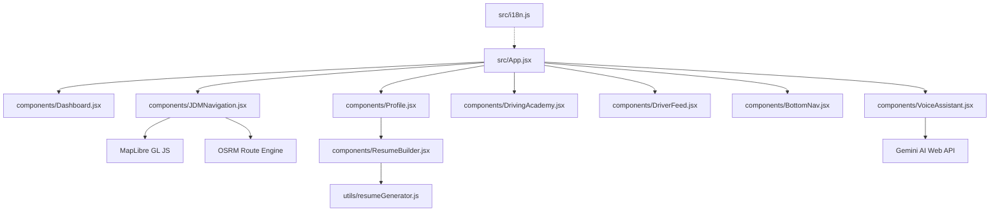

# 🗺️ Michi Ilovasi: Loyiha Mundarijasi va Arxitektura Xaritasi (MUNDARIJA.md)

> [!IMPORTANT]
> **AI AGENTLAR VA DASTURCHILAR UCHUN QAT'IY MAJBURIY QOIDA:** Loyiha ustida ishlashni va kod yozishni boshlashdan oldin, har safar ushbu mundarijani (`MUNDARIJA.md`) va loyiha xaritasini (`codebase_map.md`) to'liq o'qib chiqing! Bu tokenlar sarfini sezilarli darajada kamaytirishga, xatolarsiz tezroq kod yozishga va loyiha tuzilishini to'g'ri saqlab qolishga yordam beradi.

Ushbu hujjat loyihaning to'liq tarkibiy qismlari, fayllar tuzilishi va ularning o'zaro bog'liqligini osongina tushunish hamda kelajakda kodga tez va xatosiz o'zgartirishlar kiritish uchun yo'riqnoma bo'lib xizmat qiladi.


---

## 📂 1. Loyiha Katalogi (Folder Structure)

Loyiha standart React + Vite va Capacitor (Android/iOS) tuzilishiga ega:

* **`src/`** — Barcha manba kodlar joylashgan joy:
  * **`src/components/`** — Barcha vizual komponentlar (UI Components) va ularga tegishli CSS fayllari.
  * **`src/utils/`** — Matematik hisob-kitoblar, tarjimalar va yordamchi modullar.
  * **`src/App.jsx` & `App.css`** — Ilovaning asosiy kirish nuqtasi, navigatsiya tablari va foydalanuvchi roli boshqaruvi.
  * **`src/i18n.js`** — Ko'p tillilik tizimi (O'zbek, Yapon, Ingliz).
  * **`src/main.jsx`** — Loyihaning ishga tushirish (mounting) fayli va global xatolar kuzatuvchisi.
* **`android/`** & **`ios/`** — Capacitor orqali mobil qurilmalar uchun sinxronizatsiya qilinadigan loyihalar.
* **`vite.config.js`** — Loyiha quruvchisi sozlamalari (PWA, MapLibre ishchi kutubxonalari unga bog'langan).

---

## 🧭 2. Eng Muhim Komponentlar va Vazifalar

### 🗺️ Xarita va Navigatsiya: `src/components/JDMNavigation.jsx`
* **Vavifasi**: Ilovaning yuragi! MapLibre GL JS va OSRM routing dvigateli yordamida haydovchining GPS joylashuvini ko'rsatish, marshrut chizish, 3D (Head-Up) va 2D (North-Up) kamera aylanishlari, yuk mashinasi og'irligi/balandligi bo'yicha to'siqlarni tekshirish va simulyatsiya qilish.
* **Bog'lanishlar**: `JDMNavigation.css` orqali zamonaviy glassmorphism uslubida bezatilgan. Bosh sahifa (`App.jsx`) bilan to'g'ridan-to'g'ri bog'langan.

### 🎙️ AI Voice Assistant: `src/components/VoiceAssistant.jsx`
* **Vazifasi**: Gemini AI integratsiyasi orqali haydovchining ovozli so'rovlarini qayta ishlaydi. Masalan: *"Menga eng yaqin yo'lni top"*, *"Marshrutni boshla"*, *"Tilni yaponchaga o'zgartir"* va h.k.
* **Bog'lanishlar**: Har bir ovozli buyruq `App.jsx` orqali xaritaga va navigatsiyaga uzatiladi.

### 💼 Haydovchi Profil & Rezyume: `src/components/Profile.jsx` va `ResumeBuilder.jsx`
* **Vazifasi**: Haydovchining rezyumesini shakllantirish, JLPT (Yapon tili darajasi) sertifikatlarini kiritish va tasdiqlash, haydovchilik guvohnomalari klassifikatsiyasi boshqaruvi.
* **Bog'lanishlar**: Rezyume generatori `src/utils/resumeGenerator.js` moduli bilan hamkorlikda PDF rezyumelarni tayyorlaydi.

### 🏫 Driving Academy: `src/components/DrivingAcademy.jsx`
* **Vazifasi**: Haydovchilar uchun Yaponiyada yuk mashinasi haydash imtihonlari va Tokutei Ginou darsliklari bo'yicha videodarslar, savol-javoblar va test topshirish bo'limi.

---

## ⛓️ 3. Komponentlarning O'zaro Bog'liqlik Xaritasi (Dependency Map)

Quyidagi sxema orqali komponentlar bir-biri bilan qanday bog'langanligini ko'rishingiz mumkin:



---

## ⚡ 4. Dasturchilar va AI Agentlar Uchun Tezkor Yo'riqnoma

Loyiha ustida ishlashni tezlashtirish va har safar AI buyruqlarini bittalab tasdiqlamaslik (Submit tugmasini ko'p bosmaslik) uchun quyidagi qoidalarga amal qilinadi:

1. **Birlashtirilgan terminal buyruqlari**:
   Fayl o'zgartirilgandan so'ng, loyihani validatsiya qilish va gitga yozish bir dona buyruq zanjiri orqali taklif qilinadi:
   ```bash
   npm run validate && git add . && git commit -m "o'zgarish nomi"
   ```
   *Bu orqali siz faqat bitta "Approve" (Submit) tugmasini bosib, barcha ishlarni bittada yakunlaysiz.*

2. **Xarita ustida ishlash qoidalari**:
    * Xarita kamerasi va marker joylashuvini o'zgartirganda `isSettingsCollapsed` (marshrut sozlamalari paneli yig'ilganligi) holatini inobatga oling va dinamik padding ishlatishni davom ettiring.
    * Yangi marker qo'shishda Safari mosligi uchun `new Marker({ element: el })` formatidan foydalaning va element o'lchamlarini `36px` qilib dasturlang.

3. **Tarjimalar (i18n) qo'shish**:
    * Yangi til kalitlari har doim `src/i18n.js` faylining mos ravishda Yapon, O'zbek va Ingliz bo'limlariga kiritiladi.

---

## ⚙️ 5. Loyihaning Muhim Sozlamalari va API-lari

Loyiha to'liq va xatosiz ishlashi uchun quyidagi tashqi xizmatlar va APIdan foydalanadi:
1. **OSM Nominatim API (`https://nominatim.openstreetmap.org/search`)**: Yaponiyadagi manzillarni matnli qidiruv yordamida koordinatalarga geokodlash uchun ishlatiladi. Agar tarmoq uzilsa yoki xatolik yuz bersa, ilova avtomatik ravishda `NODES` (predefined logistika markazlari) orqali lokal qidiruvga o'tadi.
2. **OSRM Route Engine (`https://router.project-osrm.org/route/v1`)**: Avtomobil va engil yuk mashinalari uchun marshrutlarni hisoblash uchun asosiy routing xizmati.
3. **Valhalla Route Engine (`https://valhalla1.openstreetmap.de/route`)**: Og'ir yuk mashinalari (Truck) uchun yaponiya yo'llaridagi balandlik, og'irlik va kenglik cheklovlarini hisobga olgan holda marshrut hisoblashda ishlatiladi.
4. **MapLibre GL JS & ReactMapGL**: Vector xaritalar, marshrut chiziqlari, 3D binolar, qatlamlar va markerlarni rendering qilish uchun asosiy vizual kutubxonalar.
5. **Vitest (Unit Tests)** va **Playwright (E2E Tests)**: Loyihada barcha mantiqlar to'g'ri ishlashini va qidiruv tizimi, xaritalar renderlanishi qulamasligini tekshirish uchun test platformalari.
