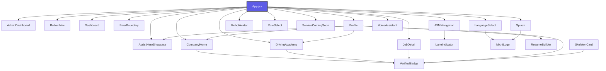

# Michi Ilovasi: Loyiha Arxitekturasi Xaritasi (Codebase Map)

> [!NOTE]
> Ushbu xarita loyihadagi barcha komponentlar bog'liqligi va parametrlarini avtomatik tahlil qilish orqali yaratilgan. U yangi dasturchilar va AI yordamchilarga loyihaning to'liq tuzilishini bir soniyada tushunishga yordam beradi.

---

## 📂 Loyiha Fayllari Statistikasi
* **Jami skanerlangan fayllar:** 79 ta
* **React Komponentlari:** 21 ta
* **Komponent Stillari (CSS):** 17 ta
* **Unit Testlar (Vitest):** 5 ta
* **Yordamchi funksiyalar (utils):** 23 ta
* **Boshqa asosiy fayllar (root):** 13 ta

---

## 📊 Komponentlar O'zaro Bog'liqlik Grafigi (Dependency Graph)

---

## 🧩 Asosiy React Komponentlari (Components)

### 📦 [AdminDashboard](file:////Users/kanoatovfarrux/.gemini/antigravity/scratch/michiappforjapan/src/components/AdminDashboard.jsx)
* **Fayl yo'li:** `src/components/AdminDashboard.jsx` (93 qator, 4884 bayt)
* **Komponent Stillari:** 🎨 [AdminDashboard.css](file:////Users/kanoatovfarrux/.gemini/antigravity/scratch/michiappforjapan/src/components/AdminDashboard.css)
* **Qabul qiladigan parametrlari (Props):**
  - `verifiedCompanies`
  - `onToggleVerify`
  - `onLogout`
  - `contractStatus`
  - `setContractStatus`
  - `profileData`
* **Import qilgan bog'liqliklari:**
  - `react`
  - `react-i18next`
  - `lucide-react`

### 📦 [AssistHeroShowcase](file:////Users/kanoatovfarrux/.gemini/antigravity/scratch/michiappforjapan/src/components/AssistHeroShowcase.jsx)
* **Fayl yo'li:** `src/components/AssistHeroShowcase.jsx` (285 qator, 11359 bayt)
* **Komponent Stillari:** 🎨 [AssistHeroShowcase.css](file:////Users/kanoatovfarrux/.gemini/antigravity/scratch/michiappforjapan/src/components/AssistHeroShowcase.css)
* **Qabul qiladigan parametrlari (Props):**
  - `onBack`
  - `onActivateVoice`
  - `darkMode`
* **Import qilgan bog'liqliklari:**
  - `react`
  - `react-i18next`
  - `lucide-react`

### 📦 [BottomNav](file:////Users/kanoatovfarrux/.gemini/antigravity/scratch/michiappforjapan/src/components/BottomNav.jsx)
* **Fayl yo'li:** `src/components/BottomNav.jsx` (172 qator, 6055 bayt)
* **Komponent Stillari:** 🎨 [BottomNav.css](file:////Users/kanoatovfarrux/.gemini/antigravity/scratch/michiappforjapan/src/components/BottomNav.css)
* **Qabul qiladigan parametrlari (Props):**
  - `activeTab`
  - `setActiveTab`
  - `unreadCount`
  - `userRole`
  - `isVoiceStandby`
  - `isVoiceActive`
  - `voiceStatus`
* **Import qilgan bog'liqliklari:**
  - `react`
  - `react-i18next`
  - `lucide-react`
  - `../utils/haptics`

### 📦 [CompanyHome](file:////Users/kanoatovfarrux/.gemini/antigravity/scratch/michiappforjapan/src/components/CompanyHome.jsx)
* **Fayl yo'li:** `src/components/CompanyHome.jsx` (1589 qator, 76843 bayt)
* **Unit Testlari:** 🧪 [CompanyHome.test.jsx](file:////Users/kanoatovfarrux/.gemini/antigravity/scratch/michiappforjapan/src/components/CompanyHome.test.jsx)
* **Qabul qiladigan parametrlari (Props):**
  - `onJobClick`
  - `onSchoolClick`
  - `jobs`
  - `setJobs`
  - `schools`
  - `setSchools`
  - `profileData`
  - `jobToEdit`
  - `setJobToEdit`
  - `onFormToggle`
  - `onApply`
  - `onApplySchool`
  - `onShoukai`
  - `applications`
  - `schoolApplications`
* **Import qilgan bog'liqliklari:**
  - `react`
  - `react-i18next`
  - `lucide-react`
  - `./VerifiedBadge`
  - `../utils/imageCompressor`

### 📦 [Dashboard](file:////Users/kanoatovfarrux/.gemini/antigravity/scratch/michiappforjapan/src/components/Dashboard.jsx)
* **Fayl yo'li:** `src/components/Dashboard.jsx` (606 qator, 25897 bayt)
* **Komponent Stillari:** 🎨 [Dashboard.css](file:////Users/kanoatovfarrux/.gemini/antigravity/scratch/michiappforjapan/src/components/Dashboard.css)
* **Qabul qiladigan parametrlari (Props):**
  - `setActiveTab`
  - `profileData`
  - `musicPlayer`
  - `isVoiceStandby`
  - `isVoiceActive`
  - `onVoiceActivate`
  - `onVoiceToggle`
  - `setProfileActivePage`
  - `setProfileActivePageSource`
  - `userRole`
  - `onNavigateToInternational`
  - `onNavigateToJDM`
  - `onOpenAssistShowcase`
* **Import qilgan bog'liqliklari:**
  - `react`
  - `react-i18next`
  - `lucide-react`
  - `../utils/haptics`

### 📦 [SkeletonCard](file:////Users/kanoatovfarrux/.gemini/antigravity/scratch/michiappforjapan/src/components/DriverFeed.jsx)
* **Fayl yo'li:** `src/components/DriverFeed.jsx` (841 qator, 38123 bayt)
* **Komponent Stillari:** 🎨 [DriverFeed.css](file:////Users/kanoatovfarrux/.gemini/antigravity/scratch/michiappforjapan/src/components/DriverFeed.css)
* **Unit Testlari:** 🧪 [DriverFeed.test.jsx](file:////Users/kanoatovfarrux/.gemini/antigravity/scratch/michiappforjapan/src/components/DriverFeed.test.jsx)
* **Qabul qiladigan parametrlari (Props):**
  - *Parametrlar mavjud emas*
* **Import qilgan bog'liqliklari:**
  - `react`
  - `react-dom`
  - `react-i18next`
  - `lucide-react`
  - `./VerifiedBadge`

### 📦 [DrivingAcademy](file:////Users/kanoatovfarrux/.gemini/antigravity/scratch/michiappforjapan/src/components/DrivingAcademy.jsx)
* **Fayl yo'li:** `src/components/DrivingAcademy.jsx` (722 qator, 32262 bayt)
* **Komponent Stillari:** 🎨 [DrivingAcademy.css](file:////Users/kanoatovfarrux/.gemini/antigravity/scratch/michiappforjapan/src/components/DrivingAcademy.css)
* **Unit Testlari:** 🧪 [DrivingAcademy.test.jsx](file:////Users/kanoatovfarrux/.gemini/antigravity/scratch/michiappforjapan/src/components/DrivingAcademy.test.jsx)
* **Qabul qiladigan parametrlari (Props):**
  - `isContractActive`
  - `onApplySchool`
  - `schoolApplications`
  - `onShoukaiPaid`
  - `profileData`
  - `onShoukai`
  - `verifiedCompanies`
  - `onToggleSave`
  - `userRole`
  - `selectedSchool`
  - `setSelectedSchool`
  - `onBackPress`
  - `schools`
  - `setSchools`
  - `onEditJob`
  - `searchQuery`
  - `setSearchQuery`
* **Import qilgan bog'liqliklari:**
  - `react`
  - `react-i18next`
  - `lucide-react`
  - `./VerifiedBadge`

### 📦 [ErrorBoundary](file:////Users/kanoatovfarrux/.gemini/antigravity/scratch/michiappforjapan/src/components/ErrorBoundary.jsx)
* **Fayl yo'li:** `src/components/ErrorBoundary.jsx` (77 qator, 2623 bayt)
* **Komponent Stillari:** 🎨 [ErrorBoundary.css](file:////Users/kanoatovfarrux/.gemini/antigravity/scratch/michiappforjapan/src/components/ErrorBoundary.css)
* **Qabul qiladigan parametrlari (Props):**
  - *Parametrlar mavjud emas*
* **Import qilgan bog'liqliklari:**
  - `react`
  - `lucide-react`

### 📦 [JDMNavigation](file:////Users/kanoatovfarrux/.gemini/antigravity/scratch/michiappforjapan/src/components/JDMNavigation.jsx)
* **Fayl yo'li:** `src/components/JDMNavigation.jsx` (4952 qator, 220117 bayt)
* **Komponent Stillari:** 🎨 [JDMNavigation.css](file:////Users/kanoatovfarrux/.gemini/antigravity/scratch/michiappforjapan/src/components/JDMNavigation.css)
* **Unit Testlari:** 🧪 [JDMNavigation.test.jsx](file:////Users/kanoatovfarrux/.gemini/antigravity/scratch/michiappforjapan/src/components/JDMNavigation.test.jsx)
* **Qabul qiladigan parametrlari (Props):**
  - `onBack`
  - `showJDMNavigation`
  - `darkMode`
* **Import qilgan bog'liqliklari:**
  - `react`
  - `react-i18next`
  - `lucide-react`
  - `../utils/haptics`
  - `maplibre-gl`
  - `react-map-gl/maplibre`
  - `../utils/mlitRestrictions`
  - `../utils/turnInstructions`
  - `../utils/overpassRestrictions`
  - `../utils/offlineTileDownloader`
  - `../utils/deadReckoning`
  - `../utils/voiceGuidance`
  - `./LaneIndicator`
  - `../utils/offlineManager`
  - `../utils/gpsMatching`
  - `../utils/bookmarkManager`
  - `../utils/poiSearch`

### 📦 [JobDetail](file:////Users/kanoatovfarrux/.gemini/antigravity/scratch/michiappforjapan/src/components/JobDetail.jsx)
* **Fayl yo'li:** `src/components/JobDetail.jsx` (406 qator, 20008 bayt)
* **Komponent Stillari:** 🎨 [JobDetail.css](file:////Users/kanoatovfarrux/.gemini/antigravity/scratch/michiappforjapan/src/components/JobDetail.css)
* **Qabul qiladigan parametrlari (Props):**
  - `job`
  - `onBack`
  - `onApply`
  - `onShoukai`
  - `applications`
  - `onToggleSave`
  - `profileData`
  - `userRole`
  - `onEditJob`
* **Import qilgan bog'liqliklari:**
  - `react`
  - `react-i18next`
  - `lucide-react`
  - `./VerifiedBadge`

### 📦 [LaneIndicator](file:////Users/kanoatovfarrux/.gemini/antigravity/scratch/michiappforjapan/src/components/LaneIndicator.jsx)
* **Fayl yo'li:** `src/components/LaneIndicator.jsx` (90 qator, 2830 bayt)
* **Qabul qiladigan parametrlari (Props):**
  - `lanes`
  - `theme`
* **Import qilgan bog'liqliklari:**
  - `react`
  - `../utils/laneGuidance`

### 📦 [LanguageSelect](file:////Users/kanoatovfarrux/.gemini/antigravity/scratch/michiappforjapan/src/components/LanguageSelect.jsx)
* **Fayl yo'li:** `src/components/LanguageSelect.jsx` (61 qator, 2248 bayt)
* **Komponent Stillari:** 🎨 [LanguageSelect.css](file:////Users/kanoatovfarrux/.gemini/antigravity/scratch/michiappforjapan/src/components/LanguageSelect.css)
* **Qabul qiladigan parametrlari (Props):**
  - `onFinish`
* **Import qilgan bog'liqliklari:**
  - `react`
  - `react-i18next`
  - `lucide-react`
  - `./MichiLogo`

### 📦 [MichiLogo](file:////Users/kanoatovfarrux/.gemini/antigravity/scratch/michiappforjapan/src/components/MichiLogo.jsx)
* **Fayl yo'li:** `src/components/MichiLogo.jsx` (28 qator, 776 bayt)
* **Qabul qiladigan parametrlari (Props):**
  - `size`
  - `fontSize`
  - `borderRadius`
  - `className`
* **Import qilgan bog'liqliklari:**
  - `react`

### 📦 [Profile](file:////Users/kanoatovfarrux/.gemini/antigravity/scratch/michiappforjapan/src/components/Profile.jsx)
* **Fayl yo'li:** `src/components/Profile.jsx` (4904 qator, 259924 bayt)
* **Komponent Stillari:** 🎨 [Profile.css](file:////Users/kanoatovfarrux/.gemini/antigravity/scratch/michiappforjapan/src/components/Profile.css)
* **Qabul qiladigan parametrlari (Props):**
  - `onLogout`
  - `contractStatus`
  - `setContractStatus`
  - `profileData`
  - `userRole`
  - `onChangeLanguage`
  - `onUpdateProfile`
  - `applications`
  - `onChangeAppStatus`
  - `notifications`
  - `onMarkRead`
  - `onMarkAllRead`
  - `unreadCount`
  - `darkMode`
  - `setDarkMode`
  - `soundSettings`
  - `setSoundSettings`
  - `companyEmployees`
  - `onAddEmployee`
  - `onAcceptEmployeeRequest`
  - `setNotifications`
  - `schoolApplications`
  - `onShoukaiPaid`
  - `onNavigate`
  - `activePage`
  - `setActivePage`
  - `profileActivePageSource`
  - `setProfileActivePageSource`
  - `onJobClick`
  - `onSchoolClick`
  - `showProfileBadges`
  - `setShowProfileBadges`
  - `notificationSound`
  - `setNotificationSound`
  - `jobs`
  - `schools`
  - `setJobs`
  - `setSchools`
  - `jobToEdit`
  - `setJobToEdit`
  - `onApply`
  - `onApplySchool`
  - `onShoukai`
  - `onTriggerRegister`
  - `isVoiceActive`
  - `setIsVoiceActive`
  - `isVoiceStandby`
  - `setIsVoiceStandby`
* **Import qilgan bog'liqliklari:**
  - `react`
  - `react-i18next`
  - `lucide-react`
  - `../utils/imageCompressor`
  - `./DriverFeed`
  - `./DrivingAcademy`
  - `./VerifiedBadge`
  - `./CompanyHome`
  - `./ResumeBuilder`
  - `./AssistHeroShowcase`

### 📦 [ResumeBuilder](file:////Users/kanoatovfarrux/.gemini/antigravity/scratch/michiappforjapan/src/components/ResumeBuilder.jsx)
* **Fayl yo'li:** `src/components/ResumeBuilder.jsx` (1271 qator, 51913 bayt)
* **Komponent Stillari:** 🎨 [ResumeBuilder.css](file:////Users/kanoatovfarrux/.gemini/antigravity/scratch/michiappforjapan/src/components/ResumeBuilder.css)
* **Qabul qiladigan parametrlari (Props):**
  - `profileData`
  - `onUpdateProfile`
  - `onBack`
  - `isVoiceActive`
  - `setIsVoiceActive`
  - `isVoiceStandby`
  - `setIsVoiceStandby`
* **Import qilgan bog'liqliklari:**
  - `react`
  - `react-i18next`
  - `lucide-react`
  - `../utils/resumeGenerator`

### 📦 [RobotAvatar](file:////Users/kanoatovfarrux/.gemini/antigravity/scratch/michiappforjapan/src/components/RobotAvatar.jsx)
* **Fayl yo'li:** `src/components/RobotAvatar.jsx` (44 qator, 1417 bayt)
* **Komponent Stillari:** 🎨 [RobotAvatar.css](file:////Users/kanoatovfarrux/.gemini/antigravity/scratch/michiappforjapan/src/components/RobotAvatar.css)
* **Qabul qiladigan parametrlari (Props):**
  - `isVoiceActive`
  - `voiceStatus`
  - `onClick`
* **Import qilgan bog'liqliklari:**
  - `react`

### 📦 [RoleSelect](file:////Users/kanoatovfarrux/.gemini/antigravity/scratch/michiappforjapan/src/components/RoleSelect.jsx)
* **Fayl yo'li:** `src/components/RoleSelect.jsx` (1132 qator, 55242 bayt)
* **Komponent Stillari:** 🎨 [RoleSelect.css](file:////Users/kanoatovfarrux/.gemini/antigravity/scratch/michiappforjapan/src/components/RoleSelect.css)
* **Qabul qiladigan parametrlari (Props):**
  - `onSelectRole`
  - `onGuest`
  - `initialStep`
* **Import qilgan bog'liqliklari:**
  - `react`
  - `react-i18next`
  - `lucide-react`
  - `../utils/imageCompressor`

### 📦 [ServiceComingSoon](file:////Users/kanoatovfarrux/.gemini/antigravity/scratch/michiappforjapan/src/components/ServiceComingSoon.jsx)
* **Fayl yo'li:** `src/components/ServiceComingSoon.jsx` (106 qator, 4068 bayt)
* **Komponent Stillari:** 🎨 [ServiceComingSoon.css](file:////Users/kanoatovfarrux/.gemini/antigravity/scratch/michiappforjapan/src/components/ServiceComingSoon.css)
* **Qabul qiladigan parametrlari (Props):**
  - `onOpenAssistShowcase`
  - `onNavigate`
* **Import qilgan bog'liqliklari:**
  - `react`
  - `react-i18next`
  - `lucide-react`

### 📦 [Splash](file:////Users/kanoatovfarrux/.gemini/antigravity/scratch/michiappforjapan/src/components/Splash.jsx)
* **Fayl yo'li:** `src/components/Splash.jsx` (22 qator, 599 bayt)
* **Komponent Stillari:** 🎨 [Splash.css](file:////Users/kanoatovfarrux/.gemini/antigravity/scratch/michiappforjapan/src/components/Splash.css)
* **Qabul qiladigan parametrlari (Props):**
  - `onFinish`
* **Import qilgan bog'liqliklari:**
  - `react`
  - `./MichiLogo`

### 📦 [VerifiedBadge](file:////Users/kanoatovfarrux/.gemini/antigravity/scratch/michiappforjapan/src/components/VerifiedBadge.jsx)
* **Fayl yo'li:** `src/components/VerifiedBadge.jsx` (29 qator, 830 bayt)
* **Qabul qiladigan parametrlari (Props):**
  - `size`
* **Import qilgan bog'liqliklari:**
  - `react`

### 📦 [VoiceAssistant](file:////Users/kanoatovfarrux/.gemini/antigravity/scratch/michiappforjapan/src/components/VoiceAssistant.jsx)
* **Fayl yo'li:** `src/components/VoiceAssistant.jsx` (3188 qator, 135972 bayt)
* **Komponent Stillari:** 🎨 [VoiceAssistant.css](file:////Users/kanoatovfarrux/.gemini/antigravity/scratch/michiappforjapan/src/components/VoiceAssistant.css)
* **Qabul qiladigan parametrlari (Props):**
  - `isActive`
  - `onClose`
  - `onStartVoice`
  - `isVoiceStandby`
  - `setIsVoiceStandby`
  - `setActiveTab`
  - `musicPlayer`
  - `onStatusChange`
  - `activeTab`
  - `jobs`
  - `schools`
  - `profileData`
  - `applications`
  - `selectedJob`
  - `selectedSchool`
  - `setSelectedJob`
  - `setSelectedSchool`
  - `setProfileActivePage`
  - `setJobSearchQuery`
  - `setJobActiveSegment`
  - `setAcademySearchQuery`
  - `handleApplyJob`
  - `handleApplySchool`
  - `handleShoukai`
  - `userRole`
  - `selectedLicenses`
  - `setSelectedLicenses`
  - `selectedLangLevel`
  - `setSelectedLangLevel`
  - `selectedBenefits`
  - `setSelectedBenefits`
  - `minSalary`
  - `setMinSalary`
  - `selectedPrefecture`
  - `setSelectedPrefecture`
  - `setApplications`
  - `toggleDarkMode`
* **Import qilgan bog'liqliklari:**
  - `react`
  - `react-i18next`
  - `lucide-react`
  - `../utils/voiceLexicon`

---

## 🛠️ Yordamchi Funksiyalar (Utils)

### ⚙️ [bookmarkManager.js](file:////Users/kanoatovfarrux/.gemini/antigravity/scratch/michiappforjapan/src/utils/bookmarkManager.js)
* **Yo'li:** `src/utils/bookmarkManager.js` (139 qator, 4281 bayt)
* **Eksport qilingan funksiyalari:**
  - `loadBookmarks()`
  - `addBookmark()`
  - `removeBookmark()`
  - `updateBookmark()`
  - `getBookmarksByCategory()`
  - `exportBookmarks()`
  - `importBookmarks()`
  - `BOOKMARK_CATEGORIES()`
* **Importlari:** *Yo'q*

### ⚙️ [bookmarkManager.test.js](file:////Users/kanoatovfarrux/.gemini/antigravity/scratch/michiappforjapan/src/utils/bookmarkManager.test.js)
* **Yo'li:** `src/utils/bookmarkManager.test.js` (137 qator, 5030 bayt)
* **Eksport qilingan funksiyalari:**
  - *Eksportlar aniqlanmadi yoki yo'q*
* **Importlari:** `vitest`, `./bookmarkManager`

### ⚙️ [deadReckoning.js](file:////Users/kanoatovfarrux/.gemini/antigravity/scratch/michiappforjapan/src/utils/deadReckoning.js)
* **Yo'li:** `src/utils/deadReckoning.js` (144 qator, 4734 bayt)
* **Eksport qilingan funksiyalari:**
  - `getDistanceMeters()`
  - `findClosestSegmentIndex()`
  - `extrapolatePositionAlongRoute()`
  - `isPositionInTunnel()`
* **Importlari:** *Yo'q*

### ⚙️ [deadReckoning.test.js](file:////Users/kanoatovfarrux/.gemini/antigravity/scratch/michiappforjapan/src/utils/deadReckoning.test.js)
* **Yo'li:** `src/utils/deadReckoning.test.js` (99 qator, 3522 bayt)
* **Eksport qilingan funksiyalari:**
  - *Eksportlar aniqlanmadi yoki yo'q*
* **Importlari:** `vitest`, `./deadReckoning`

### ⚙️ [gpsMatching.js](file:////Users/kanoatovfarrux/.gemini/antigravity/scratch/michiappforjapan/src/utils/gpsMatching.js)
* **Yo'li:** `src/utils/gpsMatching.js` (135 qator, 4698 bayt)
* **Eksport qilingan funksiyalari:**
  - `getDistance()`
  - `projectPointOnSegment()`
  - `snapToRoute()`
  - `smoothBearing()`
  - `isOffRoute()`
* **Importlari:** *Yo'q*

### ⚙️ [haptics.js](file:////Users/kanoatovfarrux/.gemini/antigravity/scratch/michiappforjapan/src/utils/haptics.js)
* **Yo'li:** `src/utils/haptics.js` (38 qator, 1142 bayt)
* **Eksport qilingan funksiyalari:**
  - `playHapticClick()`
* **Importlari:** *Yo'q*

### ⚙️ [imageCompressor.js](file:////Users/kanoatovfarrux/.gemini/antigravity/scratch/michiappforjapan/src/utils/imageCompressor.js)
* **Yo'li:** `src/utils/imageCompressor.js` (62 qator, 2198 bayt)
* **Eksport qilingan funksiyalari:**
  - `compressImage()`
* **Importlari:** *Yo'q*

### ⚙️ [japaneseEra.js](file:////Users/kanoatovfarrux/.gemini/antigravity/scratch/michiappforjapan/src/utils/japaneseEra.js)
* **Yo'li:** `src/utils/japaneseEra.js` (97 qator, 2477 bayt)
* **Eksport qilingan funksiyalari:**
  - `getEraInfo()`
  - `toJapaneseEra()`
  - `calculateAge()`
  - `toJapaneseEraYear()`
* **Importlari:** *Yo'q*

### ⚙️ [japaneseEra.test.js](file:////Users/kanoatovfarrux/.gemini/antigravity/scratch/michiappforjapan/src/utils/japaneseEra.test.js)
* **Yo'li:** `src/utils/japaneseEra.test.js` (62 qator, 2156 bayt)
* **Eksport qilingan funksiyalari:**
  - *Eksportlar aniqlanmadi yoki yo'q*
* **Importlari:** `vitest`, `./japaneseEra`

### ⚙️ [laneGuidance.js](file:////Users/kanoatovfarrux/.gemini/antigravity/scratch/michiappforjapan/src/utils/laneGuidance.js)
* **Yo'li:** `src/utils/laneGuidance.js` (181 qator, 6488 bayt)
* **Eksport qilingan funksiyalari:**
  - `parseTurnLanes()`
  - `evaluateLaneValidity()`
  - `getLaneArrowPath()`
  - `getLaneGuidanceForStep()`
  - `estimateLanesFromStep()`
* **Importlari:** *Yo'q*

### ⚙️ [mlitRestrictions.js](file:////Users/kanoatovfarrux/.gemini/antigravity/scratch/michiappforjapan/src/utils/mlitRestrictions.js)
* **Yo'li:** `src/utils/mlitRestrictions.js` (157 qator, 4959 bayt)
* **Eksport qilingan funksiyalari:**
  - `checkClearanceLimits()`
  - `MLIT_RESTRICTIONS()`
* **Importlari:** *Yo'q*

### ⚙️ [offlineManager.js](file:////Users/kanoatovfarrux/.gemini/antigravity/scratch/michiappforjapan/src/utils/offlineManager.js)
* **Yo'li:** `src/utils/offlineManager.js` (120 qator, 3515 bayt)
* **Eksport qilingan funksiyalari:**
  - `generateRouteKey()`
  - `getPrefectureTilePresets()`
* **Importlari:** *Yo'q*

### ⚙️ [offlineTileDownloader.js](file:////Users/kanoatovfarrux/.gemini/antigravity/scratch/michiappforjapan/src/utils/offlineTileDownloader.js)
* **Yo'li:** `src/utils/offlineTileDownloader.js` (148 qator, 5032 bayt)
* **Eksport qilingan funksiyalari:**
  - `generateRegionTileUrls()`
  - `getPrefectureTilePresets()`
* **Importlari:** *Yo'q*

### ⚙️ [offlineTileDownloader.test.js](file:////Users/kanoatovfarrux/.gemini/antigravity/scratch/michiappforjapan/src/utils/offlineTileDownloader.test.js)
* **Yo'li:** `src/utils/offlineTileDownloader.test.js` (83 qator, 2737 bayt)
* **Eksport qilingan funksiyalari:**
  - *Eksportlar aniqlanmadi yoki yo'q*
* **Importlari:** `vitest`, `./offlineTileDownloader`

### ⚙️ [overpassRestrictions.js](file:////Users/kanoatovfarrux/.gemini/antigravity/scratch/michiappforjapan/src/utils/overpassRestrictions.js)
* **Yo'li:** `src/utils/overpassRestrictions.js` (469 qator, 15064 bayt)
* **Eksport qilingan funksiyalari:**
  - `checkOverpassRestrictions()`
  - `mergeRestrictionResults()`
* **Importlari:** *Yo'q*

### ⚙️ [overpassRestrictions.test.js](file:////Users/kanoatovfarrux/.gemini/antigravity/scratch/michiappforjapan/src/utils/overpassRestrictions.test.js)
* **Yo'li:** `src/utils/overpassRestrictions.test.js` (93 qator, 3057 bayt)
* **Eksport qilingan funksiyalari:**
  - *Eksportlar aniqlanmadi yoki yo'q*
* **Importlari:** `vitest`, `./overpassRestrictions`

### ⚙️ [poiSearch.js](file:////Users/kanoatovfarrux/.gemini/antigravity/scratch/michiappforjapan/src/utils/poiSearch.js)
* **Yo'li:** `src/utils/poiSearch.js` (134 qator, 3682 bayt)
* **Eksport qilingan funksiyalari:**
  - `getAvailablePOITypes()`
* **Importlari:** *Yo'q*

### ⚙️ [resumeGenerator.js](file:////Users/kanoatovfarrux/.gemini/antigravity/scratch/michiappforjapan/src/utils/resumeGenerator.js)
* **Yo'li:** `src/utils/resumeGenerator.js` (554 qator, 19065 bayt)
* **Eksport qilingan funksiyalari:**
  - *Eksportlar aniqlanmadi yoki yo'q*
* **Importlari:** `pdfmake/build/pdfmake`, `./japaneseEra`

### ⚙️ [turnInstructions.js](file:////Users/kanoatovfarrux/.gemini/antigravity/scratch/michiappforjapan/src/utils/turnInstructions.js)
* **Yo'li:** `src/utils/turnInstructions.js` (698 qator, 23389 bayt)
* **Eksport qilingan funksiyalari:**
  - `translateJaInstructionToUz()`
  - `calculateBearing()`
  - `classifyTurnAngle()`
  - `formatDistanceJa()`
  - `parseOSRMSteps()`
  - `getRemainingMetrics()`
  - `getCountdownText()`
  - `mapValhallaTypeToOSRM()`
  - `parseValhallaSteps()`
  - `decodePolyline6()`
* **Importlari:** `./turnRadiusPhysics`, `./laneGuidance`

### ⚙️ [turnInstructions.test.js](file:////Users/kanoatovfarrux/.gemini/antigravity/scratch/michiappforjapan/src/utils/turnInstructions.test.js)
* **Yo'li:** `src/utils/turnInstructions.test.js` (89 qator, 3199 bayt)
* **Eksport qilingan funksiyalari:**
  - *Eksportlar aniqlanmadi yoki yo'q*
* **Importlari:** `vitest`, `./turnInstructions`

### ⚙️ [turnRadiusPhysics.js](file:////Users/kanoatovfarrux/.gemini/antigravity/scratch/michiappforjapan/src/utils/turnRadiusPhysics.js)
* **Yo'li:** `src/utils/turnRadiusPhysics.js` (410 qator, 12621 bayt)
* **Eksport qilingan funksiyalari:**
  - `calculateInnerWheelDiff()`
  - `calculateOutswing()`
  - `calculateSweptPathWidth()`
  - `evaluateTurnFeasibility()`
  - `VEHICLE_PHYSICS()`
* **Importlari:** *Yo'q*

### ⚙️ [voiceGuidance.js](file:////Users/kanoatovfarrux/.gemini/antigravity/scratch/michiappforjapan/src/utils/voiceGuidance.js)
* **Yo'li:** `src/utils/voiceGuidance.js` (274 qator, 6962 bayt)
* **Eksport qilingan funksiyalari:**
  - `setSpeechLanguage()`
  - `setSpeechVolume()`
  - `setSpeechRate()`
  - `setSpeechPitch()`
  - `setWarningOnlyMode()`
  - `initVoiceGuidance()`
  - `speak()`
  - `speakManeuver()`
  - `translateWarningToUz()`
  - `speakWarning()`
  - `speakArrival()`
  - `speakRerouting()`
  - `toggleMute()`
  - `isSpeechMuted()`
  - `stopSpeech()`
* **Importlari:** `./turnInstructions`

### ⚙️ [voiceLexicon.js](file:////Users/kanoatovfarrux/.gemini/antigravity/scratch/michiappforjapan/src/utils/voiceLexicon.js)
* **Yo'li:** `src/utils/voiceLexicon.js` (384 qator, 14149 bayt)
* **Eksport qilingan funksiyalari:**
  - `getSimilarity()`
  - `VOICE_LEXICON()`
  - `matchLexiconCommand()`
* **Importlari:** *Yo'q*

---

## 📄 Boshqa Tizim Fayllari (Root)

### 📄 [App.css](file:////Users/kanoatovfarrux/.gemini/antigravity/scratch/michiappforjapan/src/App.css)
* **Yo'li:** `src/App.css` (318 qator)
* **Importlari:** *Yo'q*

### 📄 [App.jsx](file:////Users/kanoatovfarrux/.gemini/antigravity/scratch/michiappforjapan/src/App.jsx)
* **Yo'li:** `src/App.jsx` (1344 qator)
* **Importlari:** `react`, `lucide-react`, `react-i18next`, `./components/Splash`, `./components/LanguageSelect`, `./components/RoleSelect`, `./components/BottomNav`, `./components/Dashboard`, `./components/DriverFeed`, `./components/JobDetail`, `./components/DrivingAcademy`, `./components/ServiceComingSoon`, `./components/Profile`, `./components/AdminDashboard`, `./components/CompanyHome`, `./components/VoiceAssistant`, `./components/RobotAvatar`, `./components/JDMNavigation`, `./components/AssistHeroShowcase`, `./components/ErrorBoundary`

### 📄 [en.js](file:////Users/kanoatovfarrux/.gemini/antigravity/scratch/michiappforjapan/src/locales/en.js)
* **Yo'li:** `src/locales/en.js` (624 qator)
* **Importlari:** *Yo'q*

### 📄 [i18n.js](file:////Users/kanoatovfarrux/.gemini/antigravity/scratch/michiappforjapan/src/i18n.js)
* **Yo'li:** `src/i18n.js` (13 qator)
* **Importlari:** `i18next`, `react-i18next`, `./locales`

### 📄 [index.css](file:////Users/kanoatovfarrux/.gemini/antigravity/scratch/michiappforjapan/src/index.css)
* **Yo'li:** `src/index.css` (308 qator)
* **Importlari:** *Yo'q*

### 📄 [index.js](file:////Users/kanoatovfarrux/.gemini/antigravity/scratch/michiappforjapan/src/locales/index.js)
* **Yo'li:** `src/locales/index.js` (18 qator)
* **Importlari:** `./uz.js`, `./ja.js`, `./en.js`, `./vi.js`, `./zh.js`, `./ne.js`, `./ru.js`

### 📄 [ja.js](file:////Users/kanoatovfarrux/.gemini/antigravity/scratch/michiappforjapan/src/locales/ja.js)
* **Yo'li:** `src/locales/ja.js` (714 qator)
* **Importlari:** *Yo'q*

### 📄 [main.jsx](file:////Users/kanoatovfarrux/.gemini/antigravity/scratch/michiappforjapan/src/main.jsx)
* **Yo'li:** `src/main.jsx` (69 qator)
* **Importlari:** `react`, `react-dom/client`, `./App.jsx`

### 📄 [ne.js](file:////Users/kanoatovfarrux/.gemini/antigravity/scratch/michiappforjapan/src/locales/ne.js)
* **Yo'li:** `src/locales/ne.js` (505 qator)
* **Importlari:** *Yo'q*

### 📄 [ru.js](file:////Users/kanoatovfarrux/.gemini/antigravity/scratch/michiappforjapan/src/locales/ru.js)
* **Yo'li:** `src/locales/ru.js` (70 qator)
* **Importlari:** *Yo'q*

### 📄 [uz.js](file:////Users/kanoatovfarrux/.gemini/antigravity/scratch/michiappforjapan/src/locales/uz.js)
* **Yo'li:** `src/locales/uz.js` (628 qator)
* **Importlari:** *Yo'q*

### 📄 [vi.js](file:////Users/kanoatovfarrux/.gemini/antigravity/scratch/michiappforjapan/src/locales/vi.js)
* **Yo'li:** `src/locales/vi.js` (522 qator)
* **Importlari:** *Yo'q*

### 📄 [zh.js](file:////Users/kanoatovfarrux/.gemini/antigravity/scratch/michiappforjapan/src/locales/zh.js)
* **Yo'li:** `src/locales/zh.js` (510 qator)
* **Importlari:** *Yo'q*

