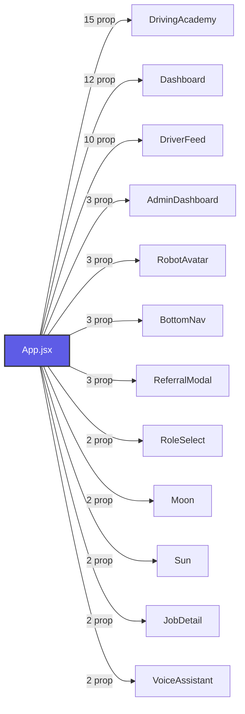

# Michi Ilovasi: Loyiha Arxitekturasi va Mundarija Xaritasi (Codebase Map)

> [!NOTE]
> Ushbu xarita loyihadagi barcha komponentlar bog'liqligi, ma'lumotlar bazalari, utilitlar va skriptlarni avtomatik skanerlash orqali yaratilgan. Oxirgi yangilangan vaqti: **24/09/2026, 19:54:55**.

---

## 📂 Loyiha Fayllari Statistikasi
* **Jami skanerlangan fayllar:** 224 ta
* **React Komponentlari:** 50 ta
* **Komponent Stillari (CSS):** 18 ta
* **Geografiya va Ma'lumotlar Bazalari (data):** 14 ta
* **Unit Testlar (Vitest):** 34 ta
* **Yordamchi Funksiyalar (utils):** 21 ta
* **Tashqi API va Xizmatlar (services):** 17 ta
* **Avtomatizatsiya Skriptlari (scripts):** 15 ta
* **Tizim va UI Qoidalari (.agents/rules):** 31 ta
* **Boshqa asosiy fayllar (src/ root):** 21 ta

---

## 📊 Komponentlar O'zaro Bog'liqlik Grafigi (Dependency Graph)

```mermaid
graph TD
  App[App.jsx]
  App --> AdminDashboard
  App --> AssistHeroShowcase
  App --> BottomNav
  App --> CompanyHome
  App --> Dashboard
  App --> DrivingAcademy
  App --> ErrorBoundary
  App --> JDMNavigation
  App --> JobDetail
  App --> LanguageSelect
  App --> Profile
  App --> ReferralModal
  App --> RobotAvatar
  App --> RoleSelect
  App --> ServiceComingSoon
  App --> Splash
  App --> VoiceAssistant
  CompanyHome --> CustomInlineDropdown
  CompanyHome --> CustomMobilePickerModal
  CompanyHome --> VerifiedBadge
  DrivingAcademy --> CustomInlineDropdown
  DrivingAcademy --> CustomMobilePickerModal
  DrivingAcademy --> VerifiedBadge
  JDMNavigation --> LaneIndicator
  JapaneseVehiclePickerModal --> LazyVehicleImage
  JobDetail --> VerifiedBadge
  LanguageSelect --> MichiLogo
  LazyVehicleImage --> VehicleGradientCard
  MichiChatFeed --> MichiChatMessageItem
  MichiChatFeed --> MichiEmptyChatView
  MichiDictationInput --> MichiMicButton
  MichiDictationInput --> MichiSendButton
  MichiDictationInput --> MichiTextInputField
  MichiSideDrawer --> MichiActivationCard
  MichiSideDrawer --> MichiChatFeed
  MichiSideDrawer --> MichiDictationInput
  MichiSideDrawer --> MichiDrawerHeader
  MichiSideDrawer --> MichiQuickChips
  MyAds --> CompanyHome
  Profile --> AssistHeroShowcase
  Profile --> CompanyHome
  Profile --> DrivingAcademy
  Profile --> JapaneseVehiclePickerModal
  Profile --> ResumeBuilder
  Profile --> VerifiedBadge
  ProfileMain --> VerifiedBadge
  RoleSelect --> N8nEmailOtpWidget
  Settings --> LanguageSelect
  SkeletonCard --> CustomMobilePickerModal
  SkeletonCard --> VerifiedBadge
  Splash --> MichiLogo
  VoiceAssistant --> MichiDrawerTrigger
  VoiceAssistant --> MichiSideDrawer
  
  style App fill:#5E5CE6,stroke:#333,stroke-width:2px,color:#fff
```

---

## 🧩 Asosiy React Komponentlari (Components)

### 📦 [AdminDashboard](file:///Users/kanoatovfarrux/michiappforjapan/src/components/AdminDashboard.jsx)
* **Fayl yo'li:** `src/components/AdminDashboard.jsx` (93 qator, 4884 bayt)
* **Komponent Stillari:** 🎨 [AdminDashboard.css](file:///Users/kanoatovfarrux/michiappforjapan/src/components/AdminDashboard.css)
* **Qabul qiladigan parametrlari (Props):**
  - `verifiedCompanies`
  - `onToggleVerify`
  - `onLogout`
  - `contractStatus`
  - `setContractStatus`
  - `profileData`
* **Import qilgan bog'liqliklari:**
  - `react`
  - `react-i18next`
  - `lucide-react`

### 📦 [Applications](file:///Users/kanoatovfarrux/michiappforjapan/src/components/profile/Applications.jsx)
* **Fayl yo'li:** `src/components/profile/Applications.jsx` (50 qator, 1777 bayt)
* **Qabul qiladigan parametrlari (Props):**
  - `applications`
  - `schoolApplications`
  - `onBack`
  - `onAppClick`
* **Import qilgan bog'liqliklari:**
  - `react`
  - `react-i18next`
  - `lucide-react`

### 📦 [AssistHeroShowcase](file:///Users/kanoatovfarrux/michiappforjapan/src/components/AssistHeroShowcase.jsx)
* **Fayl yo'li:** `src/components/AssistHeroShowcase.jsx` (366 qator, 15359 bayt)
* **Komponent Stillari:** 🎨 [AssistHeroShowcase.css](file:///Users/kanoatovfarrux/michiappforjapan/src/components/AssistHeroShowcase.css)
* **Qabul qiladigan parametrlari (Props):**
  - `onBack`
  - `isVoiceActive`
  - `onToggleVoice`
  - `onActivateVoice`
  - `darkMode`
* **Import qilgan bog'liqliklari:**
  - `react`
  - `react-i18next`
  - `lucide-react`

### 📦 [BottomNav](file:///Users/kanoatovfarrux/michiappforjapan/src/components/BottomNav.jsx)
* **Fayl yo'li:** `src/components/BottomNav.jsx` (173 qator, 5928 bayt)
* **Komponent Stillari:** 🎨 [BottomNav.css](file:///Users/kanoatovfarrux/michiappforjapan/src/components/BottomNav.css)
* **Qabul qiladigan parametrlari (Props):**
  - `activeTab`
  - `setActiveTab`
  - `unreadCount`
  - `userRole`
  - `isVoiceStandby`
  - `isVoiceActive`
  - `voiceStatus`
* **Import qilgan bog'liqliklari:**
  - `react`
  - `react-i18next`
  - `lucide-react`
  - `../utils/haptics`

### 📦 [CompanyHome](file:///Users/kanoatovfarrux/michiappforjapan/src/components/CompanyHome.jsx)
* **Fayl yo'li:** `src/components/CompanyHome.jsx` (2020 qator, 90677 bayt)
* **Unit Testlari:** 🧪 [CompanyHome.test.jsx](file:///Users/kanoatovfarrux/michiappforjapan/src/components/CompanyHome.test.jsx)
* **Qabul qiladigan parametrlari (Props):**
  - `onJobClick`
  - `onSchoolClick`
  - `jobs`
  - `setJobs`
  - `schools`
  - `setSchools`
  - `profileData`
  - `jobToEdit`
  - `setJobToEdit`
  - `onFormToggle`
  - `onApply`
  - `onApplySchool`
  - `onShoukai`
  - `applications`
  - `schoolApplications`
  - `userRole`
* **Import qilgan bog'liqliklari:**
  - `react`
  - `react-i18next`
  - `lucide-react`
  - `./VerifiedBadge`
  - `./CustomMobilePickerModal`
  - `./CustomInlineDropdown`
  - `../utils/imageCompressor`
  - `../utils/japaneseZipcodeLookup`
  - `../data/japanRegions.js`
  - `../data/japanCities.js`
  - `../data/japanStations.js`
  - `../data/jobCategories`

### 📦 [CustomInlineDropdown](file:///Users/kanoatovfarrux/michiappforjapan/src/components/CustomInlineDropdown.jsx)
* **Fayl yo'li:** `src/components/CustomInlineDropdown.jsx` (303 qator, 10929 bayt)
* **Unit Testlari:** 🧪 [CustomInlineDropdown.test.jsx](file:///Users/kanoatovfarrux/michiappforjapan/src/components/CustomInlineDropdown.test.jsx)
* **Qabul qiladigan parametrlari (Props):**
  - `label`
  - `required`
  - `value`
  - `options`
  - `placeholder`
  - `onChange`
  - `error`
  - `allowCustom`
  - `customPlaceholder`
* **Import qilgan bog'liqliklari:**
  - `react`
  - `react-dom`
  - `lucide-react`

### 📦 [CustomMobilePickerModal](file:///Users/kanoatovfarrux/michiappforjapan/src/components/CustomMobilePickerModal.jsx)
* **Fayl yo'li:** `src/components/CustomMobilePickerModal.jsx` (292 qator, 11041 bayt)
* **Unit Testlari:** 🧪 [CustomMobilePickerModal.test.jsx](file:///Users/kanoatovfarrux/michiappforjapan/src/components/CustomMobilePickerModal.test.jsx)
* **Qabul qiladigan parametrlari (Props):**
  - `isOpen`
  - `onClose`
  - `title`
  - `items`
  - `options`
  - `selectedValue`
  - `onSelect`
  - `allowCustom`
* **Import qilgan bog'liqliklari:**
  - `react`
  - `react-i18next`
  - `lucide-react`

### 📦 [Dashboard](file:///Users/kanoatovfarrux/michiappforjapan/src/components/Dashboard.jsx)
* **Fayl yo'li:** `src/components/Dashboard.jsx` (637 qator, 27745 bayt)
* **Komponent Stillari:** 🎨 [Dashboard.css](file:///Users/kanoatovfarrux/michiappforjapan/src/components/Dashboard.css)
* **Qabul qiladigan parametrlari (Props):**
  - `setActiveTab`
  - `profileData`
  - `musicPlayer`
  - `isVoiceStandby`
  - `isVoiceActive`
  - `onVoiceActivate`
  - `onVoiceToggle`
  - `setProfileActivePage`
  - `setProfileActivePageSource`
  - `userRole`
  - `onNavigateToInternational`
  - `onNavigateToJDM`
  - `onOpenAssistShowcase`
* **Import qilgan bog'liqliklari:**
  - `react`
  - `react-i18next`
  - `lucide-react`
  - `../utils/haptics`

### 📦 [SkeletonCard](file:///Users/kanoatovfarrux/michiappforjapan/src/components/DriverFeed.jsx)
* **Fayl yo'li:** `src/components/DriverFeed.jsx` (2048 qator, 100096 bayt)
* **Komponent Stillari:** 🎨 [DriverFeed.css](file:///Users/kanoatovfarrux/michiappforjapan/src/components/DriverFeed.css)
* **Unit Testlari:** 🧪 [DriverFeed.test.jsx](file:///Users/kanoatovfarrux/michiappforjapan/src/components/DriverFeed.test.jsx)
* **Qabul qiladigan parametrlari (Props):**
  - *Parametrlar mavjud emas*
* **Import qilgan bog'liqliklari:**
  - `react`
  - `react-dom`
  - `react-i18next`
  - `lucide-react`
  - `leaflet`
  - `./VerifiedBadge`
  - `./CustomMobilePickerModal`
  - `../data/japanLocationDB`
  - `../data/jobCategories`
  - `../data/jobFeatures`

### 📦 [DrivingAcademy](file:///Users/kanoatovfarrux/michiappforjapan/src/components/DrivingAcademy.jsx)
* **Fayl yo'li:** `src/components/DrivingAcademy.jsx` (1898 qator, 93106 bayt)
* **Komponent Stillari:** 🎨 [DrivingAcademy.css](file:///Users/kanoatovfarrux/michiappforjapan/src/components/DrivingAcademy.css)
* **Unit Testlari:** 🧪 [DrivingAcademy.test.jsx](file:///Users/kanoatovfarrux/michiappforjapan/src/components/DrivingAcademy.test.jsx)
* **Qabul qiladigan parametrlari (Props):**
  - `isContractActive`
  - `onApplySchool`
  - `schoolApplications`
  - `onShoukaiPaid`
  - `profileData`
  - `onShoukai`
  - `verifiedCompanies`
  - `onToggleSave`
  - `userRole`
  - `selectedSchool`
  - `setSelectedSchool`
  - `onBackPress`
  - `schools`
  - `setSchools`
  - `onEditJob`
  - `searchQuery`
  - `setSearchQuery`
* **Import qilgan bog'liqliklari:**
  - `react`
  - `react-dom`
  - `react-i18next`
  - `lucide-react`
  - `./VerifiedBadge`
  - `./CustomMobilePickerModal`
  - `../data/japanLocationDB`
  - `./CustomInlineDropdown`

### 📦 [EmailOtpAuthModal](file:///Users/kanoatovfarrux/michiappforjapan/src/components/EmailOtpAuthModal.jsx)
* **Fayl yo'li:** `src/components/EmailOtpAuthModal.jsx` (454 qator, 15721 bayt)
* **Komponent Stillari:** 🎨 [EmailOtpAuthModal.css](file:///Users/kanoatovfarrux/michiappforjapan/src/components/EmailOtpAuthModal.css)
* **Qabul qiladigan parametrlari (Props):**
  - `isOpen`
  - `onClose`
  - `onSuccess`
  - `initialRole`
* **Import qilgan bog'liqliklari:**
  - `react`
  - `lucide-react`
  - `react-i18next`
  - `../services/n8nEmailOtpService`

### 📦 [EmployeeManagement](file:///Users/kanoatovfarrux/michiappforjapan/src/components/profile/EmployeeManagement.jsx)
* **Fayl yo'li:** `src/components/profile/EmployeeManagement.jsx` (52 qator, 1827 bayt)
* **Qabul qiladigan parametrlari (Props):**
  - `employees`
  - `onBack`
  - `onVerifyEmployee`
* **Import qilgan bog'liqliklari:**
  - `react`
  - `react-i18next`
  - `lucide-react`

### 📦 [ErrorBoundary](file:///Users/kanoatovfarrux/michiappforjapan/src/components/ErrorBoundary.jsx)
* **Fayl yo'li:** `src/components/ErrorBoundary.jsx` (78 qator, 2647 bayt)
* **Komponent Stillari:** 🎨 [ErrorBoundary.css](file:///Users/kanoatovfarrux/michiappforjapan/src/components/ErrorBoundary.css)
* **Qabul qiladigan parametrlari (Props):**
  - *Parametrlar mavjud emas*
* **Import qilgan bog'liqliklari:**
  - `react`
  - `lucide-react`

### 📦 [JDMNavigation](file:///Users/kanoatovfarrux/michiappforjapan/src/components/JDMNavigation.jsx)
* **Fayl yo'li:** `src/components/JDMNavigation.jsx` (4708 qator, 210672 bayt)
* **Komponent Stillari:** 🎨 [JDMNavigation.css](file:///Users/kanoatovfarrux/michiappforjapan/src/components/JDMNavigation.css)
* **Unit Testlari:** 🧪 [JDMNavigation.test.jsx](file:///Users/kanoatovfarrux/michiappforjapan/src/components/JDMNavigation.test.jsx)
* **Qabul qiladigan parametrlari (Props):**
  - `onBack`
  - `showJDMNavigation`
  - `darkMode`
* **Import qilgan bog'liqliklari:**
  - `react`
  - `react-i18next`
  - `lucide-react`
  - `../utils/haptics`
  - `maplibre-gl`
  - `react-map-gl/maplibre`
  - `../utils/mlitRestrictions`
  - `../utils/turnInstructions`
  - `../utils/overpassRestrictions`
  - `../utils/offlineTileDownloader`
  - `../utils/deadReckoning`
  - `../utils/voiceGuidance`
  - `./LaneIndicator`
  - `../utils/offlineManager`
  - `../utils/gpsMatching`
  - `../utils/bookmarkManager`
  - `../utils/poiSearch`

### 📦 [JapaneseVehiclePickerModal](file:///Users/kanoatovfarrux/michiappforjapan/src/components/JapaneseVehiclePickerModal.jsx)
* **Fayl yo'li:** `src/components/JapaneseVehiclePickerModal.jsx` (393 qator, 15952 bayt)
* **Qabul qiladigan parametrlari (Props):**
  - `isOpen`
  - `onClose`
  - `onSelectVehicle`
  - `selectedVehicleId`
* **Import qilgan bog'liqliklari:**
  - `react`
  - `react-i18next`
  - `lucide-react`
  - `../services/vehicleApiService`
  - `../data/japaneseVehiclesMaster`
  - `./LazyVehicleImage`

### 📦 [JobDetail](file:///Users/kanoatovfarrux/michiappforjapan/src/components/JobDetail.jsx)
* **Fayl yo'li:** `src/components/JobDetail.jsx` (406 qator, 20231 bayt)
* **Komponent Stillari:** 🎨 [JobDetail.css](file:///Users/kanoatovfarrux/michiappforjapan/src/components/JobDetail.css)
* **Qabul qiladigan parametrlari (Props):**
  - `job`
  - `onBack`
  - `onApply`
  - `onShoukai`
  - `applications`
  - `onToggleSave`
  - `profileData`
  - `userRole`
  - `onEditJob`
* **Import qilgan bog'liqliklari:**
  - `react`
  - `react-i18next`
  - `lucide-react`
  - `./VerifiedBadge`

### 📦 [LaneIndicator](file:///Users/kanoatovfarrux/michiappforjapan/src/components/LaneIndicator.jsx)
* **Fayl yo'li:** `src/components/LaneIndicator.jsx` (90 qator, 2830 bayt)
* **Qabul qiladigan parametrlari (Props):**
  - `lanes`
  - `theme`
* **Import qilgan bog'liqliklari:**
  - `react`
  - `../utils/laneGuidance`

### 📦 [LanguageSelect](file:///Users/kanoatovfarrux/michiappforjapan/src/components/LanguageSelect.jsx)
* **Fayl yo'li:** `src/components/LanguageSelect.jsx` (62 qator, 2318 bayt)
* **Komponent Stillari:** 🎨 [LanguageSelect.css](file:///Users/kanoatovfarrux/michiappforjapan/src/components/LanguageSelect.css)
* **Qabul qiladigan parametrlari (Props):**
  - `onFinish`
* **Import qilgan bog'liqliklari:**
  - `react`
  - `react-i18next`
  - `lucide-react`
  - `./MichiLogo`

### 📦 [LazyVehicleImage](file:///Users/kanoatovfarrux/michiappforjapan/src/components/LazyVehicleImage.jsx)
* **Fayl yo'li:** `src/components/LazyVehicleImage.jsx` (125 qator, 3738 bayt)
* **Unit Testlari:** 🧪 [LazyVehicleImage.test.jsx](file:///Users/kanoatovfarrux/michiappforjapan/src/components/LazyVehicleImage.test.jsx)
* **Qabul qiladigan parametrlari (Props):**
  - `make`
  - `model`
  - `photoUrl`
  - `bodyStyle`
  - `type`
  - `height`
  - `onPhotoLoaded`
* **Import qilgan bog'liqliklari:**
  - `react`
  - `../services/vehicleApiService`
  - `./VehicleGradientCard`

### 📦 [MichiActivationCard](file:///Users/kanoatovfarrux/michiappforjapan/src/components/michi-ai/MichiActivationCard.jsx)
* **Fayl yo'li:** `src/components/michi-ai/MichiActivationCard.jsx` (71 qator, 1928 bayt)
* **Qabul qiladigan parametrlari (Props):**
  - `onActivate`
  - `speechLang`
* **Import qilgan bog'liqliklari:**
  - `react`
  - `react-i18next`
  - `lucide-react`

### 📦 [MichiChatFeed](file:///Users/kanoatovfarrux/michiappforjapan/src/components/michi-ai/MichiChatFeed.jsx)
* **Fayl yo'li:** `src/components/michi-ai/MichiChatFeed.jsx` (94 qator, 3548 bayt)
* **Qabul qiladigan parametrlari (Props):**
  - `chatHistoryList`
  - `transcript`
  - `status`
  - `aiResponseText`
  - `displayedAiText`
  - `copiedId`
  - `onCopy`
  - `onSpeakResponse`
  - `speechLang`
  - `speechContentRef`
  - `chatEndRef`
* **Import qilgan bog'liqliklari:**
  - `react`
  - `lucide-react`
  - `react-i18next`
  - `./MichiEmptyChatView`
  - `./MichiChatMessageItem`

### 📦 [MichiChatMessageItem](file:///Users/kanoatovfarrux/michiappforjapan/src/components/michi-ai/MichiChatMessageItem.jsx)
* **Fayl yo'li:** `src/components/michi-ai/MichiChatMessageItem.jsx` (53 qator, 1789 bayt)
* **Qabul qiladigan parametrlari (Props):**
  - `item`
  - `itemKey`
  - `copiedId`
  - `onCopy`
  - `onSpeakResponse`
  - `speechLang`
* **Import qilgan bog'liqliklari:**
  - `react`
  - `lucide-react`
  - `react-i18next`

### 📦 [MichiDictationInput](file:///Users/kanoatovfarrux/michiappforjapan/src/components/michi-ai/MichiDictationInput.jsx)
* **Fayl yo'li:** `src/components/michi-ai/MichiDictationInput.jsx` (42 qator, 981 bayt)
* **Qabul qiladigan parametrlari (Props):**
  - `isActive`
  - `status`
  - `drawerInput`
  - `setDrawerInput`
  - `onSubmit`
  - `onMicToggle`
  - `onActivateAI`
  - `onDeactivateAI`
* **Import qilgan bog'liqliklari:**
  - `react`
  - `./MichiMicButton`
  - `./MichiTextInputField`
  - `./MichiSendButton`

### 📦 [MichiDrawerHeader](file:///Users/kanoatovfarrux/michiappforjapan/src/components/michi-ai/MichiDrawerHeader.jsx)
* **Fayl yo'li:** `src/components/michi-ai/MichiDrawerHeader.jsx` (73 qator, 2196 bayt)
* **Qabul qiladigan parametrlari (Props):**
  - `status`
  - `speechLang`
  - `onClose`
  - `onDeactivateAI`
  - `onClearHistory`
* **Import qilgan bog'liqliklari:**
  - `react`
  - `lucide-react`
  - `react-i18next`

### 📦 [MichiDrawerTrigger](file:///Users/kanoatovfarrux/michiappforjapan/src/components/michi-ai/MichiDrawerTrigger.jsx)
* **Fayl yo'li:** `src/components/michi-ai/MichiDrawerTrigger.jsx` (153 qator, 4981 bayt)
* **Qabul qiladigan parametrlari (Props):**
  - `isOpen`
  - `onToggle`
  - `chatCount`
  - `speechLang`
* **Import qilgan bog'liqliklari:**
  - `react`
  - `lucide-react`

### 📦 [MichiEmptyChatView](file:///Users/kanoatovfarrux/michiappforjapan/src/components/michi-ai/MichiEmptyChatView.jsx)
* **Fayl yo'li:** `src/components/michi-ai/MichiEmptyChatView.jsx` (19 qator, 593 bayt)
* **Qabul qiladigan parametrlari (Props):**
  - `speechLang`
* **Import qilgan bog'liqliklari:**
  - `react`
  - `lucide-react`

### 📦 [MichiLogo](file:///Users/kanoatovfarrux/michiappforjapan/src/components/MichiLogo.jsx)
* **Fayl yo'li:** `src/components/MichiLogo.jsx` (28 qator, 776 bayt)
* **Qabul qiladigan parametrlari (Props):**
  - `size`
  - `fontSize`
  - `borderRadius`
  - `className`
* **Import qilgan bog'liqliklari:**
  - `react`

### 📦 [MichiMicButton](file:///Users/kanoatovfarrux/michiappforjapan/src/components/michi-ai/MichiMicButton.jsx)
* **Fayl yo'li:** `src/components/michi-ai/MichiMicButton.jsx` (56 qator, 1352 bayt)
* **Qabul qiladigan parametrlari (Props):**
  - `isActive`
  - `status`
  - `onMicToggle`
  - `onActivateAI`
  - `onDeactivateAI`
* **Import qilgan bog'liqliklari:**
  - `react`
  - `lucide-react`
  - `react-i18next`

### 📦 [MichiQuickChips](file:///Users/kanoatovfarrux/michiappforjapan/src/components/michi-ai/MichiQuickChips.jsx)
* **Fayl yo'li:** `src/components/michi-ai/MichiQuickChips.jsx` (87 qator, 3509 bayt)
* **Qabul qiladigan parametrlari (Props):**
  - `onChipClick`
  - `speechLang`
* **Import qilgan bog'liqliklari:**
  - `react`
  - `react-i18next`
  - `lucide-react`

### 📦 [MichiSendButton](file:///Users/kanoatovfarrux/michiappforjapan/src/components/michi-ai/MichiSendButton.jsx)
* **Fayl yo'li:** `src/components/michi-ai/MichiSendButton.jsx` (16 qator, 330 bayt)
* **Qabul qiladigan parametrlari (Props):**
  - `disabled`
* **Import qilgan bog'liqliklari:**
  - `react`
  - `lucide-react`

### 📦 [MichiSideDrawer](file:///Users/kanoatovfarrux/michiappforjapan/src/components/michi-ai/MichiSideDrawer.jsx)
* **Fayl yo'li:** `src/components/michi-ai/MichiSideDrawer.jsx` (96 qator, 2635 bayt)
* **Qabul qiladigan parametrlari (Props):**
  - `isOpen`
  - `onClose`
  - `isActive`
  - `status`
  - `speechLang`
  - `chatHistoryList`
  - `transcript`
  - `aiResponseText`
  - `displayedAiText`
  - `drawerInput`
  - `setDrawerInput`
  - `onSendText`
  - `onQuickChipClick`
  - `onActivateAI`
  - `onDeactivateAI`
  - `onMicToggle`
  - `onClearHistory`
  - `onSpeakResponse`
  - `speechContentRef`
  - `chatEndRef`
* **Import qilgan bog'liqliklari:**
  - `react`
  - `./MichiDrawerHeader`
  - `./MichiQuickChips`
  - `./MichiActivationCard`
  - `./MichiChatFeed`
  - `./MichiDictationInput`

### 📦 [MichiTextInputField](file:///Users/kanoatovfarrux/michiappforjapan/src/components/michi-ai/MichiTextInputField.jsx)
* **Fayl yo'li:** `src/components/michi-ai/MichiTextInputField.jsx` (25 qator, 514 bayt)
* **Qabul qiladigan parametrlari (Props):**
  - `status`
  - `drawerInput`
  - `setDrawerInput`
* **Import qilgan bog'liqliklari:**
  - `react`
  - `react-i18next`

### 📦 [MyAds](file:///Users/kanoatovfarrux/michiappforjapan/src/components/profile/MyAds.jsx)
* **Fayl yo'li:** `src/components/profile/MyAds.jsx` (27 qator, 861 bayt)
* **Qabul qiladigan parametrlari (Props):**
  - `onBack`
  - `userRole`
  - `verifiedCompanies`
* **Import qilgan bog'liqliklari:**
  - `react`
  - `react-i18next`
  - `lucide-react`
  - `../CompanyHome`

### 📦 [N8nEmailOtpWidget](file:///Users/kanoatovfarrux/michiappforjapan/src/components/auth/N8nEmailOtpWidget.jsx)
* **Fayl yo'li:** `src/components/auth/N8nEmailOtpWidget.jsx` (187 qator, 7497 bayt)
* **Qabul qiladigan parametrlari (Props):**
  - `email`
  - `isEmailVerified`
  - `setIsEmailVerified`
* **Import qilgan bog'liqliklari:**
  - `react`
  - `lucide-react`
  - `react-i18next`
  - `../../services/n8nEmailOtpService`

### 📦 [Notifications](file:///Users/kanoatovfarrux/michiappforjapan/src/components/profile/Notifications.jsx)
* **Fayl yo'li:** `src/components/profile/Notifications.jsx` (56 qator, 1996 bayt)
* **Qabul qiladigan parametrlari (Props):**
  - `notifications`
  - `onBack`
  - `onMarkRead`
  - `onDelete`
  - `onClearAll`
* **Import qilgan bog'liqliklari:**
  - `react`
  - `react-i18next`
  - `lucide-react`

### 📦 [Profile](file:///Users/kanoatovfarrux/michiappforjapan/src/components/Profile.jsx)
* **Fayl yo'li:** `src/components/Profile.jsx` (7239 qator, 370686 bayt)
* **Komponent Stillari:** 🎨 [Profile.css](file:///Users/kanoatovfarrux/michiappforjapan/src/components/Profile.css)
* **Qabul qiladigan parametrlari (Props):**
  - `onLogout`
  - `contractStatus`
  - `setContractStatus`
  - `profileData`
  - `userRole`
  - `onChangeLanguage`
  - `onUpdateProfile`
  - `applications`
  - `onChangeAppStatus`
  - `notifications`
  - `onMarkRead`
  - `onMarkAllRead`
  - `onDeleteNotif`
  - `onClearAllNotifs`
  - `unreadCount`
  - `darkMode`
  - `setDarkMode`
  - `soundSettings`
  - `setSoundSettings`
  - `companyEmployees`
  - `onAddEmployee`
  - `onAcceptEmployeeRequest`
  - `setNotifications`
  - `schoolApplications`
  - `onShoukaiPaid`
  - `onNavigate`
  - `activePage`
  - `setActivePage`
  - `profileActivePageSource`
  - `setProfileActivePageSource`
  - `scrollToTopTrigger`
  - `onJobClick`
  - `onSchoolClick`
  - `showProfileBadges`
  - `setShowProfileBadges`
  - `notificationSound`
  - `setNotificationSound`
  - `jobs`
  - `schools`
  - `setJobs`
  - `setSchools`
  - `jobToEdit`
  - `setJobToEdit`
  - `onApply`
  - `onApplySchool`
  - `onShoukai`
  - `onTriggerRegister`
  - `isVoiceActive`
  - `setIsVoiceActive`
  - `isVoiceStandby`
  - `setIsVoiceStandby`
* **Import qilgan bog'liqliklari:**
  - `react`
  - `react-i18next`
  - `lucide-react`
  - `../utils/imageCompressor`
  - `./DriverFeed`
  - `./DrivingAcademy`
  - `./VerifiedBadge`
  - `./CompanyHome`
  - `./ResumeBuilder`
  - `./AssistHeroShowcase`
  - `./JapaneseVehiclePickerModal`
  - `../services/vehicleApiService`
  - `../data/japaneseVehiclesMaster`

### 📦 [ProfileMain](file:///Users/kanoatovfarrux/michiappforjapan/src/components/profile/ProfileMain.jsx)
* **Fayl yo'li:** `src/components/profile/ProfileMain.jsx` (99 qator, 4448 bayt)
* **Qabul qiladigan parametrlari (Props):**
  - `profileData`
  - `userRole`
  - `onLogout`
  - `onNavigate`
  - `applicationsCount`
  - `savedCount`
  - `notificationsCount`
  - `shoukaiCount`
* **Import qilgan bog'liqliklari:**
  - `react`
  - `react-i18next`
  - `lucide-react`
  - `../VerifiedBadge`

### 📦 [ReferralModal](file:///Users/kanoatovfarrux/michiappforjapan/src/components/ReferralModal.jsx)
* **Fayl yo'li:** `src/components/ReferralModal.jsx` (201 qator, 6416 bayt)
* **Qabul qiladigan parametrlari (Props):**
  - `isOpen`
  - `onConfirm`
  - `onCancel`
  - `jobTitle`
* **Import qilgan bog'liqliklari:**
  - `react`
  - `react-i18next`
  - `lucide-react`

### 📦 [ResumeBuilder](file:///Users/kanoatovfarrux/michiappforjapan/src/components/profile/ResumeBuilder.jsx)
* **Fayl yo'li:** `src/components/profile/ResumeBuilder.jsx` (3 qator, 76 bayt)
* **Komponent Stillari:** 🎨 [ResumeBuilder.css](file:///Users/kanoatovfarrux/michiappforjapan/src/components/ResumeBuilder.css)
* **Qabul qiladigan parametrlari (Props):**
  - *Parametrlar mavjud emas*
* **Import qilgan bog'liqliklari:**
  - `../ResumeBuilder`

### 📦 [RobotAvatar](file:///Users/kanoatovfarrux/michiappforjapan/src/components/RobotAvatar.jsx)
* **Fayl yo'li:** `src/components/RobotAvatar.jsx` (56 qator, 2188 bayt)
* **Komponent Stillari:** 🎨 [RobotAvatar.css](file:///Users/kanoatovfarrux/michiappforjapan/src/components/RobotAvatar.css)
* **Qabul qiladigan parametrlari (Props):**
  - `isVoiceActive`
  - `voiceStatus`
  - `onClick`
* **Import qilgan bog'liqliklari:**
  - `react`
  - `react-i18next`

### 📦 [RoleSelect](file:///Users/kanoatovfarrux/michiappforjapan/src/components/RoleSelect.jsx)
* **Fayl yo'li:** `src/components/RoleSelect.jsx` (1584 qator, 73848 bayt)
* **Komponent Stillari:** 🎨 [RoleSelect.css](file:///Users/kanoatovfarrux/michiappforjapan/src/components/RoleSelect.css)
* **Qabul qiladigan parametrlari (Props):**
  - `onSelectRole`
  - `onGuest`
  - `initialStep`
* **Import qilgan bog'liqliklari:**
  - `react`
  - `react-i18next`
  - `lucide-react`
  - `../utils/imageCompressor`
  - `../services/authSecurityService`
  - `./auth/N8nEmailOtpWidget`

### 📦 [SavedItems](file:///Users/kanoatovfarrux/michiappforjapan/src/components/profile/SavedItems.jsx)
* **Fayl yo'li:** `src/components/profile/SavedItems.jsx` (42 qator, 1345 bayt)
* **Qabul qiladigan parametrlari (Props):**
  - `savedItems`
  - `onBack`
  - `onItemClick`
* **Import qilgan bog'liqliklari:**
  - `react`
  - `react-i18next`
  - `lucide-react`

### 📦 [ServiceComingSoon](file:///Users/kanoatovfarrux/michiappforjapan/src/components/ServiceComingSoon.jsx)
* **Fayl yo'li:** `src/components/ServiceComingSoon.jsx` (21 qator, 615 bayt)
* **Komponent Stillari:** 🎨 [ServiceComingSoon.css](file:///Users/kanoatovfarrux/michiappforjapan/src/components/ServiceComingSoon.css)
* **Qabul qiladigan parametrlari (Props):**
  - *Parametrlar mavjud emas*
* **Import qilgan bog'liqliklari:**
  - `react`
  - `react-i18next`
  - `lucide-react`

### 📦 [Settings](file:///Users/kanoatovfarrux/michiappforjapan/src/components/profile/Settings.jsx)
* **Fayl yo'li:** `src/components/profile/Settings.jsx` (44 qator, 1541 bayt)
* **Qabul qiladigan parametrlari (Props):**
  - `onBack`
  - `darkMode`
  - `setDarkMode`
  - `soundSettings`
  - `setSoundSettings`
* **Import qilgan bog'liqliklari:**
  - `react`
  - `react-i18next`
  - `lucide-react`
  - `../LanguageSelect`

### 📦 [ShoukaiReferrals](file:///Users/kanoatovfarrux/michiappforjapan/src/components/profile/ShoukaiReferrals.jsx)
* **Fayl yo'li:** `src/components/profile/ShoukaiReferrals.jsx` (51 qator, 1802 bayt)
* **Qabul qiladigan parametrlari (Props):**
  - `shoukaiList`
  - `onBack`
  - `onCopyLink`
* **Import qilgan bog'liqliklari:**
  - `react`
  - `react-i18next`
  - `lucide-react`

### 📦 [Splash](file:///Users/kanoatovfarrux/michiappforjapan/src/components/Splash.jsx)
* **Fayl yo'li:** `src/components/Splash.jsx` (22 qator, 599 bayt)
* **Komponent Stillari:** 🎨 [Splash.css](file:///Users/kanoatovfarrux/michiappforjapan/src/components/Splash.css)
* **Qabul qiladigan parametrlari (Props):**
  - `onFinish`
* **Import qilgan bog'liqliklari:**
  - `react`
  - `./MichiLogo`

### 📦 [VehicleGradientCard](file:///Users/kanoatovfarrux/michiappforjapan/src/components/VehicleGradientCard.jsx)
* **Fayl yo'li:** `src/components/VehicleGradientCard.jsx` (130 qator, 4195 bayt)
* **Unit Testlari:** 🧪 [VehicleGradientCard.test.jsx](file:///Users/kanoatovfarrux/michiappforjapan/src/components/VehicleGradientCard.test.jsx)
* **Qabul qiladigan parametrlari (Props):**
  - `make`
  - `model`
  - `bodyStyle`
  - `type`
  - `height`
* **Import qilgan bog'liqliklari:**
  - `react`
  - `lucide-react`

### 📦 [VerifiedBadge](file:///Users/kanoatovfarrux/michiappforjapan/src/components/VerifiedBadge.jsx)
* **Fayl yo'li:** `src/components/VerifiedBadge.jsx` (29 qator, 830 bayt)
* **Qabul qiladigan parametrlari (Props):**
  - `size`
* **Import qilgan bog'liqliklari:**
  - `react`

### 📦 [VoiceAssistant](file:///Users/kanoatovfarrux/michiappforjapan/src/components/VoiceAssistant.jsx)
* **Fayl yo'li:** `src/components/VoiceAssistant.jsx` (2764 qator, 111961 bayt)
* **Komponent Stillari:** 🎨 [VoiceAssistant.css](file:///Users/kanoatovfarrux/michiappforjapan/src/components/VoiceAssistant.css)
* **Qabul qiladigan parametrlari (Props):**
  - `isActive`
  - `onClose`
  - `onStartVoice`
  - `isVoiceStandby`
  - `setIsVoiceStandby`
  - `setActiveTab`
  - `musicPlayer`
  - `onStatusChange`
  - `activeTab`
  - `jobs`
  - `schools`
  - `profileData`
  - `applications`
  - `selectedJob`
  - `selectedSchool`
  - `setSelectedJob`
  - `setSelectedSchool`
  - `profileActivePage`
  - `setProfileActivePage`
  - `setJobSearchQuery`
  - `setJobActiveSegment`
  - `setAcademySearchQuery`
  - `handleApplyJob`
  - `handleApplySchool`
  - `handleShoukai`
  - `userRole`
  - `selectedLicenses`
  - `setSelectedLicenses`
  - `selectedLangLevel`
  - `setSelectedLangLevel`
  - `selectedBenefits`
  - `setSelectedBenefits`
  - `minSalary`
  - `setMinSalary`
  - `selectedPrefecture`
  - `setSelectedPrefecture`
  - `setApplications`
  - `toggleDarkMode`
* **Import qilgan bog'liqliklari:**
  - `react`
  - `react-i18next`
  - `lucide-react`
  - `../utils/voiceLexicon`
  - `../services/actionRegistry`
  - `../services/localSTT`
  - `../services/learningEngine`
  - `../services/screenStructureIndex`
  - `../services/japaneseLanguageEngine`
  - `../services/autonomousWebSearchEngine`
  - `../services/multiAiMeshEngine`
  - `../services/michiCacheEngine`
  - `../services/michiLocalStorageEngine`
  - `../services/huggingFaceService`
  - `./michi-ai/MichiDrawerTrigger`
  - `./michi-ai/MichiSideDrawer`

### 📦 [index](file:///Users/kanoatovfarrux/michiappforjapan/src/components/profile/index.js)
* **Fayl yo'li:** `src/components/profile/index.js` (17 qator, 705 bayt)
* **Qabul qiladigan parametrlari (Props):**
  - *Parametrlar mavjud emas*
* **Import qilgan bog'liqliklari:**
  - `../components/profile`

---

## 🗄️ Ma'lumotlar Bazalari va Modullar (Data Services)

### 🗄️ [japanCities.js](file:///Users/kanoatovfarrux/michiappforjapan/src/data/japanCities.js)
* **Yo'li:** `src/data/japanCities.js` (649 qator, 29703 bayt)
* **Eksport qilingan obyektlar/strukturalar:**
  - `getCitiesByPrefecture`
  - `JAPAN_CITIES_BY_PREFECTURE`

### 🗄️ [japanLocationDB.js](file:///Users/kanoatovfarrux/michiappforjapan/src/data/japanLocationDB.js)
* **Yo'li:** `src/data/japanLocationDB.js` (562 qator, 18190 bayt)
* **Eksport qilingan obyektlar/strukturalar:**
  - `getAllTrainLines`
  - `getAllCities`
  - `REGIONS`
  - `PREFECTURES`
  - `CITIES_BY_PREFECTURE`
  - `TRAIN_LINES_BY_PREFECTURE`

### 🗄️ [japanRegions.js](file:///Users/kanoatovfarrux/michiappforjapan/src/data/japanRegions.js)
* **Yo'li:** `src/data/japanRegions.js` (124 qator, 5306 bayt)
* **Eksport qilingan obyektlar/strukturalar:**
  - `JAPAN_REGIONS`
  - `ALL_47_PREFECTURES`

### 🗄️ [japanStations.js](file:///Users/kanoatovfarrux/michiappforjapan/src/data/japanStations.js)
* **Yo'li:** `src/data/japanStations.js` (266 qator, 12437 bayt)
* **Eksport qilingan obyektlar/strukturalar:**
  - `getAllTrainLineOptions`
  - `getStationsByLine`
  - `getStationsByPrefecture`
  - `JAPAN_STATIONS_BY_PREFECTURE`

### 🗄️ [japaneseExtendedResourcesLibrary.js](file:///Users/kanoatovfarrux/michiappforjapan/src/data/japaneseExtendedResourcesLibrary.js)
* **Yo'li:** `src/data/japaneseExtendedResourcesLibrary.js` (72 qator, 3446 bayt)
* **Eksport qilingan obyektlar/strukturalar:**
  - `JAPANESE_EXTENDED_RESOURCES_LIBRARY`

### 🗄️ [japaneseGlobalTextbookLibrary.js](file:///Users/kanoatovfarrux/michiappforjapan/src/data/japaneseGlobalTextbookLibrary.js)
* **Yo'li:** `src/data/japaneseGlobalTextbookLibrary.js` (182 qator, 17909 bayt)
* **Eksport qilingan obyektlar/strukturalar:**
  - `JAPANESE_GLOBAL_TEXTBOOK_LIBRARY`

### 🗄️ [japaneseJLPTMasterLibrary.js](file:///Users/kanoatovfarrux/michiappforjapan/src/data/japaneseJLPTMasterLibrary.js)
* **Yo'li:** `src/data/japaneseJLPTMasterLibrary.js` (138 qator, 6324 bayt)
* **Eksport qilingan obyektlar/strukturalar:**
  - `JAPANESE_JLPT_MASTER_LIBRARY`

### 🗄️ [japaneseLogisticsDictionary.js](file:///Users/kanoatovfarrux/michiappforjapan/src/data/japaneseLogisticsDictionary.js)
* **Yo'li:** `src/data/japaneseLogisticsDictionary.js` (67 qator, 4760 bayt)
* **Eksport qilingan obyektlar/strukturalar:**
  - `JAPANESE_LOGISTICS_DICTIONARY`

### 🗄️ [japaneseUniversalMasterDictionary.js](file:///Users/kanoatovfarrux/michiappforjapan/src/data/japaneseUniversalMasterDictionary.js)
* **Yo'li:** `src/data/japaneseUniversalMasterDictionary.js` (111 qator, 7792 bayt)
* **Eksport qilingan obyektlar/strukturalar:**
  - `JAPANESE_UNIVERSAL_MASTER_DICTIONARY`

### 🗄️ [japaneseVehiclesDb.js](file:///Users/kanoatovfarrux/michiappforjapan/src/data/japaneseVehiclesDb.js)
* **Yo'li:** `src/data/japaneseVehiclesDb.js` (306 qator, 9116 bayt)
* **Eksport qilingan obyektlar/strukturalar:**
  - `queryJapaneseVehicles`
  - `JAPANESE_AUTOMAKERS`
  - `HISTORICAL_ERAS`
  - `JAPANESE_VEHICLE_DATABASE`

### 🗄️ [japaneseVehiclesMaster.js](file:///Users/kanoatovfarrux/michiappforjapan/src/data/japaneseVehiclesMaster.js)
* **Yo'li:** `src/data/japaneseVehiclesMaster.js` (145 qator, 21452 bayt)
* **Eksport qilingan obyektlar/strukturalar:**
  - `queryMasterJapaneseVehicles`
  - `JAPANESE_AUTOMAKERS_MASTER`
  - `JAPANESE_HISTORICAL_ERAS`
  - `MASTER_VEHICLE_DATABASE`

### 🗄️ [jlptN5toN1GrammarData.js](file:///Users/kanoatovfarrux/michiappforjapan/src/data/jlptN5toN1GrammarData.js)
* **Yo'li:** `src/data/jlptN5toN1GrammarData.js` (168 qator, 16220 bayt)
* **Eksport qilingan obyektlar/strukturalar:**
  - `JLPT_N5_TO_N1_DATA`

### 🗄️ [jobCategories.js](file:///Users/kanoatovfarrux/michiappforjapan/src/data/jobCategories.js)
* **Yo'li:** `src/data/jobCategories.js` (39 qator, 3163 bayt)
* **Eksport qilingan obyektlar/strukturalar:**
  - `JOB_CATEGORIES`

### 🗄️ [jobFeatures.js](file:///Users/kanoatovfarrux/michiappforjapan/src/data/jobFeatures.js)
* **Yo'li:** `src/data/jobFeatures.js` (144 qator, 7026 bayt)
* **Eksport qilingan obyektlar/strukturalar:**
  - `JOB_FEATURES`

---

## 🛠️ Yordamchi Funksiyalar (Utils)

### ⚙️ [bookmarkManager.js](file:///Users/kanoatovfarrux/michiappforjapan/src/utils/bookmarkManager.js)
* **Yo'li:** `src/utils/bookmarkManager.js` (139 qator, 4281 bayt)
* **Eksport qilingan funksiyalari:**
  - `loadBookmarks()`
  - `addBookmark()`
  - `removeBookmark()`
  - `updateBookmark()`
  - `getBookmarksByCategory()`
  - `exportBookmarks()`
  - `importBookmarks()`
  - `BOOKMARK_CATEGORIES()`
* **Importlari:** *Yo'q*

### ⚙️ [deadReckoning.js](file:///Users/kanoatovfarrux/michiappforjapan/src/utils/deadReckoning.js)
* **Yo'li:** `src/utils/deadReckoning.js` (144 qator, 4734 bayt)
* **Eksport qilingan funksiyalari:**
  - `getDistanceMeters()`
  - `findClosestSegmentIndex()`
  - `extrapolatePositionAlongRoute()`
  - `isPositionInTunnel()`
* **Importlari:** *Yo'q*

### ⚙️ [gpsMatching.js](file:///Users/kanoatovfarrux/michiappforjapan/src/utils/gpsMatching.js)
* **Yo'li:** `src/utils/gpsMatching.js` (135 qator, 4698 bayt)
* **Eksport qilingan funksiyalari:**
  - `getDistance()`
  - `projectPointOnSegment()`
  - `snapToRoute()`
  - `smoothBearing()`
  - `isOffRoute()`
* **Importlari:** *Yo'q*

### ⚙️ [haptics.js](file:///Users/kanoatovfarrux/michiappforjapan/src/utils/haptics.js)
* **Yo'li:** `src/utils/haptics.js` (38 qator, 1142 bayt)
* **Eksport qilingan funksiyalari:**
  - `playHapticClick()`
* **Importlari:** *Yo'q*

### ⚙️ [imageCompressor.js](file:///Users/kanoatovfarrux/michiappforjapan/src/utils/imageCompressor.js)
* **Yo'li:** `src/utils/imageCompressor.js` (62 qator, 2198 bayt)
* **Eksport qilingan funksiyalari:**
  - `compressImage()`
* **Importlari:** *Yo'q*

### ⚙️ [japaneseEra.js](file:///Users/kanoatovfarrux/michiappforjapan/src/utils/japaneseEra.js)
* **Yo'li:** `src/utils/japaneseEra.js` (97 qator, 2477 bayt)
* **Eksport qilingan funksiyalari:**
  - `getEraInfo()`
  - `toJapaneseEra()`
  - `calculateAge()`
  - `toJapaneseEraYear()`
* **Importlari:** *Yo'q*

### ⚙️ [japaneseZipcodeLookup.js](file:///Users/kanoatovfarrux/michiappforjapan/src/utils/japaneseZipcodeLookup.js)
* **Yo'li:** `src/utils/japaneseZipcodeLookup.js` (206 qator, 8579 bayt)
* **Eksport qilingan funksiyalari:**
  - `getPrefectureByPostalPrefix()`
  - `cleanAddressKanji()`
  - `JAPAN_PREFECTURE_MAP()`
* **Importlari:** *Yo'q*

### ⚙️ [jobPostingNormalizer.js](file:///Users/kanoatovfarrux/michiappforjapan/src/utils/jobPostingNormalizer.js)
* **Yo'li:** `src/utils/jobPostingNormalizer.js` (71 qator, 3709 bayt)
* **Eksport qilingan funksiyalari:**
  - `normalizeJobPosting()`
* **Importlari:** *Yo'q*

### ⚙️ [laneGuidance.js](file:///Users/kanoatovfarrux/michiappforjapan/src/utils/laneGuidance.js)
* **Yo'li:** `src/utils/laneGuidance.js` (181 qator, 6488 bayt)
* **Eksport qilingan funksiyalari:**
  - `parseTurnLanes()`
  - `evaluateLaneValidity()`
  - `getLaneArrowPath()`
  - `getLaneGuidanceForStep()`
  - `estimateLanesFromStep()`
* **Importlari:** *Yo'q*

### ⚙️ [logger.js](file:///Users/kanoatovfarrux/michiappforjapan/src/utils/logger.js)
* **Yo'li:** `src/utils/logger.js` (51 qator, 1231 bayt)
* **Eksport qilingan funksiyalari:**
  - `logger()`
* **Importlari:** *Yo'q*

### ⚙️ [mlitRestrictions.js](file:///Users/kanoatovfarrux/michiappforjapan/src/utils/mlitRestrictions.js)
* **Yo'li:** `src/utils/mlitRestrictions.js` (157 qator, 4959 bayt)
* **Eksport qilingan funksiyalari:**
  - `checkClearanceLimits()`
  - `MLIT_RESTRICTIONS()`
* **Importlari:** *Yo'q*

### ⚙️ [offlineManager.js](file:///Users/kanoatovfarrux/michiappforjapan/src/utils/offlineManager.js)
* **Yo'li:** `src/utils/offlineManager.js` (120 qator, 3515 bayt)
* **Eksport qilingan funksiyalari:**
  - `generateRouteKey()`
  - `getPrefectureTilePresets()`
* **Importlari:** *Yo'q*

### ⚙️ [offlineTileDownloader.js](file:///Users/kanoatovfarrux/michiappforjapan/src/utils/offlineTileDownloader.js)
* **Yo'li:** `src/utils/offlineTileDownloader.js` (148 qator, 5032 bayt)
* **Eksport qilingan funksiyalari:**
  - `generateRegionTileUrls()`
  - `getPrefectureTilePresets()`
* **Importlari:** *Yo'q*

### ⚙️ [overpassRestrictions.js](file:///Users/kanoatovfarrux/michiappforjapan/src/utils/overpassRestrictions.js)
* **Yo'li:** `src/utils/overpassRestrictions.js` (469 qator, 15064 bayt)
* **Eksport qilingan funksiyalari:**
  - `checkOverpassRestrictions()`
  - `mergeRestrictionResults()`
* **Importlari:** *Yo'q*

### ⚙️ [poiSearch.js](file:///Users/kanoatovfarrux/michiappforjapan/src/utils/poiSearch.js)
* **Yo'li:** `src/utils/poiSearch.js` (134 qator, 3682 bayt)
* **Eksport qilingan funksiyalari:**
  - `getAvailablePOITypes()`
* **Importlari:** *Yo'q*

### ⚙️ [resumeGenerator.js](file:///Users/kanoatovfarrux/michiappforjapan/src/utils/resumeGenerator.js)
* **Yo'li:** `src/utils/resumeGenerator.js` (565 qator, 19537 bayt)
* **Eksport qilingan funksiyalari:**
  - *Eksportlar aniqlanmadi*
* **Importlari:** `pdfmake/build/pdfmake`, `./japaneseEra`

### ⚙️ [turnInstructions.js](file:///Users/kanoatovfarrux/michiappforjapan/src/utils/turnInstructions.js)
* **Yo'li:** `src/utils/turnInstructions.js` (698 qator, 23389 bayt)
* **Eksport qilingan funksiyalari:**
  - `translateJaInstructionToUz()`
  - `calculateBearing()`
  - `classifyTurnAngle()`
  - `formatDistanceJa()`
  - `parseOSRMSteps()`
  - `getRemainingMetrics()`
  - `getCountdownText()`
  - `mapValhallaTypeToOSRM()`
  - `parseValhallaSteps()`
  - `decodePolyline6()`
* **Importlari:** `./turnRadiusPhysics`, `./laneGuidance`

### ⚙️ [turnRadiusPhysics.js](file:///Users/kanoatovfarrux/michiappforjapan/src/utils/turnRadiusPhysics.js)
* **Yo'li:** `src/utils/turnRadiusPhysics.js` (410 qator, 12621 bayt)
* **Eksport qilingan funksiyalari:**
  - `calculateInnerWheelDiff()`
  - `calculateOutswing()`
  - `calculateSweptPathWidth()`
  - `evaluateTurnFeasibility()`
  - `VEHICLE_PHYSICS()`
* **Importlari:** *Yo'q*

### ⚙️ [userIdManager.js](file:///Users/kanoatovfarrux/michiappforjapan/src/utils/userIdManager.js)
* **Yo'li:** `src/utils/userIdManager.js` (64 qator, 1811 bayt)
* **Eksport qilingan funksiyalari:**
  - `getPermanentUserId()`
  - `clearUserId()`
* **Importlari:** *Yo'q*

### ⚙️ [voiceGuidance.js](file:///Users/kanoatovfarrux/michiappforjapan/src/utils/voiceGuidance.js)
* **Yo'li:** `src/utils/voiceGuidance.js` (274 qator, 6962 bayt)
* **Eksport qilingan funksiyalari:**
  - `setSpeechLanguage()`
  - `setSpeechVolume()`
  - `setSpeechRate()`
  - `setSpeechPitch()`
  - `setWarningOnlyMode()`
  - `initVoiceGuidance()`
  - `speak()`
  - `speakManeuver()`
  - `translateWarningToUz()`
  - `speakWarning()`
  - `speakArrival()`
  - `speakRerouting()`
  - `toggleMute()`
  - `isSpeechMuted()`
  - `stopSpeech()`
* **Importlari:** `./turnInstructions`

### ⚙️ [voiceLexicon.js](file:///Users/kanoatovfarrux/michiappforjapan/src/utils/voiceLexicon.js)
* **Yo'li:** `src/utils/voiceLexicon.js` (496 qator, 19976 bayt)
* **Eksport qilingan funksiyalari:**
  - `getSimilarity()`
  - `VOICE_LEXICON()`
  - `matchLexiconCommand()`
* **Importlari:** *Yo'q*

---

## 🔌 Tashqi API va Xizmatlar Modullari (Services)

### 🔌 [actionRegistry.js](file:///Users/kanoatovfarrux/michiappforjapan/src/services/actionRegistry.js)
* **Yo'li:** `src/services/actionRegistry.js` (473 qator, 14709 bayt)
* **Eksport qilingan funksiyalari:**
  - `actionRegistry()`
* **Importlari:** *Yo'q*

### 🔌 [authSecurityService.js](file:///Users/kanoatovfarrux/michiappforjapan/src/services/authSecurityService.js)
* **Yo'li:** `src/services/authSecurityService.js` (569 qator, 18468 bayt)
* **Eksport qilingan funksiyalari:**
  - `getLockoutDurationMs()`
  - `checkLockout()`
  - `recordFailedAttempt()`
  - `resetAttempts()`
  - `generateOTP()`
  - `verifyOTP()`
  - `generateCaptcha()`
  - `sanitizeInput()`
  - `evaluatePasswordStrength()`
  - `checkRateLimit()`
* **Importlari:** *Yo'q*

### 🔌 [autonomousWebSearchEngine.js](file:///Users/kanoatovfarrux/michiappforjapan/src/services/autonomousWebSearchEngine.js)
* **Yo'li:** `src/services/autonomousWebSearchEngine.js` (308 qator, 15218 bayt)
* **Eksport qilingan funksiyalari:**
  - `autonomousWebSearchEngine()`
* **Importlari:** *Yo'q*

### 🔌 [deepUISchemaIndex.js](file:///Users/kanoatovfarrux/michiappforjapan/src/services/deepUISchemaIndex.js)
* **Yo'li:** `src/services/deepUISchemaIndex.js` (212 qator, 8104 bayt)
* **Eksport qilingan funksiyalari:**
  - `DEEP_UI_ELEMENT_SCHEMA()`
  - `deepUISchemaIndex()`
* **Importlari:** *Yo'q*

### 🔌 [huggingFaceService.js](file:///Users/kanoatovfarrux/michiappforjapan/src/services/huggingFaceService.js)
* **Yo'li:** `src/services/huggingFaceService.js` (144 qator, 5698 bayt)
* **Eksport qilingan funksiyalari:**
  - `sanitizeMichiResponse()`
* **Importlari:** `@gradio/client`

### 🔌 [japaneseJLPTMasterEngine.js](file:///Users/kanoatovfarrux/michiappforjapan/src/services/japaneseJLPTMasterEngine.js)
* **Yo'li:** `src/services/japaneseJLPTMasterEngine.js` (154 qator, 5146 bayt)
* **Eksport qilingan funksiyalari:**
  - `japaneseJLPTMasterEngine()`
* **Importlari:** `../data/japaneseJLPTMasterLibrary.js`

### 🔌 [japaneseLanguageEngine.js](file:///Users/kanoatovfarrux/michiappforjapan/src/services/japaneseLanguageEngine.js)
* **Yo'li:** `src/services/japaneseLanguageEngine.js` (264 qator, 9832 bayt)
* **Eksport qilingan funksiyalari:**
  - `japaneseLanguageEngine()`
* **Importlari:** `../data/japaneseLogisticsDictionary.js`, `../data/japaneseUniversalMasterDictionary.js`, `./jlptN1LanguageEngine.js`, `./japaneseJLPTMasterEngine.js`, `./japaneseTextbookEngine.js`

### 🔌 [japaneseTextbookEngine.js](file:///Users/kanoatovfarrux/michiappforjapan/src/services/japaneseTextbookEngine.js)
* **Yo'li:** `src/services/japaneseTextbookEngine.js` (168 qator, 5104 bayt)
* **Eksport qilingan funksiyalari:**
  - `japaneseTextbookEngine()`
* **Importlari:** `../data/japaneseGlobalTextbookLibrary.js`, `../data/japaneseExtendedResourcesLibrary.js`

### 🔌 [jlptN1LanguageEngine.js](file:///Users/kanoatovfarrux/michiappforjapan/src/services/jlptN1LanguageEngine.js)
* **Yo'li:** `src/services/jlptN1LanguageEngine.js` (284 qator, 8598 bayt)
* **Eksport qilingan funksiyalari:**
  - `jlptN1LanguageEngine()`
* **Importlari:** `../data/jlptN5toN1GrammarData.js`

### 🔌 [learningEngine.js](file:///Users/kanoatovfarrux/michiappforjapan/src/services/learningEngine.js)
* **Yo'li:** `src/services/learningEngine.js` (143 qator, 4865 bayt)
* **Eksport qilingan funksiyalari:**
  - `learningEngine()`
* **Importlari:** *Yo'q*

### 🔌 [localSTT.js](file:///Users/kanoatovfarrux/michiappforjapan/src/services/localSTT.js)
* **Yo'li:** `src/services/localSTT.js` (70 qator, 1966 bayt)
* **Eksport qilingan funksiyalari:**
  - `localSTT()`
* **Importlari:** *Yo'q*

### 🔌 [michiCacheEngine.js](file:///Users/kanoatovfarrux/michiappforjapan/src/services/michiCacheEngine.js)
* **Yo'li:** `src/services/michiCacheEngine.js` (126 qator, 3679 bayt)
* **Eksport qilingan funksiyalari:**
  - `michiCacheEngine()`
* **Importlari:** *Yo'q*

### 🔌 [michiLocalStorageEngine.js](file:///Users/kanoatovfarrux/michiappforjapan/src/services/michiLocalStorageEngine.js)
* **Yo'li:** `src/services/michiLocalStorageEngine.js` (227 qator, 7307 bayt)
* **Eksport qilingan funksiyalari:**
  - `michiLocalStorageEngine()`
* **Importlari:** *Yo'q*

### 🔌 [multiAiMeshEngine.js](file:///Users/kanoatovfarrux/michiappforjapan/src/services/multiAiMeshEngine.js)
* **Yo'li:** `src/services/multiAiMeshEngine.js` (337 qator, 12990 bayt)
* **Eksport qilingan funksiyalari:**
  - `multiAiMeshEngine()`
* **Importlari:** `./autonomousWebSearchEngine.js`, `./japaneseLanguageEngine.js`, `./michiCacheEngine.js`

### 🔌 [n8nEmailOtpService.js](file:///Users/kanoatovfarrux/michiappforjapan/src/services/n8nEmailOtpService.js)
* **Yo'li:** `src/services/n8nEmailOtpService.js` (126 qator, 3695 bayt)
* **Eksport qilingan funksiyalari:**
  - `isValidEmail()`
  - `verifyEmailOtpCode()`
* **Importlari:** `./authSecurityService`

### 🔌 [screenStructureIndex.js](file:///Users/kanoatovfarrux/michiappforjapan/src/services/screenStructureIndex.js)
* **Yo'li:** `src/services/screenStructureIndex.js` (172 qator, 10048 bayt)
* **Eksport qilingan funksiyalari:**
  - `APP_UI_STRUCTURE_MAP()`
  - `screenStructureIndex()`
* **Importlari:** `./deepUISchemaIndex.js`

### 🔌 [vehicleApiService.js](file:///Users/kanoatovfarrux/michiappforjapan/src/services/vehicleApiService.js)
* **Yo'li:** `src/services/vehicleApiService.js` (250 qator, 7978 bayt)
* **Eksport qilingan funksiyalari:**
  - `getCachedData()`
  - `setCachedData()`
  - `clearVehicleCache()`
  - `POPULAR_GLOBAL_BRANDS()`
* **Importlari:** *Yo'q*

---

## 🤖 Avtomatizatsiya va Tekshiruv Skriptlari (Scripts)

### 🛠️ [analyze_code_logic.mjs](file:///Users/kanoatovfarrux/michiappforjapan/scripts/analyze_code_logic.mjs)
* **Yo'li:** `scripts/analyze_code_logic.mjs` (166 qator, 5748 bayt)

### 🛠️ [analyze_impact.mjs](file:///Users/kanoatovfarrux/michiappforjapan/scripts/analyze_impact.mjs)
* **Yo'li:** `scripts/analyze_impact.mjs` (199 qator, 7921 bayt)

### 🛠️ [audit_voice_understanding.mjs](file:///Users/kanoatovfarrux/michiappforjapan/scripts/audit_voice_understanding.mjs)
* **Yo'li:** `scripts/audit_voice_understanding.mjs` (137 qator, 5615 bayt)

### 🛠️ [deep_ui_audit.mjs](file:///Users/kanoatovfarrux/michiappforjapan/scripts/deep_ui_audit.mjs)
* **Yo'li:** `scripts/deep_ui_audit.mjs` (176 qator, 6944 bayt)

### 🛠️ [fast_lookup.mjs](file:///Users/kanoatovfarrux/michiappforjapan/scripts/fast_lookup.mjs)
* **Yo'li:** `scripts/fast_lookup.mjs` (426 qator, 14814 bayt)

### 🛠️ [generate_codebase_map.js](file:///Users/kanoatovfarrux/michiappforjapan/scripts/generate_codebase_map.js)
* **Yo'li:** `scripts/generate_codebase_map.js` (787 qator, 28792 bayt)

### 🛠️ [generate_extra_role_screenshots.js](file:///Users/kanoatovfarrux/michiappforjapan/scripts/generate_extra_role_screenshots.js)
* **Yo'li:** `scripts/generate_extra_role_screenshots.js` (69 qator, 2380 bayt)

### 🛠️ [generate_pdf_report.js](file:///Users/kanoatovfarrux/michiappforjapan/scripts/generate_pdf_report.js)
* **Yo'li:** `scripts/generate_pdf_report.js` (445 qator, 16774 bayt)

### 🛠️ [generate_screenshots.js](file:///Users/kanoatovfarrux/michiappforjapan/scripts/generate_screenshots.js)
* **Yo'li:** `scripts/generate_screenshots.js` (222 qator, 7894 bayt)

### 🛠️ [health_check.mjs](file:///Users/kanoatovfarrux/michiappforjapan/scripts/health_check.mjs)
* **Yo'li:** `scripts/health_check.mjs` (271 qator, 8843 bayt)

### 🛠️ [validate_i18n.mjs](file:///Users/kanoatovfarrux/michiappforjapan/scripts/validate_i18n.mjs)
* **Yo'li:** `scripts/validate_i18n.mjs` (152 qator, 5301 bayt)

### 🛠️ [validate_layout.mjs](file:///Users/kanoatovfarrux/michiappforjapan/scripts/validate_layout.mjs)
* **Yo'li:** `scripts/validate_layout.mjs` (96 qator, 2818 bayt)

### 🛠️ [validate_vehicle_db.mjs](file:///Users/kanoatovfarrux/michiappforjapan/scripts/validate_vehicle_db.mjs)
* **Yo'li:** `scripts/validate_vehicle_db.mjs` (216 qator, 7368 bayt)

### 🛠️ [verify_all_47_cities.mjs](file:///Users/kanoatovfarrux/michiappforjapan/scripts/verify_all_47_cities.mjs)
* **Yo'li:** `scripts/verify_all_47_cities.mjs` (68 qator, 2326 bayt)

### 🛠️ [verify_all_47_stations.mjs](file:///Users/kanoatovfarrux/michiappforjapan/scripts/verify_all_47_stations.mjs)
* **Yo'li:** `scripts/verify_all_47_stations.mjs` (71 qator, 2703 bayt)

---

## 📜 Tizim va UI Invariant Qoidalari (.agents/rules)

### 📜 [01_dashboard.md](file:///Users/kanoatovfarrux/michiappforjapan/.agents/rules/pages/01_dashboard.md)
* **Yo'li:** `.agents/rules/pages/01_dashboard.md` (63 qator)

### 📜 [02_driver_feed.md](file:///Users/kanoatovfarrux/michiappforjapan/.agents/rules/pages/02_driver_feed.md)
* **Yo'li:** `.agents/rules/pages/02_driver_feed.md` (60 qator)

### 📜 [03_driving_academy.md](file:///Users/kanoatovfarrux/michiappforjapan/.agents/rules/pages/03_driving_academy.md)
* **Yo'li:** `.agents/rules/pages/03_driving_academy.md` (76 qator)

### 📜 [04_jdm_navigation.md](file:///Users/kanoatovfarrux/michiappforjapan/.agents/rules/pages/04_jdm_navigation.md)
* **Yo'li:** `.agents/rules/pages/04_jdm_navigation.md` (23 qator)

### 📜 [05_profile_main.md](file:///Users/kanoatovfarrux/michiappforjapan/.agents/rules/pages/05_profile_main.md)
* **Yo'li:** `.agents/rules/pages/05_profile_main.md` (53 qator)

### 📜 [06_my_ads.md](file:///Users/kanoatovfarrux/michiappforjapan/.agents/rules/pages/06_my_ads.md)
* **Yo'li:** `.agents/rules/pages/06_my_ads.md` (83 qator)

### 📜 [07_personal_info.md](file:///Users/kanoatovfarrux/michiappforjapan/.agents/rules/pages/07_personal_info.md)
* **Yo'li:** `.agents/rules/pages/07_personal_info.md` (58 qator)

### 📜 [08_applications.md](file:///Users/kanoatovfarrux/michiappforjapan/.agents/rules/pages/08_applications.md)
* **Yo'li:** `.agents/rules/pages/08_applications.md` (35 qator)

### 📜 [09_saved_items.md](file:///Users/kanoatovfarrux/michiappforjapan/.agents/rules/pages/09_saved_items.md)
* **Yo'li:** `.agents/rules/pages/09_saved_items.md` (22 qator)

### 📜 [10_notifications.md](file:///Users/kanoatovfarrux/michiappforjapan/.agents/rules/pages/10_notifications.md)
* **Yo'li:** `.agents/rules/pages/10_notifications.md` (58 qator)

### 📜 [11_settings.md](file:///Users/kanoatovfarrux/michiappforjapan/.agents/rules/pages/11_settings.md)
* **Yo'li:** `.agents/rules/pages/11_settings.md` (23 qator)

### 📜 [12_platform_about.md](file:///Users/kanoatovfarrux/michiappforjapan/.agents/rules/pages/12_platform_about.md)
* **Yo'li:** `.agents/rules/pages/12_platform_about.md` (24 qator)

### 📜 [13_shoukai_referrals.md](file:///Users/kanoatovfarrux/michiappforjapan/.agents/rules/pages/13_shoukai_referrals.md)
* **Yo'li:** `.agents/rules/pages/13_shoukai_referrals.md` (30 qator)

### 📜 [14_employee_management.md](file:///Users/kanoatovfarrux/michiappforjapan/.agents/rules/pages/14_employee_management.md)
* **Yo'li:** `.agents/rules/pages/14_employee_management.md` (34 qator)

### 📜 [15_filter_drawer.md](file:///Users/kanoatovfarrux/michiappforjapan/.agents/rules/pages/15_filter_drawer.md)
* **Yo'li:** `.agents/rules/pages/15_filter_drawer.md` (42 qator)

### 📜 [16_assist_showcase.md](file:///Users/kanoatovfarrux/michiappforjapan/.agents/rules/pages/16_assist_showcase.md)
* **Yo'li:** `.agents/rules/pages/16_assist_showcase.md` (40 qator)

### 📜 [ai_assistant_startup_unblocked.md](file:///Users/kanoatovfarrux/michiappforjapan/.agents/rules/ai_assistant_startup_unblocked.md)
* **Yo'li:** `.agents/rules/ai_assistant_startup_unblocked.md` (14 qator)

### 📜 [ai_voice_stt_learnings.md](file:///Users/kanoatovfarrux/michiappforjapan/.agents/rules/ai_voice_stt_learnings.md)
* **Yo'li:** `.agents/rules/ai_voice_stt_learnings.md` (13 qator)

### 📜 [domain_disambiguation_router.md](file:///Users/kanoatovfarrux/michiappforjapan/.agents/rules/domain_disambiguation_router.md)
* **Yo'li:** `.agents/rules/domain_disambiguation_router.md` (13 qator)

### 📜 [gemini_model_version_management.md](file:///Users/kanoatovfarrux/michiappforjapan/.agents/rules/gemini_model_version_management.md)
* **Yo'li:** `.agents/rules/gemini_model_version_management.md` (12 qator)

### 📜 [huggingface_ai_brain_integration.md](file:///Users/kanoatovfarrux/michiappforjapan/.agents/rules/huggingface_ai_brain_integration.md)
* **Yo'li:** `.agents/rules/huggingface_ai_brain_integration.md` (188 qator)

### 📜 [incremental_learning_and_branch_protocol.md](file:///Users/kanoatovfarrux/michiappforjapan/.agents/rules/incremental_learning_and_branch_protocol.md)
* **Yo'li:** `.agents/rules/incremental_learning_and_branch_protocol.md` (13 qator)

### 📜 [intent_classification_guard.md](file:///Users/kanoatovfarrux/michiappforjapan/.agents/rules/intent_classification_guard.md)
* **Yo'li:** `.agents/rules/intent_classification_guard.md` (16 qator)

### 📜 [michi_ui_constraints.md](file:///Users/kanoatovfarrux/michiappforjapan/.agents/rules/michi_ui_constraints.md)
* **Yo'li:** `.agents/rules/michi_ui_constraints.md` (81 qator)

### 📜 [michi_universal_knowledge_engine.md](file:///Users/kanoatovfarrux/michiappforjapan/.agents/rules/michi_universal_knowledge_engine.md)
* **Yo'li:** `.agents/rules/michi_universal_knowledge_engine.md` (27 qator)

### 📜 [past_mistakes.md](file:///Users/kanoatovfarrux/michiappforjapan/.agents/rules/past_mistakes.md)
* **Yo'li:** `.agents/rules/past_mistakes.md` (753 qator)

### 📜 [pure_gemini_ai_conversational_mode.md](file:///Users/kanoatovfarrux/michiappforjapan/.agents/rules/pure_gemini_ai_conversational_mode.md)
* **Yo'li:** `.agents/rules/pure_gemini_ai_conversational_mode.md` (28 qator)

### 📜 [stt_interim_streaming_rule.md](file:///Users/kanoatovfarrux/michiappforjapan/.agents/rules/stt_interim_streaming_rule.md)
* **Yo'li:** `.agents/rules/stt_interim_streaming_rule.md` (13 qator)

### 📜 [ui_ambient_orb_smoothness.md](file:///Users/kanoatovfarrux/michiappforjapan/.agents/rules/ui_ambient_orb_smoothness.md)
* **Yo'li:** `.agents/rules/ui_ambient_orb_smoothness.md` (13 qator)

### 📜 [voice-assistant-and-gemini-api-patterns.md](file:///Users/kanoatovfarrux/michiappforjapan/.agents/rules/voice-assistant-and-gemini-api-patterns.md)
* **Yo'li:** `.agents/rules/voice-assistant-and-gemini-api-patterns.md` (60 qator)

### 📜 [web_speech_hardware_rule.md](file:///Users/kanoatovfarrux/michiappforjapan/.agents/rules/web_speech_hardware_rule.md)
* **Yo'li:** `.agents/rules/web_speech_hardware_rule.md` (12 qator)

---

## 🔄 State & Data-Flow Xaritasi (App.jsx Global State Registry)

### Global State Ro'yxati

| # | State Nomi | Setter | Default | Satr | localStorage Sync |
|---|---|---|---|---|---|
| 1 | `showSplash` | `setShowSplash` | `true` | L144 | — |
| 2 | `languageSelected` | `setLanguageSelected` | `false` | L145 | — |
| 3 | `userRole` | `setUserRole` | `null` | L146 | — |
| 4 | `activeTab` | `setActiveTab` | `'home'` | L147 | — |
| 5 | `showJDMNavigation` | `setShowJDMNavigation` | `false` | L148 | — |
| 6 | `showAssistHeroShowcase` | `setShowAssistHeroShowcase` | `false` | L149 | — |
| 7 | `hasOpenedJDM` | `setHasOpenedJDM` | `false` | L150 | — |
| 8 | `isVoiceStandby` | `setIsVoiceStandby` | `(` | L167 | ✅ |
| 9 | `isVoiceActive` | `setIsVoiceActive` | `false` | L174 | — |
| 10 | `voiceStatus` | `setVoiceStatus` | `'idle'` | L175 | — |
| 11 | `selectedJob` | `setSelectedJob` | `null` | L214 | — |
| 12 | `selectedSchool` | `setSelectedSchool` | `null` | L218 | — |
| 13 | `profileActivePage` | `setProfileActivePage` | `'main'` | L222 | — |
| 14 | `profileActivePageSource` | `setProfileActivePageSource` | `'profile'` | L223 | — |
| 15 | `profileScrollToTopTrigger` | `setProfileScrollToTopTrigger` | `0` | L224 | — |
| 16 | `backTab` | `setBackTab` | `null` | L227 | — |
| 17 | `pendingApply` | `setPendingApply` | `null` | L230 | — |
| 18 | `authInitialStep` | `setAuthInitialStep` | `'role'` | L231 | — |
| 19 | `showCompleteProfileModal` | `setShowCompleteProfileModal` | `false` | L232 | — |
| 20 | `isPlaying` | `setIsPlaying` | `false` | L249 | — |
| 21 | `currentTrackIndex` | `setCurrentTrackIndex` | `0` | L250 | — |
| 22 | `currentTime` | `setCurrentTime` | `0` | L251 | — |
| 23 | `duration` | `setDuration` | `0` | L252 | — |
| 24 | `volume` | `setVolume` | `0.7` | L253 | — |
| 25 | `clockTime` | `setClockTime` | `(` | L257 | — |
| 26 | `jobSearchQuery` | `setJobSearchQuery` | `''` | L264 | — |
| 27 | `jobActiveSegment` | `setJobActiveSegment` | `'all'` | L265 | — |
| 28 | `academySearchQuery` | `setAcademySearchQuery` | `''` | L266 | — |
| 29 | `selectedLicenses` | `setSelectedLicenses` | `[]` | L269 | — |
| 30 | `selectedLangLevel` | `setSelectedLangLevel` | `'all'` | L270 | — |
| 31 | `selectedBenefits` | `setSelectedBenefits` | `[]` | L271 | — |
| 32 | `minSalary` | `setMinSalary` | `0` | L272 | — |
| 33 | `selectedPrefecture` | `setSelectedPrefecture` | `'all'` | L273 | — |
| 34 | `selectedCity` | `setSelectedCity` | `'all'` | L274 | — |
| 35 | `stationQuery` | `setStationQuery` | `''` | L275 | — |
| 36 | `onlyNearStation` | `setOnlyNearStation` | `false` | L276 | — |
| 37 | `contractStatus` | `setContractStatus` | `'none'` | L292 | — |
| 38 | `verifiedCompanies` | `setVerifiedCompanies` | `['Sagawa Express', 'Yamato Transport']` | L293 | — |
| 39 | `darkMode` | `setDarkMode` | `(` | L332 | ✅ |
| 40 | `soundSettings` | `setSoundSettings` | `(` | L338 | ✅ |
| 41 | `showProfileBadges` | `setShowProfileBadges` | `(` | L355 | ✅ |
| 42 | `notificationSound` | `setNotificationSound` | `(` | L361 | ✅ |
| 43 | `jobs` | `setJobs` | `MOCK_JOBS` | L435 | — |
| 44 | `schools` | `setSchools` | `MOCK_SCHOOLS` | L436 | — |
| 45 | `applications` | `setApplications` | `[]` | L439 | — |
| 46 | `companyEmployees` | `setCompanyEmployees` | `[]` | L442 | — |
| 47 | `notifications` | `setNotifications` | `[]` | L445 | — |
| 48 | `jobToEdit` | `setJobToEdit` | `null` | L448 | — |
| 49 | `schoolApplications` | `setSchoolApplications` | `[]` | L600 | — |

### Prop-Drilling Zanjiri (App.jsx → Komponentlar)

| Komponent | Qabul qilgan Proplar soni | Asosiy Proplar |
|---|---|---|
| **DrivingAcademy** | 15 | `isContractActive`, `onApplySchool`, `schoolApplications`, `onShoukaiPaid`, `profileData`, `onShoukai` +9 ta |
| **Dashboard** | 12 | `setActiveTab`, `profileData`, `musicPlayer`, `isVoiceStandby`, `isVoiceActive`, `onVoiceActivate` +6 ta |
| **DriverFeed** | 10 | `onJobClick`, `jobs`, `isContractActive`, `verifiedCompanies`, `onShoukai`, `onApply` +4 ta |
| **AdminDashboard** | 3 | `verifiedCompanies`, `onToggleVerify`, `onLogout` |
| **RobotAvatar** | 3 | `isVoiceActive`, `voiceStatus`, `onClick` |
| **BottomNav** | 3 | `activeTab`, `setActiveTab`, `options` |
| **ReferralModal** | 3 | `isOpen`, `jobTitle`, `onConfirm` |
| **RoleSelect** | 2 | `onSelectRole`, `onGuest` |
| **Moon** | 2 | `size`, `strokeWidth` |
| **Sun** | 2 | `size`, `strokeWidth` |
| **JobDetail** | 2 | `job`, `onBack` |
| **VoiceAssistant** | 2 | `isActive`, `onClose` |
| **Splash** | 1 | `onFinish` |
| **LanguageSelect** | 1 | `onFinish` |
| **ServiceComingSoon** | 1 | `onOpenAssistShowcase` |
| **Profile** | 1 | `onLogout` |
| **AppProvider** | 1 | `value` |
| **JDMNavigation** | 1 | `onBack` |
| **AssistHeroShowcase** | 1 | `onBack` |
| **FileText** | 1 | `size` |

#### Prop-Drilling Mermaid Grafik

---

## 🔤 Reverse i18n Index — Ekran Matni → Kod Xaritasi

> Ushbu bo'lim har bir i18n kalitining 3 tildagi tarjimasini va aynan qaysi komponentda ishlatilishini ko'rsatadi.

**Jami ishlatilgan i18n kalitlar:** 690 ta, **33** ta komponentda tarqalgan

### 📄 AdminDashboard (9 ta kalit)

| i18n Key | 🇯🇵 Yapon | 🇬🇧 English | 🇺🇿 O'zbek | Satr |
|---|---|---|---|---|
| `adminPanel` | 管理パネル | Admin Panel | Admin Panel | L23 |
| `logout` | ログアウト | Logout | Tizimdan chiqish | L26 |
| `adminPanelDesc` | 企業や学校に「信頼のパートナー ⭐」ステータスを付 | Grant or revoke "Trusted  | Kompaniyalar va maktablar | L32 |
| `adminPendingContract` | 署名済み（承認待ち） | Contract Signed (Pending  | Shartnoma imzolangan (Tas | L42 |
| `typeLogistics` | 物流・運送 | Logistics / Transport | Logistika / Yuk tashish | L53 |
| `typeDrivingSchool` | 自動車学校 | Driving School | Avtomaktab | L55 |
| `verified` | 承認済み | Verified | Tasdiqlangan | L78 |
| `adminApproveContract` | 契約を承認する | Approve Contract | Shartnomani tasdiqlash | L80 |
| `verify` | 承認する | Verify | Tasdiqlash | L82 |

### 📄 App (9 ta kalit)

| i18n Key | 🇯🇵 Yapon | 🇬🇧 English | 🇺🇿 O'zbek | Satr |
|---|---|---|---|---|
| `roleGuest` | ゲスト | Guest | Mehmon | L694 |
| `simulatedFriend` | — | — | — | L778 |
| `japan` | — | — | — | L781 |
| `mixed` | — | — | — | L782 |
| `demoAddress` | — | — | — | L786 |
| `completeResumeModalTitle` | 履歴書を完成させてください | Please Complete Your Resu | Rezyumeni to'ldiring | L1379 |
| `completeResumeModalDesc` | この求人に応募するには履歴書の入力が必要です。 | Filling out your resume i | Ushbu vakansiyaga ariza t | L1382 |
| `completeResumeBtn` | 履歴書を入力する | Fill Resume Now | Rezyumeni to'ldirish | L1405 |
| `cancelEdit` | キャンセル | Cancel | Bekor qilish | L1422 |

### 📄 Applications (2 ta kalit)

| i18n Key | 🇯🇵 Yapon | 🇬🇧 English | 🇺🇿 O'zbek | Satr |
|---|---|---|---|---|
| `myApplications` | 応募履歴 | My Applications | Mening arizalarim | L16 |
| `noApplications` | 応募履歴はありません | No applications yet | Hali arizalar yo'q | L23 |

### 📄 BottomNav (5 ta kalit)

| i18n Key | 🇯🇵 Yapon | 🇬🇧 English | 🇺🇿 O'zbek | Satr |
|---|---|---|---|---|
| `navHome` | ホーム | Home | Asosiy | L11 |
| `navJobs` | 求人 | Jobs | Ishlar | L12 |
| `navService` | サービス | Service | Servis | L13 |
| `navAcademy` | 教習所 | Academy | Avtomaktablar | L14 |
| `navProfile` | マイページ | Profile | Profil | L15 |

### 📄 CompanyHome (136 ta kalit)

| i18n Key | 🇯🇵 Yapon | 🇬🇧 English | 🇺🇿 O'zbek | Satr |
|---|---|---|---|---|
| `manualAddressTip` | 💡 郵便番号が確認されました。都道府県・市区町村 | 💡 Postal code accepted.  | 💡 Poçta indeksi qabul qi | L283 |
| `reqTitle` | タイトルを入力してください | Title is required | Sarlavha kiritilishi shar | L537 |
| `reqSalary` | 給与・受講料を入力してください | Salary/Fee is required | Narx/Maosh kiritilishi sh | L538 |
| `reqJobType` | 雇用形態を選択してください | — | — | L539 |
| `reqBonus` | 賞与・特典を選択してください | — | — | L540 |
| `reqSubcategory` | 職種・免許を選択してください | — | — | L541 |
| `reqTrainLine` | 利用路線を選択してください | — | — | L542 |
| `reqNearestStation` | 最寄り駅を選択または入力してください | — | — | L543 |
| `reqPhone` | 電話番号を入力してください | Phone number is required | Telefon raqam kiritilishi | L544 |
| `reqEmail` | メールアドレスを入力してください | Email address is required | Email kiritilishi shart | L545 |
| `reqDesc` | 詳細説明を入力してください | Description is required | Batafsil ma'lumot kiritil | L546 |
| `reqShoukai` | 紹介金の有無を選択してください | Please select referral st | Shoukai holatini belgilas | L547 |
| `reqShoukaiSum` | 紹介金額を入力してください | Referral fee is required | Shoukai summasini kiritis | L548 |
| `reqPostalCode` | 郵便番号を入力してください | Postal code is required | Pochta indeksi kiritilish | L552 |
| `invalidPostalCode` | 郵便番号は xxx-xxxx 形式で入力してくださ | Postal code must be in xx | Pochta indeksi xxx-xxxx f | L554 |
| `reqPrefecture` | 都道府県を選択してください | Prefecture is required | Prefektura tanlanishi sha | L557 |
| `reqDetailAddress` | 詳細住所を入力してください | Detailed address is requi | Batafsil manzil kiritilis | L560 |
| `reqTownAddress` | 町名・丁目を選択または入力してください | Please enter town or dist | Ko'cha va dahani kiriting | L563 |
| `schoolTypeLabel` | 教習免許区分・カテゴリー | License Category / Class | Toifalar / Kategoriya | L571 |
| `jobTitleLabel` | 求人タイトル（職種） | Job Title | Sarlavha (Vakansiya) | L571 |
| `schoolPriceLabel` | 基本受講料金 | Base Course Tuition | Boshlang'ich o'qish narxi | L572 |
| `salaryLabel` | 月給（平均） | Monthly Salary (Average) | Oylik maosh (O'rtacha) | L572 |
| `jobTypeLabel` | 雇用形態 | Employment Type | Bandlik shakli | L573 |
| `schoolDiscountLabel` | 受講割引・特典 | Course Discount & Benefit | O'quv chegirmasi va imtiy | L574 |
| `bonusLabel` | 賞与・割引特典 | Bonus & Benefits | Mukofot va Imtiyozlar | L574 |
| `jobSubcategoryLabel` | 職種・免許 | Job Category & License | Ish yo'nalishi va litsenz | L575 |
| `trainLineLabel` | 利用路線 | — | — | L576 |
| `nearestStationLabel` | 最寄り駅 | Nearest Station | Eng yaqin stansiya | L577 |
| `postalCodeLabel` | 郵便番号 | Postal Code | Pochta indeksi | L578 |
| `prefectureLabel` | 都道府県 | Prefecture | Prefektura | L579 |
| ... | *+106 ta kalit* | | | |

### 📄 CustomMobilePickerModal (5 ta kalit)

| i18n Key | 🇯🇵 Yapon | 🇬🇧 English | 🇺🇿 O'zbek | Satr |
|---|---|---|---|---|
| `searchPlaceholder` | 市区町村名や会社名で探す | Search by city or company | Shahar yoki kompaniya nom | L143 |
| `noResultsFound` | — | — | — | L227 |
| `otherCustomInput` | — | — | — | L243 |
| `customInputPlaceholder` | — | — | — | L248 |
| `selectBtn` | — | — | — | L282 |

### 📄 Dashboard (38 ta kalit)

| i18n Key | 🇯🇵 Yapon | 🇬🇧 English | 🇺🇿 O'zbek | Satr |
|---|---|---|---|---|
| `navJobs` | 求人 | Jobs | Ishlar | L276 |
| `navService` | サービス | Service | Servis | L296 |
| `navAcademy` | 教習所 | Academy | Avtomaktablar | L286 |
| `heroSlide1Badge` | 🔥 ボーナス | 🔥 Bonus | 🔥 Bonus | L34 |
| `heroSlide1Title` | 紹介ボーナスをゲット | Get Shoukai Bonus | Shoukai Pulini Oling | L35 |
| `heroSlide1Desc` | 友達を仕事に紹介して、特別な紹介ボーナスを受け取り | Invite your friends to wo | Tanishlaringizni ishga ta | L36 |
| `heroSlide2Badge` | ⏳ 近日公開 | ⏳ Coming Soon | ⏳ Tez kunda | L42 |
| `heroSlide2Title` | 待ち時間なしのサービス | Queue-free Service | Navbatlarsiz Servis | L43 |
| `heroSlide2Desc` | 事前にカーサービスを予約して支払いを済ませましょう | Book car services and pay | Avtoservislarga oldindan  | L44 |
| `heroSlide3Badge` | 💼 求人 | 💼 Vacancies | 💼 Vakansiyalar | L50 |
| `heroSlide3Title` | 理想の仕事 | Your Dream Job | Orzuingizdagi Ish | L51 |
| `heroSlide3Desc` | 最新の高時給求人をいち早く見つけましょう。 | Be the first to find the  | Eng so'nggi va yuqori mao | L52 |
| `welcomeTitle` | ようこそ | Welcome | Xush kelibsiz | L226 |
| `voiceAssistantTitle` | 音声AIアシスタント | Voice AI Assistant | Ovozli yordamchi | L243 |
| `voiceAssistantDesc` | アプリを日本語の音声でリモートコントロール | Control the app using Jap | Ilovani yapon tilida maso | L244 |
| `bentoView` | 見る | View | Ko'rish | L277 |
| `bentoStudy` | 学ぶ | Study | O'qish | L287 |
| `bentoServices` | サービス | Services | Xizmatlar | L297 |
| `bentoInternationalTitle` | 国際採用 | International Recruitment | Xalqaro Ishlar | L323 |
| `bentoInternationalSub` | 特定技能ビザサポート求人 | Tokutei Ginou visa suppor | Tokutei Ginou viza beruvc | L327 |
| `bentoHousingAvailable` | 🏠 寮・社宅あり | 🏠 Housing Available | 🏠 Uy-joy bor | L336 |
| `bentoMinN4` | 最小 N4 | Min N4 | Minimal N4 | L339 |
| `playingBackgroundMusic` | BGM再生中 | Playing Background Music | Fon musiqasi ijro etilmoq | L363 |
| `musicPaused` | BGM一時停止 | Music Paused | Musiqa pauzada | L363 |
| `manageAdsSub` | 掲載の管理 | Manage Ads | E'lonlarni boshqarish | L438 |
| `myAdsMenu` | マイ掲載一覧 | My Announcements | Mening e'lonlarim | L439 |
| `myAdsDesc` | 新しい求人票の作成や応募ドライバーを管理します。 | Create new job openings a | Yangi vakansiyalar e'lon  | L440 |
| `manageAppsSub` | 応募ステータスの確認 | Check Application Status | Arizalar holatini tekshir | L457 |
| `myApplications` | 応募履歴 | My Applications | Mening arizalarim | L458 |
| `myApplicationsDesc` | 送った応募の一覧や企業からの返信状況を確認します。 | Track submitted applicati | Yuborilgan arizalar va ja | L459 |
| ... | *+8 ta kalit* | | | |

### 📄 DriverFeed (37 ta kalit)

| i18n Key | 🇯🇵 Yapon | 🇬🇧 English | 🇺🇿 O'zbek | Satr |
|---|---|---|---|---|
| `selectPrefecture` | 都道府県を選択 | Select Prefecture | Prefekturani tanlang | L1423 |
| `perMonth` | 月額 | per month | oyiga | L1697 |
| `shiftWork` | シフト制 | Shift System | Smena bo'yicha | L1716 |
| `shoukaiAvailable` | 紹介金対象 | Referral Reward Available | Shoukai mavjud | L2027 |
| `editJob` | 求人を編集 | Edit Job | E'lonni tahrirlash | L1753 |
| `applyJob` | 応募する | Apply Now | Topshirish | L1808 |
| `shoukaiAvailableLabel` | 紹介金対象 | Referral Bonus | Shoukai bodi | L1776 |
| `searchPlaceholder` | 市区町村名や会社名で探す | Search by city or company | Shahar yoki kompaniya nom | L1451 |
| `advancedFilters` | 詳細検索 | Advanced Search | Kengaytirilgan filtrlar | L788 |
| `clearAll` | リセット | Reset | Tozalash | L807 |
| `searchByCities` | 都道府県・市区町村から探す | Search by Prefecture & Ci | 都道府県・市区町村から探す | L837 |
| `allPrefectures` | 全ての地域 | All Prefectures | Barcha hududlar | L885 |
| `searchByStations` | 沿線・駅から探す | Search by Train Line & St | 沿線・駅から探す | L1003 |
| `searchByRadius` | 現在地からの距離 | Search by Current Locatio | 現在地からの距離 | L1122 |
| `searchByJobCategory` | 職種から探す | Search by Job Category | Ish turi bo'yicha qidiruv | L1199 |
| `searchByFeatures` | 特徴・条件から探す | Search by Features & Cond | Xususiyat va shartlar bo' | L1303 |
| `searchCountBtn` | — | — | — | L1414 |
| `jobMapTitle` | 求人マップ検索 | Interactive Job Map Searc | Interaktiv e'lonlar xarit | L1461 |
| `allJobs` | すべて | All Jobs | Barcha e'lonlar | L1493 |
| `tokuteiGinouSegment` | 特定技能 | Tokutei Ginou | Tokutei Ginou | L1499 |
| `fullTime` | 正社員 | Full-Time | Doimiy ish (Seishain) | L1505 |
| `partTime` | アルバイト・パート | Part-Time / Hourly | Soatbay / Part-time | L1511 |
| `nearStationChip` | 駅から徒歩10分 | 10 min walk to station | Bekatgacha 10 min piyoda | L1613 |
| `jobsCountResult` | — | — | — | L1626 |
| `newest` | 新着順 | Newest | Yangi e'lonlar | L1628 |
| `salary_high` | 給与が高い順 | Salary: High to Low | Maosh: Yuqoridan pastga | L1629 |
| `salary_low` | 給与が低い順 | Salary: Low to High | Maosh: Pastdan yuqoriga | L1630 |
| `noJobsFound` | 該当する求人が見つかりませんでした | No jobs found matching th | Mos e'lonlar topilmadi | L1645 |
| `foreigners_visa` | 特定技能 • 国際採用 | Tokutei Ginou • Internati | Tokutei Ginou • Xalqaro I | L1671 |
| `foreigners_visa_renew` | ビザ更新支援 | Visa Renewal Support | Vizani Uzaytirish Ko'magi | L1676 |
| ... | *+7 ta kalit* | | | |

### 📄 DrivingAcademy (84 ta kalit)

| i18n Key | 🇯🇵 Yapon | 🇬🇧 English | 🇺🇿 O'zbek | Satr |
|---|---|---|---|---|
| `emailLabel` | メールアドレス | Email | Email | L508 |
| `defaultSchoolShoukaiConditions` | 教習所への入校および受講開始が確認された時点で紹介 | Referral reward is paid o | O'qishni boshlagandan so' | L539 |
| `selectPrefecture` | 都道府県を選択 | Select Prefecture | Prefekturani tanlang | L1507 |
| `shoukaiAvailable` | 紹介金対象 | Referral Reward Available | Shoukai mavjud | L533 |
| `editJob` | 求人を編集 | Edit Job | E'lonni tahrirlash | L623 |
| `clearAll` | リセット | Reset | Tozalash | L789 |
| `allPrefectures` | 全ての地域 | All Prefectures | Barcha hududlar | L902 |
| `searchByStations` | 沿線・駅から探す | Search by Train Line & St | 沿線・駅から探す | L1020 |
| `callSchool` | 電話する | Call | Qo'ng'iroq | L632 |
| `shoukai` | 紹介 | Referral | Shoukai | L638 |
| `loadMore` | もっと見る | Load More | Ko'proq yuklash | L1881 |
| `addressMaskedNotice` | 詳細な住所は面接設定時に開示されます | Detailed address will be  | Aniq manzil faqat suhbatg | L245 |
| `courseOffered` | 提供コース | Courses Offered | Taklif qilinadigan kursla | L474 |
| `memberDiscount` | 会員割引あり | Member discount | A'zolar uchun chegirma | L488 |
| `schoolDesc` | 学校について | About this school | Maktab haqida | L495 |
| `schoolPhone` | 電話番号 | Phone | Telefon | L504 |
| `fullAddress` | 住所（詳細） | Full Address | To'liq manzil | L512 |
| `shoukaiShare` | シェア / 紹介 | Share / Shoukai | Ulashish / Shoukai | L527 |
| `shoukaiDesc` | 友達を紹介して報酬を獲得 | Refer a friend and earn r | Do'stingizni taklif qilin | L529 |
| `shoukaiConditionsTitle` | 紹介の条件と注記 | Referral Terms and Notes | Shoukai shartlari va izoh | L537 |
| `shoukaiBy` | 紹介者 | Referred by | Taklif qilgan | L553 |
| `recommendEmployee` | 社員を推薦する | Recommend Employee | Xodimni tavsiya etish | L564 |
| `applyToSchool` | 学校に応募 | Apply to School | Maktabga topshirish | L564 |
| `shoukaiPaid` | 支払済み | Paid | To'langan | L586 |
| `appliedToSchool` | 出願済み | Applied | Topshirilgan | L653 |
| `lic_futsu` | 普通自動車 | Standard Motor Vehicle (F | Futsu yengil avtomobili | L683 |
| `lic_oogata` | 大型自動車 | Heavy Truck (Oogata) | Oogata katta yuk avtomobi | L684 |
| `lic_chugata` | 中型自動車 | Medium Truck (Chugata) | Chugata o'rta yuk avtomob | L685 |
| `lic_junchugata` | 準中型自動車 | Semi-Medium Truck (Jun-Ch | Jun-Chugata yuk avtomobil | L686 |
| `lic_futsunishu` | 普通二種 (タクシー) | Commercial Class 2 Taxi L | Taksi guvohnomasi (Futsu  | L687 |
| ... | *+54 ta kalit* | | | |

### 📄 EmployeeManagement (2 ta kalit)

| i18n Key | 🇯🇵 Yapon | 🇬🇧 English | 🇺🇿 O'zbek | Satr |
|---|---|---|---|---|
| `employeeManagement` | — | — | — | L14 |
| `noEmployees` | — | — | — | L21 |

### 📄 HomeMacOS (23 ta kalit)

| i18n Key | 🇯🇵 Yapon | 🇬🇧 English | 🇺🇿 O'zbek | Satr |
|---|---|---|---|---|
| `heroSlide1Badge` | 🔥 ボーナス | 🔥 Bonus | 🔥 Bonus | L35 |
| `heroSlide1Title` | 紹介ボーナスをゲット | Get Shoukai Bonus | Shoukai Pulini Oling | L36 |
| `heroSlide1Desc` | 友達を仕事に紹介して、特別な紹介ボーナスを受け取り | Invite your friends to wo | Tanishlaringizni ishga ta | L37 |
| `heroSlide2Badge` | ⏳ 近日公開 | ⏳ Coming Soon | ⏳ Tez kunda | L43 |
| `heroSlide2Title` | 待ち時間なしのサービス | Queue-free Service | Navbatlarsiz Servis | L44 |
| `heroSlide2Desc` | 事前にカーサービスを予約して支払いを済ませましょう | Book car services and pay | Avtoservislarga oldindan  | L45 |
| `heroSlide3Badge` | 💼 求人 | 💼 Vacancies | 💼 Vakansiyalar | L51 |
| `heroSlide3Title` | 理想の仕事 | Your Dream Job | Orzuingizdagi Ish | L52 |
| `heroSlide3Desc` | 最新の高時給求人をいち早く見つけましょう。 | Be the first to find the  | Eng so'nggi va yuqori mao | L53 |
| `viewDetailsBtn` | — | — | — | L164 |
| `jobsSubtitle` | — | — | — | L196 |
| `jobsTitle` | — | — | — | L197 |
| `jobsDesc` | — | — | — | L198 |
| `academySubtitle` | — | — | — | L213 |
| `academyTitle` | Michi自動車学校 | Michi Driving Academy | Michi AvtoMaktab | L214 |
| `academyDesc` | 日本で最も信頼される提携自動車学校 | Japan's most trusted part | Yaponiyadagi eng nufuzli  | L215 |
| `servicesSubtitle` | — | — | — | L230 |
| `servicesTitle` | — | — | — | L231 |
| `servicesDesc` | — | — | — | L232 |
| `jdmNavTitle` | — | — | — | L257 |
| `jdmNavDesc` | — | — | — | L258 |
| `assistTitle` | — | — | — | L281 |
| `assistDesc` | — | — | — | L282 |

### 📄 JDMNavigation (1 ta kalit)

| i18n Key | 🇯🇵 Yapon | 🇬🇧 English | 🇺🇿 O'zbek | Satr |
|---|---|---|---|---|
| `comingSoonTag` | 近日公開 | Coming Soon | Tez orada | L2886 |

### 📄 JapaneseVehiclePickerModal (4 ta kalit)

| i18n Key | 🇯🇵 Yapon | 🇬🇧 English | 🇺🇿 O'zbek | Satr |
|---|---|---|---|---|
| `vehicleCatalogTitle` | 自動車カタログ | Vehicle Catalog | Avtomobil Katalogi | L132 |
| `vehicleCatalogSub` | 12,340+ グローバルブランド & リアルHD | 12,340+ Global Brands & R | 12,340+ Global Brendlar & | L147 |
| `noVehiclesFound` | 該当する車両が見つかりません。 | No vehicles found for thi | Ushbu filtr boʻyicha avto | L353 |
| `closeBtn` | 閉じる | Close | Yopish | L386 |

### 📄 JobDetail (37 ta kalit)

| i18n Key | 🇯🇵 Yapon | 🇬🇧 English | 🇺🇿 O'zbek | Satr |
|---|---|---|---|---|
| `nearestStationLabel` | 最寄り駅 | Nearest Station | Eng yaqin stansiya | L223 |
| `defaultJobShoukaiConditions` | 推薦された応募者が採用され、3ヶ月以上勤務を継続し | Referral reward is paid w | Tavsiya qilingan nomzod i | L314 |
| `minutesUnit` | 分 | mins | daqiqa | L227 |
| `foreignersLabel` | 外国人採用実績 | Foreign Hiring Record | Chet elliklarni ishga oli | L46 |
| `housingLabel` | 寮・社宅サポート | Dormitory & Housing Suppo | Yotoqxona / Uy-joy yordam | L47 |
| `perMonth` | 月額 | per month | oyiga | L41 |
| `shiftWork` | シフト制 | Shift System | Smena bo'yicha | L42 |
| `shoukaiAvailable` | 紹介金対象 | Referral Reward Available | Shoukai mavjud | L308 |
| `editJob` | 求人を編集 | Edit Job | E'lonni tahrirlash | L329 |
| `applyJob` | 応募する | Apply Now | Topshirish | L369 |
| `shoukaiAvailableLabel` | 紹介金対象 | Referral Bonus | Shoukai bodi | L358 |
| `foreigners_visa` | 特定技能 • 国際採用 | Tokutei Ginou • Internati | Tokutei Ginou • Xalqaro I | L87 |
| `foreigners_visa_renew` | ビザ更新支援 | Visa Renewal Support | Vizani Uzaytirish Ko'magi | L92 |
| `foreigners_ok` | 外国籍歓迎（ビザ不要） | Foreigners Welcome (No Vi | Chet elliklar ochiq (Viza | L97 |
| `shoukai` | 紹介 | Referral | Shoukai | L358 |
| `addressMaskedNotice` | 詳細な住所は面接設定時に開示されます | Detailed address will be  | Aniq manzil faqat suhbatg | L21 |
| `shoukaiShare` | シェア / 紹介 | Share / Shoukai | Ulashish / Shoukai | L302 |
| `shoukaiDesc` | 友達を紹介して報酬を獲得 | Refer a friend and earn r | Do'stingizni taklif qilin | L305 |
| `shoukaiConditionsTitle` | 紹介の条件と注記 | Referral Terms and Notes | Shoukai shartlari va izoh | L312 |
| `callBtn` | 電話する | Call | Qo'ng'iroq qilish | L340 |
| `salary` | 給与 | Salary | Maosh | L41 |
| `workHours` | 勤務時間 | Work Hours | Ish vaqti | L42 |
| `dayOff` | 休日 | Days Off | Dam olish | L43 |
| `bonusDetail` | 賞与 | Bonus | 賞与 | L44 |
| `insurance` | 社会保険 | Social Insurance | Sug'urta | L45 |
| `licenseRequired` | 必要免許 | License Requirement | Litsenziya talabi | L48 |
| `trustedPartner` | 信頼のパートナー | Trusted Partner | Ishonchli Hamkor | L105 |
| `jobConditions` | 労働条件 | Working Conditions | Ish sharoitlari | L173 |
| `sswRequirementsTitle` | 特定技能（SSW）試験・ビザ要件 | Tokutei Ginou (SSW) Visa  | Tokutei Ginou (SSW) Imtih | L253 |
| `sswLanguageReq` | 🇯🇵 日本語要件：JLPT N4またはJFT- | 🇯🇵 Japanese: JLPT N4 or | 🇯🇵 Yapon Tili: JLPT N4  | L258 |
| ... | *+7 ta kalit* | | | |

### 📄 JobsMacOS (5 ta kalit)

| i18n Key | 🇯🇵 Yapon | 🇬🇧 English | 🇺🇿 O'zbek | Satr |
|---|---|---|---|---|
| `filterAllJobs` | — | — | — | L14 |
| `filterTokuteiGinou` | — | — | — | L15 |
| `filterFullTime` | — | — | — | L16 |
| `filterHeavyTruck` | — | — | — | L17 |
| `filterHighSalary` | — | — | — | L18 |

### 📄 MichiChatFeed (3 ta kalit)

| i18n Key | 🇯🇵 Yapon | 🇬🇧 English | 🇺🇿 O'zbek | Satr |
|---|---|---|---|---|
| `youLabel` | あなた | You | Siz | L46 |
| `copiedBtn` | コピーしました！ | Copied! | Nusxalandi! | L75 |
| `copyBtn` | コピー | Copy | Nusxalash | L75 |

### 📄 MichiChatMessageItem (3 ta kalit)

| i18n Key | 🇯🇵 Yapon | 🇬🇧 English | 🇺🇿 O'zbek | Satr |
|---|---|---|---|---|
| `youLabel` | あなた | You | Siz | L20 |
| `copiedBtn` | コピーしました！ | Copied! | Nusxalandi! | L35 |
| `copyBtn` | コピー | Copy | Nusxalash | L35 |

### 📄 MichiDrawerHeader (5 ta kalit)

| i18n Key | 🇯🇵 Yapon | 🇬🇧 English | 🇺🇿 O'zbek | Satr |
|---|---|---|---|---|
| `back` | 戻る | Back | Orqaga | L21 |
| `statusThinking` | 思考中... | Thinking... | Fikrlamoqda... | L34 |
| `statusSpeaking` | 応答中... | Speaking... | Gapirmoqda... | L36 |
| `statusReady` | 準備完了 | Ready | Tayyor | L37 |
| `clearHistoryBtn` | 履歴を消去 | Clear history | Tarixni tozalash | L58 |

### 📄 MichiMicButton (3 ta kalit)

| i18n Key | 🇯🇵 Yapon | 🇬🇧 English | 🇺🇿 O'zbek | Satr |
|---|---|---|---|---|
| `activateAiTitle` | AIを有効化 | Activate AI | AI-ni yoqish | L33 |
| `listeningPlaceholder` | 音声を聞き取り中... | Listening... speak now | Gapiring, eshitilmoqda... | L34 |
| `deactivateAiTitle` | AIを無効化 | Deactivate AI | AI-ni o'chirish | L35 |

### 📄 MichiTextInputField (2 ta kalit)

| i18n Key | 🇯🇵 Yapon | 🇬🇧 English | 🇺🇿 O'zbek | Satr |
|---|---|---|---|---|
| `listeningPlaceholder` | 音声を聞き取り中... | Listening... speak now | Gapiring, eshitilmoqda... | L16 |
| `askInputPlaceholder` | Michi AI に質問を入力... | Type a message to Michi A | Savolingizni yozing... | L17 |

### 📄 MyAds (1 ta kalit)

| i18n Key | 🇯🇵 Yapon | 🇬🇧 English | 🇺🇿 O'zbek | Satr |
|---|---|---|---|---|
| `myPostedAds` | — | — | — | L15 |

### 📄 N8nEmailOtpWidget (14 ta kalit)

| i18n Key | 🇯🇵 Yapon | 🇬🇧 English | 🇺🇿 O'zbek | Satr |
|---|---|---|---|---|
| `validEmailRequired` | 有効なメールアドレスを入力してください。 | Please enter a valid emai | Iltimos, to'g'ri email ki | L31 |
| `otpSentSuccess` | 確認コードをメールに送信しました！ | Verification code sent to | Tasdiqlash kodi pochtangi | L44 |
| `enter6DigitCode` | 6桁の確認コードを入力してください。 | Please enter the full 6-d | Iltimos, 6 xonali kodni t | L57 |
| `emailVerifiedSuccess` | ✅ メールアドレスが正常に認証されました！ | ✅ Email successfully veri | ✅ Email muvaffaqiyatli ta | L66 |
| `otpExpired` | 認証コードの期限が切れています。再送信してください | Verification code has exp | Tasdiqlash kodining mudda | L70 |
| `otpMaxAttemptsExceeded` | 試行回数が上限に達しました。新しいコードをリクエス | Maximum attempts exceeded | Maksimal noto'g'ri urinis | L72 |
| `invalidCodeWithRemaining` | 認証コードが正しくありません。残り試行回数: {{ | Invalid code! Remaining a | Noto'g'ri kod! Qolgan uri | L74 |
| `emailVerifiedBadge` | ✅ メールアドレス認証完了 | ✅ Email Verified! | ✅ Email tasdiqlandi! | L84 |
| `sendingCode` | 送信中... | Sending... | Yuborilmoqda... | L111 |
| `resendCode` | 再送信 | Resend | Qayta yuborish | L111 |
| `resendOtp` | コードを再送信 | Resend Code | Kodni qayta yuborish | L111 |
| `sendOtpBtn` | コードを送信 | Send Code | Kodni tasdiqlash | L111 |
| `otpInputPlaceholder` | 6桁の認証コード | 6-digit OTP code | 6-xonali OTP kod | L119 |
| `verifyBtn` | 認証する | Verify | Tasdiqlash | L167 |

### 📄 Notifications (2 ta kalit)

| i18n Key | 🇯🇵 Yapon | 🇬🇧 English | 🇺🇿 O'zbek | Satr |
|---|---|---|---|---|
| `notifications` | 通知 | Notifications | Bildirishnomalar | L14 |
| `noNotifications` | 通知はまだありません | No notifications yet | Hali bildirishnomalar yo' | L25 |

### 📄 Profile (179 ta kalit)

| i18n Key | 🇯🇵 Yapon | 🇬🇧 English | 🇺🇿 O'zbek | Satr |
|---|---|---|---|---|
| `roleGuest` | ゲスト | Guest | Mehmon | L2169 |
| `cancelEdit` | キャンセル | Cancel | Bekor qilish | L3132 |
| `logout` | ログアウト | Logout | Tizimdan chiqish | L7187 |
| `typeLogistics` | 物流・運送 | Logistics / Transport | Logistika / Yuk tashish | L3194 |
| `typeDrivingSchool` | 自動車学校 | Driving School | Avtomaktab | L3195 |
| `shoukaiAvailableLabel` | 紹介金対象 | Referral Bonus | Shoukai bodi | L4794 |
| `myAdsMenu` | マイ掲載一覧 | My Announcements | Mening e'lonlarim | L3084 |
| `myApplications` | 応募履歴 | My Applications | Mening arizalarim | L3696 |
| `viewDetails` | 詳細を見る | View Details | Batafsil ko'rish | L4542 |
| `roleDriver` | ドライバー (求職者) | Driver (Job Seeker) | Haydovchi (Ish izlovchi) | L2166 |
| `roleCompanyLabel` | 企業 | Company | Kompaniya | L2167 |
| `roleSchool` | 自動車学校 | Driving School | AvtoMaktab | L2168 |
| `currentAddressLabel` | 現住所 | My current residence | Hozirgi yashash joyim | L2208 |
| `currentlyStudyingLabel` | 在学中 | Currently studying | Hozir ham o'qiyman | L2209 |
| `notifications` | 通知 | Notifications | Bildirishnomalar | L2326 |
| `markAllRead` | すべて既読にする | Mark all read | Hammasini o'qilgan deb be | L2349 |
| `confirmClearNotifs` | すべての通知を削除しますか？ | Are you sure you want to  | Barcha bildirishnomalarni | L2357 |
| `clearAllNotifs` | すべて消去 | Clear All | Barchasini o'chirish | L2377 |
| `filterAll` | すべて | All | Barchasi | L2421 |
| `filterUnread` | 未読 | Unread | O'qilmagan | L2456 |
| `filterInterview` | 面接・選考 | Interviews | Suhbatlar | L2491 |
| `filterShoukai` | 紹介・報酬 | Rewards | Mukofotlar | L2526 |
| `noNotifications` | 通知はまだありません | No notifications yet | Hali bildirishnomalar yo' | L2549 |
| `acceptedNotifTitle` | 応募が採用されました！ | Application Accepted! | Ariza qabul qilindi! | L2618 |
| `interviewNotifTitle` | 面接のご招待 | Interview Invitation | Suhbatga taklif | L2619 |
| `reviewedNotifTitle` | 応募が確認されました | Application Reviewed | Ariza ko'rib chiqildi | L2620 |
| `rejectedNotifTitle` | 応募が却下されました | Application Rejected | Ariza rad etildi | L2621 |
| `shoukaiPaidNotif` | 紹介報酬が支払われました | Shoukai reward paid | Shoukai mukofoti to'landi | L2622 |
| `newNotification` | 新着 | New | Yangi | L2626 |
| `deleteNotif` | 削除 | Delete | O'chirish | L2646 |
| ... | *+149 ta kalit* | | | |

### 📄 ProfileMain (9 ta kalit)

| i18n Key | 🇯🇵 Yapon | 🇬🇧 English | 🇺🇿 O'zbek | Satr |
|---|---|---|---|---|
| `logout` | ログアウト | Logout | Tizimdan chiqish | L91 |
| `myApplications` | 応募履歴 | My Applications | Mening arizalarim | L55 |
| `notifications` | 通知 | Notifications | Bildirishnomalar | L76 |
| `settings` | 設定 | Settings | Sozlamalar | L83 |
| `myShoukai` | マイ紹介一覧 | My Referrals | Mening Shoukai'larim | L69 |
| `personalInfo` | 個人情報 | Personal Information | Shaxsiy Ma'lumotlar | L43 |
| `guestUser` | — | — | — | L32 |
| `resumeBuilder` | — | — | — | L49 |
| `savedItems` | — | — | — | L62 |

### 📄 ReferralModal (6 ta kalit)

| i18n Key | 🇯🇵 Yapon | 🇬🇧 English | 🇺🇿 O'zbek | Satr |
|---|---|---|---|---|
| `cancel` | キャンセル | Cancel | Bekor qilish | L107 |
| `referralModalTitle` | 紹介 (Shoukai) | Referral (紹介) | Shoukai (紹介) | L101 |
| `referralModalDesc` | この求人を紹介してくれた方がいる場合は、その方のM | If someone referred you t | Agar kimdir sizi bu e'lon | L119 |
| `referralPlaceholder` | 例: #Michi-A1B2 (任意) | e.g. #Michi-A1B2 (optiona | Masalan: #Michi-A1B2 (ixt | L142 |
| `applyBtn` | — | — | — | L188 |
| `referralOptional` | ※ IDを入力しなくても応募可能です | * You can apply even with | * ID kiritmasangiz ham ar | L195 |

### 📄 ResumeBuilder (70 ta kalit)

| i18n Key | 🇯🇵 Yapon | 🇬🇧 English | 🇺🇿 O'zbek | Satr |
|---|---|---|---|---|
| `postalCodeLabel` | 郵便番号 | Postal Code | Pochta indeksi | L729 |
| `phoneLabel` | 電話番号 | Phone Number | Telefon | L755 |
| `birthPlaceLabel` | 出生地 | Place of Birth | Tug'ilgan joyi | L688 |
| `nationalityLabel` | 国籍 | Nationality | Millati | L704 |
| `livingAddressTitle` | 現住所履歴 | Living Address History | Yashash manzillari | L742 |
| `educationTitle` | 学歴履歴 | Education History | Ta'lim ma'lumotlari | L784 |
| `workExperience` | 職歴 | Work Experience | Ish tajribasi | L890 |
| `company` | 企業 | Company | Kompaniya | L898 |
| `pdfError` | PDFの作成中にエラーが発生しました | An error occurred while g | PDF yaratishda xatolik yu | L504 |
| `popupBlocked` | ポップアップがブロックされました。ブラウザの設定か | Pop-up window was blocked | Pop-up oyna bloklandi. Br | L528 |
| `previewNotReady` | PDFの準備中です... | PDF preview is being prep | PDF hali tayyor emas. Ilt | L531 |
| `resumeBuilderTitle` | 履歴書作成ツール | Japanese Resume Builder | Yapon Rezyumesi Generator | L571 |
| `personalInfo` | 個人情報 | Personal Information | Shaxsiy Ma'lumotlar | L577 |
| `step1Desc` | 履歴書に必要な個人情報を入力してください。お名前の | Please fill in your perso | Rirekisho rezyumesi uchun | L578 |
| `fullNameLabel` | 氏名（漢字またはローマ字） | Full Name | Ism va familiya | L582 |
| `fullNameHint` | ローマ字（例: YAMADA TARO）または漢字 | Enter in English letters  | Yapon tilida to'ldirish u | L584 |
| `katakanaNameLabel` | ふりがな（カタカナ） | Katakana Pronunciation | Katakanada yozilishi | L598 |
| `furiganaHint` | お名前のカタカナ読みを入力してください（例: ヤマ | Enter your name pronuncia | Ismingizning yaponcha kat | L600 |
| `genderLabel` | 性別 | Gender | Jins | L614 |
| `male` | 男 | Male | Erkak | L621 |
| `female` | 女 | Female | Ayol | L628 |
| `dobLabel` | 生年月日 | Date of Birth | Tug'ilgan sana (Kun, Oy,  | L634 |
| `dobHint` | 生年月日を日、月、和暦（年）の順で選択してください | Select your birth date in | Tug'ilgan kuningizni kun, | L636 |
| `daySuffix` | 日 | day | kun | L650 |
| `monthSuffix` | 月 | month | oy | L663 |
| `yearSuffix` | 年 | year | yil | L676 |
| `birthPlaceHint` | 出生国または出身地を入力してください（例：日本、東 | Enter your country or pla | Tug'ilgan mamlakatingiz y | L690 |
| `birthPlacePlaceholder` | 例：日本 | e.g., United Kingdom | Masalan: O'zbekiston | L698 |
| `nationalityHint` | 国籍を入力してください（例：日本）。 | Enter your nationality (e | Fuqaroligingiz yoki milla | L706 |
| `nationalityPlaceholder` | 例：日本 | e.g., British | Masalan: O'zbekistonlik | L714 |
| ... | *+40 ta kalit* | | | |

### 📄 RoleSelect (102 ta kalit)

| i18n Key | 🇯🇵 Yapon | 🇬🇧 English | 🇺🇿 O'zbek | Satr |
|---|---|---|---|---|
| `typeLogistics` | 物流・運送 | Logistics / Transport | Logistika / Yuk tashish | L1343 |
| `typeDrivingSchool` | 自動車学校 | Driving School | Avtomaktab | L1344 |
| `welcomeTitle` | ようこそ | Welcome | Xush kelibsiz | L1552 |
| `currentAddressLabel` | 現住所 | My current residence | Hozirgi yashash joyim | L306 |
| `currentlyStudyingLabel` | 在学中 | Currently studying | Hozir ham o'qiyman | L307 |
| `namePlaceholder` | 氏名 (ローマ字) ✱ | Full Name (Latin alphabet | Ism Familya (Lotin alifbo | L1038 |
| `companyTypeLabel` | 事業種別 | Business Type | Faoliyat turi | L1337 |
| `typeTaxiCompany` | タクシー会社 | Taxi Company / Service | Taksi xizmati / Kompaniya | L1345 |
| `typeBusCompany` | バス会社 | Bus Company / Service | Avtobus xizmati / Yo'nali | L1346 |
| `typeSpecialMachinery` | 特殊車両・建設重機 | Special Machinery / Const | Maxsus texnika / Qurilish | L1347 |
| `typeOther` | その他 | Other | Boshqa | L1348 |
| `contactPersonPlaceholder` | 担当者名 | Contact Person Name | Mas'ul shaxs ismi | L1396 |
| `companyPhonePlaceholder` | 電話番号 | Phone Number | Telefon raqam | L1405 |
| `livingAddressTitle` | 現住所履歴 | Living Address History | Yashash manzillari | L1074 |
| `livingAddressPlaceholder` | 現住所を入力してください（都道府県、市区町村、番地 | Current address (Prefectu | Hozirgi manzilingiz (Pref | L1092 |
| `addAddressBtn` | 住所を追加 | Add Living Address | Yashash manzili qo'shish | L1114 |
| `educationTitle` | 学歴履歴 | Education History | Ta'lim ma'lumotlari | L1120 |
| `educationSchoolPlaceholder` | 学校名（高校・専門・大学など） | Educational institution n | O'quv muassasasi nomi | L1138 |
| `educationMajorPlaceholder` | 学部・学科・専攻 | Field of Study / Major | Yo'nalishi / Mutaxassisli | L1147 |
| `startDateLabel` | 入社日 | Start Date | Kirgan vaqti | L1155 |
| `endDateLabel` | 退社日 | End Date | Ketgan vaqti | L1164 |
| `addEducationBtn` | 学歴を追加 | Add School/College | O'qish joyi qo'shish | L1189 |
| `driverLicensesLabel` | 運転免許証 | Driver Licenses | Haydovchilik guvohnomalar | L1197 |
| `techCertsLabel` | 特殊技術・資格証明書 | Specialized Vehicles & Ce | Maxsus texnika va malaka  | L1217 |
| `workExperience` | 職歴 | Work Experience | Ish tajribasi | L1240 |
| `companyDetailsTitle` | 連絡先情報 | Contact Information | Bog'lanish Ma'lumotlari | L1393 |
| `companyAddressPlaceholder` | 住所（都道府県、市区町村） | Address (Prefecture, City | Manzil (Prefektura, Shaha | L1354 |
| `websitePlaceholder` | 企業のウェブサイト（任意） | Company Website (Optional | Kompaniya veb-sayti (ixti | L1374 |
| `employeeCountPlaceholder` | 従業員数 | Number of Employees | Xodimlar soni | L1414 |
| `companyDescPlaceholder` | 組織の簡単な説明（任意） | Brief description (Option | Tashkilot haqida qisqacha | L1422 |
| ... | *+72 ta kalit* | | | |

### 📄 SavedItems (2 ta kalit)

| i18n Key | 🇯🇵 Yapon | 🇬🇧 English | 🇺🇿 O'zbek | Satr |
|---|---|---|---|---|
| `noSavedItems` | 保存された項目はありません | Nothing saved yet | Hozircha hech narsa saqla | L21 |
| `savedItems` | — | — | — | L14 |

### 📄 ServiceComingSoon (2 ta kalit)

| i18n Key | 🇯🇵 Yapon | 🇬🇧 English | 🇺🇿 O'zbek | Satr |
|---|---|---|---|---|
| `comingSoon` | 近日公開 | Coming Soon | Tez Kunda | L15 |
| `comingSoonDesc` | 自動車サービスセクションは間もなく開始されます。最 | The auto service section  | Avtoservislar bo'limi tez | L16 |

### 📄 Settings (4 ta kalit)

| i18n Key | 🇯🇵 Yapon | 🇬🇧 English | 🇺🇿 O'zbek | Satr |
|---|---|---|---|---|
| `settings` | 設定 | Settings | Sozlamalar | L15 |
| `darkMode` | ダークモード | Dark Mode | Qorong'i rejim | L29 |
| `languageSettings` | — | — | — | L20 |
| `appearanceSettings` | — | — | — | L25 |

### 📄 ShoukaiReferrals (5 ta kalit)

| i18n Key | 🇯🇵 Yapon | 🇬🇧 English | 🇺🇿 O'zbek | Satr |
|---|---|---|---|---|
| `simulatedFriend` | — | — | — | L37 |
| `shoukaiDesc` | 友達を紹介して報酬を獲得 | Refer a friend and earn r | Do'stingizni taklif qilin | L22 |
| `myShoukai` | マイ紹介一覧 | My Referrals | Mening Shoukai'larim | L14 |
| `shoukaiTitle` | — | — | — | L21 |
| `noShoukaiYet` | — | — | — | L29 |

### 📄 VoiceAssistant (14 ta kalit)

| i18n Key | 🇯🇵 Yapon | 🇬🇧 English | 🇺🇿 O'zbek | Satr |
|---|---|---|---|---|
| `noInternetWait` | インターネット接続がありません。接続の再開を待って | No internet connection. W | Internet aloqasi yo'q. Ta | L336 |
| `offlineSpeechNotSupported` | — | — | — | L647 |
| `speechError` | 音声認識エラーが発生しました。もう一度お試しくださ | Speech recognition error  | Ovozni eshitishda xatolik | L759 |
| `micDeniedTitle` | マイクのアクセス許可が必要です | — | — | L1896 |
| `aiSystemBusy` | システムが混雑しています。少々お待ちください。 | System is busy. Please tr | システムが混雑しています。少々お待ちください。 | L1994 |
| `aiError` | 申し訳ありません、リクエストを処理できませんでした | Sorry, could not process  | 申し訳ありません、リクエストを処理できませんでした | L1995 |
| `apiRequiredDesc` | 音声アシスタントを使用するには、無料のGoogle | — | — | L2485 |
| `saveKeyBtn` | 保存 | — | — | L2510 |
| `getFreeKey` | 無料のAPIキーを取得 (Google AI St | — | — | L2519 |
| `howToEnable` | — | — | — | L2531 |
| `step1` | ブラウザのアドレスバーにある鍵マークをクリックして | — | — | L2533 |
| `step2` | — | — | — | L2534 |
| `step3` | ページを再読み込みするか、下のボタンを押してくださ | — | — | L2535 |
| `checkPermissionBtn` | 権限を再確認 | — | — | L2550 |

---

## ⚠️ Impact & Risk Matrix — O'zgartirish Ta'sir Doirasi

> Har bir fayl uchun avtomatik hisoblangan xavf darajasi: kimlar import qiladi + bug tarixi + fayl hajmi asosida.

### 🔴 CRITICAL Risk (O'zgartirishdan oldin ALBATTA past_mistakes.md o'qing)

| Fayl | Turi | Qatorlar | Ishlatilgan joylar | Bug tarixi | Importerlar |
|---|---|---|---|---|---|
| **VerifiedBadge** | component | 29 | 6x | 1 ta bug | CompanyHome.jsx, DriverFeed.jsx, DrivingAcademy.jsx, JobDetail.jsx, Profile.jsx, ProfileMain.jsx |
| **CompanyHome** | component | 2020 | 4x | 6 ta bug | App.jsx, CompanyHome.test.jsx, Profile.jsx, MyAds.jsx |
| **DriverFeed** | component | 2048 | 4x | 12 ta bug | App.jsx, DriverFeed.test.jsx, Profile.jsx, JobsMacOS.jsx |
| **DrivingAcademy** | component | 1898 | 3x | 8 ta bug | App.jsx, DrivingAcademy.test.jsx, Profile.jsx |
| **JDMNavigation** | component | 4708 | 3x | 1 ta bug | App.jsx, JDMNavigation.test.jsx, JDMNavigationSearch.test.jsx |
| **BottomNav** | component | 173 | 1x | 32 ta bug | App.jsx |
| **ErrorBoundary** | component | 78 | 1x | 4 ta bug | App.jsx |
| **Profile** | component | 7239 | 1x | 22 ta bug | App.jsx |
| **RobotAvatar** | component | 56 | 1x | 3 ta bug | App.jsx |
| **RoleSelect** | component | 1584 | 1x | 1 ta bug | App.jsx |
| **VoiceAssistant** | component | 2764 | 1x | 7 ta bug | App.jsx |
| **MichiSideDrawer** | component | 96 | 1x | 3 ta bug | VoiceAssistant.jsx |
| **index** | component | 17 | 0x | 9 ta bug |  |
| **Applications** | component | 50 | 0x | 11 ta bug |  |
| **Notifications** | component | 56 | 0x | 9 ta bug |  |
| **Settings** | component | 44 | 0x | 7 ta bug |  |

### 🟡 HIGH Risk

| Fayl | Turi | Qatorlar | Ishlatilgan joylar | Bug tarixi | Importerlar |
|---|---|---|---|---|---|
| **haptics** | util | 38 | 4x | 0 ta bug | BottomNav.jsx, Dashboard.jsx, JDMNavigation.jsx, HomeMacOS.jsx |
| **CustomInlineDropdown** | component | 303 | 3x | 2 ta bug | CompanyHome.jsx, CustomInlineDropdown.test.jsx, DrivingAcademy.jsx |
| **CustomMobilePickerModal** | component | 292 | 3x | 0 ta bug | CompanyHome.jsx, DriverFeed.jsx, DrivingAcademy.jsx |
| **imageCompressor** | util | 62 | 3x | 0 ta bug | CompanyHome.jsx, Profile.jsx, RoleSelect.jsx |
| **vehicleApiService** | service | 250 | 3x | 0 ta bug | JapaneseVehiclePickerModal.jsx, LazyVehicleImage.jsx, Profile.jsx |
| **japanLocationDB** | data | 562 | 3x | 0 ta bug | DriverFeed.jsx, DrivingAcademy.jsx, japanStations.js |
| **AssistHeroShowcase** | component | 366 | 2x | 1 ta bug | App.jsx, Profile.jsx |
| **ResumeBuilder** | component | 3 | 2x | 1 ta bug | Profile.jsx, ResumeBuilder.jsx |
| **N8nEmailOtpWidget** | component | 187 | 2x | 1 ta bug | RoleSelect.jsx, index.js |
| **Dashboard** | component | 637 | 1x | 2 ta bug | App.jsx |
| **JobDetail** | component | 406 | 1x | 2 ta bug | App.jsx |
| **MichiChatFeed** | component | 94 | 1x | 1 ta bug | MichiSideDrawer.jsx |
| **MichiChatMessageItem** | component | 53 | 1x | 1 ta bug | MichiChatFeed.jsx |
| **MichiDictationInput** | component | 42 | 1x | 1 ta bug | MichiSideDrawer.jsx |
| **MichiDrawerHeader** | component | 73 | 1x | 1 ta bug | MichiSideDrawer.jsx |
| **MichiDrawerTrigger** | component | 153 | 1x | 2 ta bug | VoiceAssistant.jsx |
| **MichiMicButton** | component | 56 | 1x | 1 ta bug | MichiDictationInput.jsx |
| **MichiSendButton** | component | 16 | 1x | 1 ta bug | MichiDictationInput.jsx |
| **MichiTextInputField** | component | 25 | 1x | 1 ta bug | MichiDictationInput.jsx |
| **EmployeeManagement** | component | 52 | 0x | 1 ta bug |  |
| **MyAds** | component | 27 | 0x | 1 ta bug |  |
| **ProfileMain** | component | 99 | 0x | 1 ta bug |  |
| **SavedItems** | component | 42 | 0x | 1 ta bug |  |
| **ShoukaiReferrals** | component | 51 | 0x | 1 ta bug |  |
| **logger** | util | 51 | 0x | 1 ta bug |  |

### 🟢 MEDIUM Risk

| Fayl | Turi | Ishlatilgan joylar | Importerlar |
|---|---|---|---|
| LanguageSelect | component | 2x | App.jsx, Settings.jsx |
| MichiLogo | component | 2x | LanguageSelect.jsx, Splash.jsx |
| laneGuidance | util | 2x | LaneIndicator.jsx, turnInstructions.js |
| turnInstructions | util | 2x | JDMNavigation.jsx, voiceGuidance.js |
| authSecurityService | service | 2x | RoleSelect.jsx, n8nEmailOtpService.js |
| autonomousWebSearchEngine | service | 2x | VoiceAssistant.jsx, multiAiMeshEngine.js |
| japaneseLanguageEngine | service | 2x | VoiceAssistant.jsx, multiAiMeshEngine.js |
| michiCacheEngine | service | 2x | VoiceAssistant.jsx, multiAiMeshEngine.js |
| n8nEmailOtpService | service | 2x | EmailOtpAuthModal.jsx, N8nEmailOtpWidget.jsx |
| japanRegions | data | 2x | CompanyHome.jsx, japanCities.js |
| japaneseVehiclesMaster | data | 2x | JapaneseVehiclePickerModal.jsx, Profile.jsx |
| jobCategories | data | 2x | CompanyHome.jsx, DriverFeed.jsx |

### ⚪ LOW Risk

| Fayl | Turi | Ishlatilgan joylar |
|---|---|---|
| AdminDashboard | component | 1x |
| JapaneseVehiclePickerModal | component | 1x |
| LaneIndicator | component | 1x |
| LazyVehicleImage | component | 1x |
| ReferralModal | component | 1x |
| ServiceComingSoon | component | 1x |
| Splash | component | 1x |
| VehicleGradientCard | component | 1x |
| MichiActivationCard | component | 1x |
| MichiEmptyChatView | component | 1x |
| MichiQuickChips | component | 1x |
| bookmarkManager | util | 1x |
| deadReckoning | util | 1x |
| gpsMatching | util | 1x |
| japaneseEra | util | 1x |
| japaneseZipcodeLookup | util | 1x |
| mlitRestrictions | util | 1x |
| offlineManager | util | 1x |
| offlineTileDownloader | util | 1x |
| overpassRestrictions | util | 1x |
| poiSearch | util | 1x |
| resumeGenerator | util | 1x |
| turnRadiusPhysics | util | 1x |
| userIdManager | util | 1x |
| voiceGuidance | util | 1x |
| voiceLexicon | util | 1x |
| actionRegistry | service | 1x |
| deepUISchemaIndex | service | 1x |
| huggingFaceService | service | 1x |
| japaneseJLPTMasterEngine | service | 1x |
| japaneseTextbookEngine | service | 1x |
| jlptN1LanguageEngine | service | 1x |
| learningEngine | service | 1x |
| localSTT | service | 1x |
| michiLocalStorageEngine | service | 1x |
| multiAiMeshEngine | service | 1x |
| screenStructureIndex | service | 1x |
| japanCities | data | 1x |
| japanStations | data | 1x |
| japaneseExtendedResourcesLibrary | data | 1x |
| japaneseGlobalTextbookLibrary | data | 1x |
| japaneseJLPTMasterLibrary | data | 1x |
| japaneseLogisticsDictionary | data | 1x |
| japaneseUniversalMasterDictionary | data | 1x |
| jlptN5toN1GrammarData | data | 1x |
| jobFeatures | data | 1x |
| EmailOtpAuthModal | component | 0x |
| jobPostingNormalizer | util | 0x |
| japaneseVehiclesDb | data | 0x |

### 📊 Risk Xulosasi

| Daraja | Soni |
|---|---|
| 🔴 CRITICAL | 16 |
| 🟡 HIGH | 25 |
| 🟢 MEDIUM | 12 |
| ⚪ LOW | 49 |
| **JAMI** | **102** |

