# Michi App For Japan — Codebase Architecture Map & Modular Directory Index

This document provides a comprehensive structural blueprint and modular component map for the entire **Michi App For Japan** codebase.

---

## 🏗️ 1. Master System Architecture Diagram

```mermaid
graph TD
    %% Core System Entry
    subgraph Entry ["🚀 Core Entry & Global Shell"]
        MAIN["src/main.jsx<br/>(React Root Entry)"] --> APP["src/App.jsx<br/>(Master Layout & Router)"]
        APP --> I18N["src/i18n.js & src/locales/<br/>(8 Languages: ja, uz, en, ru, vi, zh, ne, id)"]
        APP --> INDEX_CSS["src/index.css & src/App.css<br/>(Global Theme & OLED Matte Black)"]
    end

    %% Navigation Router
    subgraph Router ["🧭 Main Navigation Tabs"]
        APP --> DASH["src/components/Dashboard.jsx<br/>(Home Dashboard & Bento Grid)"]
        APP --> JOBS["src/components/DriverFeed.jsx<br/>(Jobs Feed & Candidate Applications)"]
        APP --> ACADEMY["src/components/DrivingAcademy.jsx<br/>(Driving Schools & Lodging/Commute)"]
        APP --> JDM["src/components/JDMNavigation.jsx<br/>(JDM GPS Navigation & Truck Restrictions)"]
        APP --> PROFILE["src/components/Profile.jsx<br/>(User Profile, Resume & Referrals)"]
    end

    %% Dashboard Components
    subgraph DashMod ["📱 Dashboard Sub-Components"]
        DASH --> HERO_CAROUSEL["Dash Hero Carousel<br/>(SLIDES: Bonus, Service, Jobs)"]
        DASH --> CALENDAR_ROW["Calendar Day Bar<br/>(Interactive Date Selector)"]
        DASH --> GREETING_ROW["Welcome Greeting & Time Pill<br/>(Live Digital Clock)"]
        DASH --> BENTO_AI_CARD["Michi Activation Card<br/>(bento-ai-card)"]
        DASH --> BENTO_ICONS["Bento Icons Row<br/>(Jobs, Academy, Service)"]
        DASH --> BENTO_SSW["International Recruiting Card<br/>(Tokutei Ginou SSW Visa)"]
        DASH --> BENTO_MUSIC["Compact Music Player Card<br/>(bento-music-card)"]
        DASH --> BENTO_ADS["My Posted Ads Shortcut<br/>(bento-my-ads-card)"]
    end

    %% Michi AI Subsystem
    subgraph MichiAI ["🤖 Michi AI Subsystem"]
        BENTO_AI_CARD --> MICHI_CARD["src/components/michi-ai/MichiActivationCard.jsx"]
        APP --> VOICE_ASSISTANT["src/components/VoiceAssistant.jsx<br/>(Web Speech STT & HF Integration)"]
        VOICE_ASSISTANT --> ROBOT_AVATAR["src/components/RobotAvatar.jsx<br/>(5.2s Soft Gentle Undulating Robot)"]
        VOICE_ASSISTANT --> SIDE_DRAWER["src/components/michi-ai/MichiSideDrawer.jsx<br/>(Q&A History & Live Streaming)"]
        SIDE_DRAWER --> QUICK_CHIPS["src/components/michi-ai/MichiQuickChips.jsx<br/>(Multi-language Localized Prompts)"]
        SIDE_DRAWER --> DICTATION["src/components/michi-ai/MichiDictationInput.jsx<br/>(Live Dictation Bar)"]
        VOICE_ASSISTANT --> HF_SERVICE["src/services/huggingFaceService.js<br/>(farruxkanoatov-michiai.hf.space)"]
        VOICE_ASSISTANT --> LOCAL_STORAGE_ENG["src/services/michiLocalStorageEngine.js<br/>(Persistent Q&A Storage)"]
    end

    %% Jobs & Driver Feed Subsystem
    subgraph JobsSub ["💼 Jobs & Recruitment Subsystem"]
        JOBS --> JOB_DETAIL["src/components/JobDetail.jsx<br/>(Job View & Requirements)"]
        JOBS --> FILTER_DRAWER["Townwork Filter Drawer<br/>(Prefectures, Stations, Wages)"]
        JOBS --> CANDIDATE_RESUME["Candidate Resume Builder<br/>(JLPT Verification & PDF)"]
        JOBS --> COMPANY_ADS["src/components/CompanyHome.jsx<br/>(HR Posted Ads & Employee Portal)"]
    end

    %% JDM Navigation Subsystem
    subgraph NavSub ["🚚 JDM GPS & Logistics Navigation"]
        JDM --> LANE_IND["src/components/LaneIndicator.jsx<br/>(Multi-Lane Guidance)"]
        JDM --> POI_SEARCH["src/utils/poiSearch.js<br/>(Stations, Service Areas, Rest Stops)"]
        JDM --> TILE_DOWNLOADER["src/utils/offlineTileDownloader.js<br/>(Offline Map Caching)"]
        JDM --> DEAD_RECKONING["src/utils/deadReckoning.js<br/>(GPS Dead Reckoning & Inertial Navigation)"]
    end

    %% Services & Storage Layer
    subgraph Services ["⚡ Services & Storage Layer"]
        HF_SERVICE --> MESH_ENGINE["src/services/multiAiMeshEngine.js"]
        MESH_ENGINE --> WEB_SEARCH["src/services/autonomousWebSearchEngine.js"]
        APP --> AUTH_SECURITY["src/services/authSecurityService.js"]
        PROFILE --> RESUME_BUILDER["src/components/ResumeBuilder.jsx"]
    end
```



---

## 📂 2. Modular Directory Structure Index

```
src/
├── App.jsx                        # Master Application Router, Tab State & Header Shell
├── App.css                        # Layout Styles & Global Header Light/Dark Rules
├── index.css                      # Master Design System, Fonts, Glassmorphism & OLED Variables
├── i18n.js                        # i18next Multi-language Configuration Initialization
│
├── components/                    # Core UI Page Components & Widgets
│   ├── Dashboard.jsx / .css       # Home Dashboard: Hero Carousel, Calendar, Bento Grid, Music Player
│   ├── DriverFeed.jsx / .css      # Driver Jobs Feed: Filter Drawer, Job Cards, Candidate Applications
│   ├── JobDetail.jsx / .css       # Detailed Job View Modal & Requirements Breakdown
│   ├── DrivingAcademy.jsx / .css   # Driving Schools: Lodging/Commute Filters & Course Selector
│   ├── JDMNavigation.jsx / .css   # JDM Logistics GPS Navigation: MLIT Truck Height/Weight Overlays
│   ├── Profile.jsx / .css         # User Profile: Resume, Shoukai Referral Bonus, My Saved Jobs
│   ├── ResumeBuilder.jsx / .css   # Interactive Resume Generator (Rirekisho / Shokumukirekisho)
│   ├── CompanyHome.jsx            # My Posted Ads & Employer HR Management Portal
│   ├── VoiceAssistant.jsx / .css  # Master AI Orchestrator connecting STT, HF Stream & Speech
│   ├── RobotAvatar.jsx / .css     # 5.2s Soft Gentle Undulating Robot Avatar with Ambient Glow
│   ├── BottomNav.jsx / .css       # Floating Glassmorphic Dock Navigation Bar (5 Main Tabs)
│   ├── AssistHeroShowcase.jsx     # Platform Vision & AI Assist Showcase View
│   ├── AdminDashboard.jsx         # System Admin Panel & Metrics
│   ├── RoleSelect.jsx / .css      # User Role Selector (Driver, Student, HR Employer)
│   ├── LanguageSelect.jsx / .css  # Language Switcher Modal (8 Supported Locales)
│   ├── Splash.jsx / .css          # Startup Animated Splash Screen
│   ├── ErrorBoundary.jsx / .css   # React Error Boundary Safeguard
│   └── michi-ai/                  # Michi AI Modular Component Suite
│       ├── MichiActivationCard.jsx # Bento Grid AI Activation Trigger Button
│       ├── MichiSideDrawer.jsx     # Persistent Q&A Drawer Chat & Live Streaming Text
│       ├── MichiDictationInput.jsx # Real-time Voice & Text Input Bar
│       ├── MichiQuickChips.jsx     # Dynamically Localized Prompt Suggestion Chips
│       └── MichiDrawerTrigger.jsx  # Floating Avatar Trigger Button
│
├── services/                      # API Connectors, AI Engines & Local Storage
│   ├── huggingFaceService.js      # Direct Hugging Face Gradio Client API Streamer (michiai.hf.space)
│   ├── michiLocalStorageEngine.js # Persistent Local Storage Manager for AI Conversations
│   ├── michiCacheEngine.js        # LRU Cache Engine for Fast Response Retrieval
│   ├── multiAiMeshEngine.js       # Multi-AI Routing Mesh & Fallback Reasoning
│   ├── autonomousWebSearchEngine.js# Autonomous Web Search Integration
│   ├── authSecurityService.js     # User Authentication & Security Layer
│   ├── japaneseLanguageEngine.js  # JLPT & Japanese Grammar Processing Engine
│   └── vehicleApiService.js       # Vehicle & Logistics Specification Lookup Engine
│
├── data/                          # Static Datasets, Dictionaries & Curated Databases
│   ├── japanCities.js / japanRegions.js / japanStations.js / japanLocationDB.js
│   ├── japaneseUniversalMasterDictionary.js / japaneseLogisticsDictionary.js
│   ├── jlptN5toN1GrammarData.js / japaneseJLPTMasterLibrary.js
│   ├── japaneseVehiclesDb.js / japaneseVehiclesMaster.js
│   └── jobCategories.js / jobFeatures.js
│
├── utils/                         # Pure Helper Utilities & Math Engines
│   ├── haptics.js                 # Cross-platform Web Haptic Vibration & Audio Clicks
│   ├── poiSearch.js               # Navigation Point-of-Interest Search Physics
│   ├── deadReckoning.js           # GPS Inertial Navigation Physics Engine
│   ├── laneGuidance.js            # Highway Lane Guidance Calculator
│   ├── mlitRestrictions.js        # Japanese Ministry of Transport Truck Restriction Overlays
│   ├── offlineTileDownloader.js   # Offline Vector/Raster Map Tile Manager
│   └── jobPostingNormalizer.js    # Data Normalization Engine for Job Listings
│
└── locales/                       # 8 Supported Multi-Language Dictionaries
    ├── ja.js                      # Japanese (日本語) — Native App Primary Standard
    ├── uz.js                      # Uzbek (O'zbekcha) — Primary International Standard
    ├── en.js                      # English
    ├── ru.js                      # Russian (Русский)
    ├── vi.js                      # Vietnamese (Tiếng Việt)
    ├── zh.js                      # Chinese (中文)
    ├── ne.js                      # Nepali (नेपाली)
    └── index.js                   # Dictionary Exporter & Language Resolver
```

---

## 🌿 3. Git Branch Hierarchy & Release Synchronization

| Branch Name | Purpose | Status |
| :--- | :--- | :--- |
| `start-1.0a1` | **Active Development Branch** — All 20 recent commits (Michi AI fixes, OLED dark mode, localized prompt chips, soft aura animation) | ✅ Verified & Compiled |
| `start-1.0a` | **Staging Branch** — Target for local merge | ⏳ Pending Merge |
| `start-1.0` | **Production Release Branch** — Target for release merge | ⏳ Pending Merge |

---

## 🎯 4. Architectural Rules Invariants

1. **Theme Scoping (Rule 19)**: Light mode styling (`html.light-mode`) retains original glassmorphism blurred containers and ambient light blobs; dark mode (`html.dark-mode`) enforces pure OLED matte black (`#0B0C10` background, `#13151B` cards, zero box shadow).
2. **AI Activation Trigger**: Activating AI via `MichiActivationCard` initiates speech recognition dictation without auto-opening the side drawer chat.
3. **Stream Memory Preservation**: Streaming live AI text never resets typewriter progress from character 0 when new chunk streams arrive.
4. **Chat History Sync**: Q&A messages are automatically synchronized between React state and `michiLocalStorageEngine` for persistent drawer display.
5. **Design Standard Invariant (Rule 5 & Rule 17)**: No raw text emojis in UI controls. `MichiSideDrawer` uses Lucide vector icons (`Bot`, `Copy`, `Check`, `Volume2`) and 7-language localized strings (`copyBtn`, `copiedBtn`, `speakBtn`, `youLabel`, `statusThinking`, `statusSpeaking`, `statusReady`, `clearHistoryBtn`) for interactive multi-language copy feedback.
6. **Microphone Activation & Input Lock Invariant**: `MichiDictationInput` microphone button maintains clean, solid, non-pulsating visual states: muted `MicOff` icon for OFF state (clicking turns AI ON), indigo tinted `Mic` icon for active ON state (clicking turns AI OFF), and solid gradient `Mic` icon for active speech recording. When AI is OFF (`!isActive`), both the text input field (`disabled={!isActive}`) and send button (`disabled={!isActive}`) are completely disabled with `not-allowed` cursor styling.


