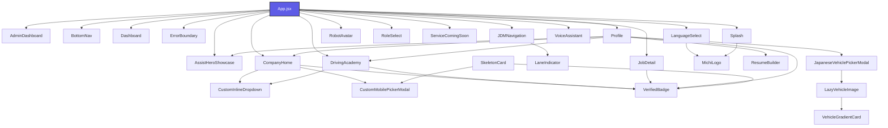

# Michi Ilovasi: Loyiha Arxitekturasi va Mundarija Xaritasi (Codebase Map)

> [!NOTE]
> Ushbu xarita loyihadagi barcha komponentlar bog'liqligi, ma'lumotlar bazalari, utilitlar va skriptlarni avtomatik skanerlash orqali yaratilgan. Oxirgi yangilangan vaqti: **07/09/2026, 17:09:23**.

---

## 📂 Loyiha Fayllari Statistikasi
* **Jami skanerlangan fayllar:** 132 ta
* **React Komponentlari:** 26 ta
* **Komponent Stillari (CSS):** 17 ta
* **Geografiya va Ma'lumotlar Bazalari (data):** 8 ta
* **Unit Testlar (Vitest):** 17 ta
* **Yordamchi Funksiyalar (utils):** 19 ta
* **Avtomatizatsiya Skriptlari (scripts):** 12 ta
* **Tizim va UI Qoidalari (.agents/rules):** 17 ta
* **Boshqa asosiy fayllar (src/ root):** 16 ta

---

## 📊 Komponentlar O'zaro Bog'liqlik Grafigi (Dependency Graph)

---

## 🧩 Asosiy React Komponentlari (Components)

### 📦 [AdminDashboard](file:////Users/kanoatovfarrux/.gemini/antigravity/scratch/michiappforjapan/src/components/AdminDashboard.jsx)
* **Fayl yo'li:** `src/components/AdminDashboard.jsx` (93 qator, 4884 bayt)
* **Komponent Stillari:** 🎨 [AdminDashboard.css](file:////Users/kanoatovfarrux/.gemini/antigravity/scratch/michiappforjapan/src/components/AdminDashboard.css)
* **Qabul qiladigan parametrlari (Props):**
  - `verifiedCompanies`
  - `onToggleVerify`
  - `onLogout`
  - `contractStatus`
  - `setContractStatus`
  - `profileData`
* **Import qilgan bog'liqliklari:**
  - `react`
  - `react-i18next`
  - `lucide-react`

### 📦 [AssistHeroShowcase](file:////Users/kanoatovfarrux/.gemini/antigravity/scratch/michiappforjapan/src/components/AssistHeroShowcase.jsx)
* **Fayl yo'li:** `src/components/AssistHeroShowcase.jsx` (366 qator, 15284 bayt)
* **Komponent Stillari:** 🎨 [AssistHeroShowcase.css](file:////Users/kanoatovfarrux/.gemini/antigravity/scratch/michiappforjapan/src/components/AssistHeroShowcase.css)
* **Qabul qiladigan parametrlari (Props):**
  - `onBack`
  - `isVoiceActive`
  - `onToggleVoice`
  - `onActivateVoice`
  - `darkMode`
* **Import qilgan bog'liqliklari:**
  - `react`
  - `react-i18next`
  - `lucide-react`

### 📦 [BottomNav](file:////Users/kanoatovfarrux/.gemini/antigravity/scratch/michiappforjapan/src/components/BottomNav.jsx)
* **Fayl yo'li:** `src/components/BottomNav.jsx` (172 qator, 6055 bayt)
* **Komponent Stillari:** 🎨 [BottomNav.css](file:////Users/kanoatovfarrux/.gemini/antigravity/scratch/michiappforjapan/src/components/BottomNav.css)
* **Qabul qiladigan parametrlari (Props):**
  - `activeTab`
  - `setActiveTab`
  - `unreadCount`
  - `userRole`
  - `isVoiceStandby`
  - `isVoiceActive`
  - `voiceStatus`
* **Import qilgan bog'liqliklari:**
  - `react`
  - `react-i18next`
  - `lucide-react`
  - `../utils/haptics`

### 📦 [CompanyHome](file:////Users/kanoatovfarrux/.gemini/antigravity/scratch/michiappforjapan/src/components/CompanyHome.jsx)
* **Fayl yo'li:** `src/components/CompanyHome.jsx` (1981 qator, 87613 bayt)
* **Unit Testlari:** 🧪 [CompanyHome.test.jsx](file:////Users/kanoatovfarrux/.gemini/antigravity/scratch/michiappforjapan/src/components/CompanyHome.test.jsx)
* **Qabul qiladigan parametrlari (Props):**
  - `onJobClick`
  - `onSchoolClick`
  - `jobs`
  - `setJobs`
  - `schools`
  - `setSchools`
  - `profileData`
  - `jobToEdit`
  - `setJobToEdit`
  - `onFormToggle`
  - `onApply`
  - `onApplySchool`
  - `onShoukai`
  - `applications`
  - `schoolApplications`
* **Import qilgan bog'liqliklari:**
  - `react`
  - `react-i18next`
  - `lucide-react`
  - `./VerifiedBadge`
  - `./CustomMobilePickerModal`
  - `./CustomInlineDropdown`
  - `../utils/imageCompressor`
  - `../utils/japaneseZipcodeLookup`
  - `../data/japanRegions.js`
  - `../data/japanCities.js`
  - `../data/japanStations.js`
  - `../data/jobCategories`

### 📦 [CustomInlineDropdown](file:////Users/kanoatovfarrux/.gemini/antigravity/scratch/michiappforjapan/src/components/CustomInlineDropdown.jsx)
* **Fayl yo'li:** `src/components/CustomInlineDropdown.jsx` (268 qator, 9689 bayt)
* **Unit Testlari:** 🧪 [CustomInlineDropdown.test.jsx](file:////Users/kanoatovfarrux/.gemini/antigravity/scratch/michiappforjapan/src/components/CustomInlineDropdown.test.jsx)
* **Qabul qiladigan parametrlari (Props):**
  - `label`
  - `required`
  - `value`
  - `options`
  - `placeholder`
  - `onChange`
  - `error`
  - `allowCustom`
  - `customPlaceholder`
* **Import qilgan bog'liqliklari:**
  - `react`
  - `react-dom`
  - `lucide-react`

### 📦 [CustomMobilePickerModal](file:////Users/kanoatovfarrux/.gemini/antigravity/scratch/michiappforjapan/src/components/CustomMobilePickerModal.jsx)
* **Fayl yo'li:** `src/components/CustomMobilePickerModal.jsx` (292 qator, 11041 bayt)
* **Unit Testlari:** 🧪 [CustomMobilePickerModal.test.jsx](file:////Users/kanoatovfarrux/.gemini/antigravity/scratch/michiappforjapan/src/components/CustomMobilePickerModal.test.jsx)
* **Qabul qiladigan parametrlari (Props):**
  - `isOpen`
  - `onClose`
  - `title`
  - `items`
  - `options`
  - `selectedValue`
  - `onSelect`
  - `allowCustom`
* **Import qilgan bog'liqliklari:**
  - `react`
  - `react-i18next`
  - `lucide-react`

### 📦 [Dashboard](file:////Users/kanoatovfarrux/.gemini/antigravity/scratch/michiappforjapan/src/components/Dashboard.jsx)
* **Fayl yo'li:** `src/components/Dashboard.jsx` (637 qator, 27745 bayt)
* **Komponent Stillari:** 🎨 [Dashboard.css](file:////Users/kanoatovfarrux/.gemini/antigravity/scratch/michiappforjapan/src/components/Dashboard.css)
* **Qabul qiladigan parametrlari (Props):**
  - `setActiveTab`
  - `profileData`
  - `musicPlayer`
  - `isVoiceStandby`
  - `isVoiceActive`
  - `onVoiceActivate`
  - `onVoiceToggle`
  - `setProfileActivePage`
  - `setProfileActivePageSource`
  - `userRole`
  - `onNavigateToInternational`
  - `onNavigateToJDM`
  - `onOpenAssistShowcase`
* **Import qilgan bog'liqliklari:**
  - `react`
  - `react-i18next`
  - `lucide-react`
  - `../utils/haptics`

### 📦 [SkeletonCard](file:////Users/kanoatovfarrux/.gemini/antigravity/scratch/michiappforjapan/src/components/DriverFeed.jsx)
* **Fayl yo'li:** `src/components/DriverFeed.jsx` (1984 qator, 95235 bayt)
* **Komponent Stillari:** 🎨 [DriverFeed.css](file:////Users/kanoatovfarrux/.gemini/antigravity/scratch/michiappforjapan/src/components/DriverFeed.css)
* **Unit Testlari:** 🧪 [DriverFeed.test.jsx](file:////Users/kanoatovfarrux/.gemini/antigravity/scratch/michiappforjapan/src/components/DriverFeed.test.jsx)
* **Qabul qiladigan parametrlari (Props):**
  - *Parametrlar mavjud emas*
* **Import qilgan bog'liqliklari:**
  - `react`
  - `react-dom`
  - `react-i18next`
  - `lucide-react`
  - `leaflet`
  - `./VerifiedBadge`
  - `./CustomMobilePickerModal`
  - `../data/japanLocationDB`
  - `../data/jobCategories`
  - `../data/jobFeatures`

### 📦 [DrivingAcademy](file:////Users/kanoatovfarrux/.gemini/antigravity/scratch/michiappforjapan/src/components/DrivingAcademy.jsx)
* **Fayl yo'li:** `src/components/DrivingAcademy.jsx` (926 qator, 42404 bayt)
* **Komponent Stillari:** 🎨 [DrivingAcademy.css](file:////Users/kanoatovfarrux/.gemini/antigravity/scratch/michiappforjapan/src/components/DrivingAcademy.css)
* **Unit Testlari:** 🧪 [DrivingAcademy.test.jsx](file:////Users/kanoatovfarrux/.gemini/antigravity/scratch/michiappforjapan/src/components/DrivingAcademy.test.jsx)
* **Qabul qiladigan parametrlari (Props):**
  - `isContractActive`
  - `onApplySchool`
  - `schoolApplications`
  - `onShoukaiPaid`
  - `profileData`
  - `onShoukai`
  - `verifiedCompanies`
  - `onToggleSave`
  - `userRole`
  - `selectedSchool`
  - `setSelectedSchool`
  - `onBackPress`
  - `schools`
  - `setSchools`
  - `onEditJob`
  - `searchQuery`
  - `setSearchQuery`
* **Import qilgan bog'liqliklari:**
  - `react`
  - `react-dom`
  - `react-i18next`
  - `lucide-react`
  - `./VerifiedBadge`
  - `./CustomInlineDropdown`

### 📦 [ErrorBoundary](file:////Users/kanoatovfarrux/.gemini/antigravity/scratch/michiappforjapan/src/components/ErrorBoundary.jsx)
* **Fayl yo'li:** `src/components/ErrorBoundary.jsx` (78 qator, 2647 bayt)
* **Komponent Stillari:** 🎨 [ErrorBoundary.css](file:////Users/kanoatovfarrux/.gemini/antigravity/scratch/michiappforjapan/src/components/ErrorBoundary.css)
* **Qabul qiladigan parametrlari (Props):**
  - *Parametrlar mavjud emas*
* **Import qilgan bog'liqliklari:**
  - `react`
  - `lucide-react`

### 📦 [JDMNavigation](file:////Users/kanoatovfarrux/.gemini/antigravity/scratch/michiappforjapan/src/components/JDMNavigation.jsx)
* **Fayl yo'li:** `src/components/JDMNavigation.jsx` (4708 qator, 210672 bayt)
* **Komponent Stillari:** 🎨 [JDMNavigation.css](file:////Users/kanoatovfarrux/.gemini/antigravity/scratch/michiappforjapan/src/components/JDMNavigation.css)
* **Unit Testlari:** 🧪 [JDMNavigation.test.jsx](file:////Users/kanoatovfarrux/.gemini/antigravity/scratch/michiappforjapan/src/components/JDMNavigation.test.jsx)
* **Qabul qiladigan parametrlari (Props):**
  - `onBack`
  - `showJDMNavigation`
  - `darkMode`
* **Import qilgan bog'liqliklari:**
  - `react`
  - `react-i18next`
  - `lucide-react`
  - `../utils/haptics`
  - `maplibre-gl`
  - `react-map-gl/maplibre`
  - `../utils/mlitRestrictions`
  - `../utils/turnInstructions`
  - `../utils/overpassRestrictions`
  - `../utils/offlineTileDownloader`
  - `../utils/deadReckoning`
  - `../utils/voiceGuidance`
  - `./LaneIndicator`
  - `../utils/offlineManager`
  - `../utils/gpsMatching`
  - `../utils/bookmarkManager`
  - `../utils/poiSearch`

### 📦 [JapaneseVehiclePickerModal](file:////Users/kanoatovfarrux/.gemini/antigravity/scratch/michiappforjapan/src/components/JapaneseVehiclePickerModal.jsx)
* **Fayl yo'li:** `src/components/JapaneseVehiclePickerModal.jsx` (393 qator, 15952 bayt)
* **Qabul qiladigan parametrlari (Props):**
  - `isOpen`
  - `onClose`
  - `onSelectVehicle`
  - `selectedVehicleId`
* **Import qilgan bog'liqliklari:**
  - `react`
  - `react-i18next`
  - `lucide-react`
  - `../services/vehicleApiService`
  - `../data/japaneseVehiclesMaster`
  - `./LazyVehicleImage`

### 📦 [JobDetail](file:////Users/kanoatovfarrux/.gemini/antigravity/scratch/michiappforjapan/src/components/JobDetail.jsx)
* **Fayl yo'li:** `src/components/JobDetail.jsx` (406 qator, 20231 bayt)
* **Komponent Stillari:** 🎨 [JobDetail.css](file:////Users/kanoatovfarrux/.gemini/antigravity/scratch/michiappforjapan/src/components/JobDetail.css)
* **Qabul qiladigan parametrlari (Props):**
  - `job`
  - `onBack`
  - `onApply`
  - `onShoukai`
  - `applications`
  - `onToggleSave`
  - `profileData`
  - `userRole`
  - `onEditJob`
* **Import qilgan bog'liqliklari:**
  - `react`
  - `react-i18next`
  - `lucide-react`
  - `./VerifiedBadge`

### 📦 [LaneIndicator](file:////Users/kanoatovfarrux/.gemini/antigravity/scratch/michiappforjapan/src/components/LaneIndicator.jsx)
* **Fayl yo'li:** `src/components/LaneIndicator.jsx` (90 qator, 2830 bayt)
* **Qabul qiladigan parametrlari (Props):**
  - `lanes`
  - `theme`
* **Import qilgan bog'liqliklari:**
  - `react`
  - `../utils/laneGuidance`

### 📦 [LanguageSelect](file:////Users/kanoatovfarrux/.gemini/antigravity/scratch/michiappforjapan/src/components/LanguageSelect.jsx)
* **Fayl yo'li:** `src/components/LanguageSelect.jsx` (62 qator, 2318 bayt)
* **Komponent Stillari:** 🎨 [LanguageSelect.css](file:////Users/kanoatovfarrux/.gemini/antigravity/scratch/michiappforjapan/src/components/LanguageSelect.css)
* **Qabul qiladigan parametrlari (Props):**
  - `onFinish`
* **Import qilgan bog'liqliklari:**
  - `react`
  - `react-i18next`
  - `lucide-react`
  - `./MichiLogo`

### 📦 [LazyVehicleImage](file:////Users/kanoatovfarrux/.gemini/antigravity/scratch/michiappforjapan/src/components/LazyVehicleImage.jsx)
* **Fayl yo'li:** `src/components/LazyVehicleImage.jsx` (125 qator, 3738 bayt)
* **Unit Testlari:** 🧪 [LazyVehicleImage.test.jsx](file:////Users/kanoatovfarrux/.gemini/antigravity/scratch/michiappforjapan/src/components/LazyVehicleImage.test.jsx)
* **Qabul qiladigan parametrlari (Props):**
  - `make`
  - `model`
  - `photoUrl`
  - `bodyStyle`
  - `type`
  - `height`
  - `onPhotoLoaded`
* **Import qilgan bog'liqliklari:**
  - `react`
  - `../services/vehicleApiService`
  - `./VehicleGradientCard`

### 📦 [MichiLogo](file:////Users/kanoatovfarrux/.gemini/antigravity/scratch/michiappforjapan/src/components/MichiLogo.jsx)
* **Fayl yo'li:** `src/components/MichiLogo.jsx` (28 qator, 776 bayt)
* **Qabul qiladigan parametrlari (Props):**
  - `size`
  - `fontSize`
  - `borderRadius`
  - `className`
* **Import qilgan bog'liqliklari:**
  - `react`

### 📦 [Profile](file:////Users/kanoatovfarrux/.gemini/antigravity/scratch/michiappforjapan/src/components/Profile.jsx)
* **Fayl yo'li:** `src/components/Profile.jsx` (5871 qator, 300049 bayt)
* **Komponent Stillari:** 🎨 [Profile.css](file:////Users/kanoatovfarrux/.gemini/antigravity/scratch/michiappforjapan/src/components/Profile.css)
* **Qabul qiladigan parametrlari (Props):**
  - `onLogout`
  - `contractStatus`
  - `setContractStatus`
  - `profileData`
  - `userRole`
  - `onChangeLanguage`
  - `onUpdateProfile`
  - `applications`
  - `onChangeAppStatus`
  - `notifications`
  - `onMarkRead`
  - `onMarkAllRead`
  - `unreadCount`
  - `darkMode`
  - `setDarkMode`
  - `soundSettings`
  - `setSoundSettings`
  - `companyEmployees`
  - `onAddEmployee`
  - `onAcceptEmployeeRequest`
  - `setNotifications`
  - `schoolApplications`
  - `onShoukaiPaid`
  - `onNavigate`
  - `activePage`
  - `setActivePage`
  - `profileActivePageSource`
  - `setProfileActivePageSource`
  - `onJobClick`
  - `onSchoolClick`
  - `showProfileBadges`
  - `setShowProfileBadges`
  - `notificationSound`
  - `setNotificationSound`
  - `jobs`
  - `schools`
  - `setJobs`
  - `setSchools`
  - `jobToEdit`
  - `setJobToEdit`
  - `onApply`
  - `onApplySchool`
  - `onShoukai`
  - `onTriggerRegister`
  - `isVoiceActive`
  - `setIsVoiceActive`
  - `isVoiceStandby`
  - `setIsVoiceStandby`
* **Import qilgan bog'liqliklari:**
  - `react`
  - `react-i18next`
  - `lucide-react`
  - `../utils/imageCompressor`
  - `./DriverFeed`
  - `./DrivingAcademy`
  - `./VerifiedBadge`
  - `./CompanyHome`
  - `./ResumeBuilder`
  - `./AssistHeroShowcase`
  - `./JapaneseVehiclePickerModal`
  - `../services/vehicleApiService`
  - `../data/japaneseVehiclesMaster`

### 📦 [ResumeBuilder](file:////Users/kanoatovfarrux/.gemini/antigravity/scratch/michiappforjapan/src/components/ResumeBuilder.jsx)
* **Fayl yo'li:** `src/components/ResumeBuilder.jsx` (1271 qator, 51913 bayt)
* **Komponent Stillari:** 🎨 [ResumeBuilder.css](file:////Users/kanoatovfarrux/.gemini/antigravity/scratch/michiappforjapan/src/components/ResumeBuilder.css)
* **Qabul qiladigan parametrlari (Props):**
  - `profileData`
  - `onUpdateProfile`
  - `onBack`
  - `isVoiceActive`
  - `setIsVoiceActive`
  - `isVoiceStandby`
  - `setIsVoiceStandby`
* **Import qilgan bog'liqliklari:**
  - `react`
  - `react-i18next`
  - `lucide-react`
  - `../utils/resumeGenerator`

### 📦 [RobotAvatar](file:////Users/kanoatovfarrux/.gemini/antigravity/scratch/michiappforjapan/src/components/RobotAvatar.jsx)
* **Fayl yo'li:** `src/components/RobotAvatar.jsx` (52 qator, 1941 bayt)
* **Komponent Stillari:** 🎨 [RobotAvatar.css](file:////Users/kanoatovfarrux/.gemini/antigravity/scratch/michiappforjapan/src/components/RobotAvatar.css)
* **Qabul qiladigan parametrlari (Props):**
  - `isVoiceActive`
  - `voiceStatus`
  - `onClick`
* **Import qilgan bog'liqliklari:**
  - `react`
  - `react-i18next`

### 📦 [RoleSelect](file:////Users/kanoatovfarrux/.gemini/antigravity/scratch/michiappforjapan/src/components/RoleSelect.jsx)
* **Fayl yo'li:** `src/components/RoleSelect.jsx` (1132 qator, 55242 bayt)
* **Komponent Stillari:** 🎨 [RoleSelect.css](file:////Users/kanoatovfarrux/.gemini/antigravity/scratch/michiappforjapan/src/components/RoleSelect.css)
* **Qabul qiladigan parametrlari (Props):**
  - `onSelectRole`
  - `onGuest`
  - `initialStep`
* **Import qilgan bog'liqliklari:**
  - `react`
  - `react-i18next`
  - `lucide-react`
  - `../utils/imageCompressor`

### 📦 [ServiceComingSoon](file:////Users/kanoatovfarrux/.gemini/antigravity/scratch/michiappforjapan/src/components/ServiceComingSoon.jsx)
* **Fayl yo'li:** `src/components/ServiceComingSoon.jsx` (21 qator, 615 bayt)
* **Komponent Stillari:** 🎨 [ServiceComingSoon.css](file:////Users/kanoatovfarrux/.gemini/antigravity/scratch/michiappforjapan/src/components/ServiceComingSoon.css)
* **Qabul qiladigan parametrlari (Props):**
  - *Parametrlar mavjud emas*
* **Import qilgan bog'liqliklari:**
  - `react`
  - `react-i18next`
  - `lucide-react`

### 📦 [Splash](file:////Users/kanoatovfarrux/.gemini/antigravity/scratch/michiappforjapan/src/components/Splash.jsx)
* **Fayl yo'li:** `src/components/Splash.jsx` (22 qator, 599 bayt)
* **Komponent Stillari:** 🎨 [Splash.css](file:////Users/kanoatovfarrux/.gemini/antigravity/scratch/michiappforjapan/src/components/Splash.css)
* **Qabul qiladigan parametrlari (Props):**
  - `onFinish`
* **Import qilgan bog'liqliklari:**
  - `react`
  - `./MichiLogo`

### 📦 [VehicleGradientCard](file:////Users/kanoatovfarrux/.gemini/antigravity/scratch/michiappforjapan/src/components/VehicleGradientCard.jsx)
* **Fayl yo'li:** `src/components/VehicleGradientCard.jsx` (130 qator, 4195 bayt)
* **Unit Testlari:** 🧪 [VehicleGradientCard.test.jsx](file:////Users/kanoatovfarrux/.gemini/antigravity/scratch/michiappforjapan/src/components/VehicleGradientCard.test.jsx)
* **Qabul qiladigan parametrlari (Props):**
  - `make`
  - `model`
  - `bodyStyle`
  - `type`
  - `height`
* **Import qilgan bog'liqliklari:**
  - `react`
  - `lucide-react`

### 📦 [VerifiedBadge](file:////Users/kanoatovfarrux/.gemini/antigravity/scratch/michiappforjapan/src/components/VerifiedBadge.jsx)
* **Fayl yo'li:** `src/components/VerifiedBadge.jsx` (29 qator, 830 bayt)
* **Qabul qiladigan parametrlari (Props):**
  - `size`
* **Import qilgan bog'liqliklari:**
  - `react`

### 📦 [VoiceAssistant](file:////Users/kanoatovfarrux/.gemini/antigravity/scratch/michiappforjapan/src/components/VoiceAssistant.jsx)
* **Fayl yo'li:** `src/components/VoiceAssistant.jsx` (3188 qator, 136058 bayt)
* **Komponent Stillari:** 🎨 [VoiceAssistant.css](file:////Users/kanoatovfarrux/.gemini/antigravity/scratch/michiappforjapan/src/components/VoiceAssistant.css)
* **Qabul qiladigan parametrlari (Props):**
  - `isActive`
  - `onClose`
  - `onStartVoice`
  - `isVoiceStandby`
  - `setIsVoiceStandby`
  - `setActiveTab`
  - `musicPlayer`
  - `onStatusChange`
  - `activeTab`
  - `jobs`
  - `schools`
  - `profileData`
  - `applications`
  - `selectedJob`
  - `selectedSchool`
  - `setSelectedJob`
  - `setSelectedSchool`
  - `setProfileActivePage`
  - `setJobSearchQuery`
  - `setJobActiveSegment`
  - `setAcademySearchQuery`
  - `handleApplyJob`
  - `handleApplySchool`
  - `handleShoukai`
  - `userRole`
  - `selectedLicenses`
  - `setSelectedLicenses`
  - `selectedLangLevel`
  - `setSelectedLangLevel`
  - `selectedBenefits`
  - `setSelectedBenefits`
  - `minSalary`
  - `setMinSalary`
  - `selectedPrefecture`
  - `setSelectedPrefecture`
  - `setApplications`
  - `toggleDarkMode`
* **Import qilgan bog'liqliklari:**
  - `react`
  - `react-i18next`
  - `lucide-react`
  - `../utils/voiceLexicon`

---

## 🗄️ Ma'lumotlar Bazalari va Modullar (Data Services)

### 🗄️ [japanCities.js](file:////Users/kanoatovfarrux/.gemini/antigravity/scratch/michiappforjapan/src/data/japanCities.js)
* **Yo'li:** `src/data/japanCities.js` (649 qator, 29703 bayt)
* **Eksport qilingan obyektlar/strukturalar:**
  - `getCitiesByPrefecture`
  - `JAPAN_CITIES_BY_PREFECTURE`

### 🗄️ [japanLocationDB.js](file:////Users/kanoatovfarrux/.gemini/antigravity/scratch/michiappforjapan/src/data/japanLocationDB.js)
* **Yo'li:** `src/data/japanLocationDB.js` (562 qator, 18190 bayt)
* **Eksport qilingan obyektlar/strukturalar:**
  - `getAllTrainLines`
  - `getAllCities`
  - `REGIONS`
  - `PREFECTURES`
  - `CITIES_BY_PREFECTURE`
  - `TRAIN_LINES_BY_PREFECTURE`

### 🗄️ [japanRegions.js](file:////Users/kanoatovfarrux/.gemini/antigravity/scratch/michiappforjapan/src/data/japanRegions.js)
* **Yo'li:** `src/data/japanRegions.js` (124 qator, 5306 bayt)
* **Eksport qilingan obyektlar/strukturalar:**
  - `JAPAN_REGIONS`
  - `ALL_47_PREFECTURES`

### 🗄️ [japanStations.js](file:////Users/kanoatovfarrux/.gemini/antigravity/scratch/michiappforjapan/src/data/japanStations.js)
* **Yo'li:** `src/data/japanStations.js` (266 qator, 12437 bayt)
* **Eksport qilingan obyektlar/strukturalar:**
  - `getAllTrainLineOptions`
  - `getStationsByLine`
  - `getStationsByPrefecture`
  - `JAPAN_STATIONS_BY_PREFECTURE`

### 🗄️ [japaneseVehiclesDb.js](file:////Users/kanoatovfarrux/.gemini/antigravity/scratch/michiappforjapan/src/data/japaneseVehiclesDb.js)
* **Yo'li:** `src/data/japaneseVehiclesDb.js` (306 qator, 9116 bayt)
* **Eksport qilingan obyektlar/strukturalar:**
  - `queryJapaneseVehicles`
  - `JAPANESE_AUTOMAKERS`
  - `HISTORICAL_ERAS`
  - `JAPANESE_VEHICLE_DATABASE`

### 🗄️ [japaneseVehiclesMaster.js](file:////Users/kanoatovfarrux/.gemini/antigravity/scratch/michiappforjapan/src/data/japaneseVehiclesMaster.js)
* **Yo'li:** `src/data/japaneseVehiclesMaster.js` (145 qator, 21452 bayt)
* **Eksport qilingan obyektlar/strukturalar:**
  - `queryMasterJapaneseVehicles`
  - `JAPANESE_AUTOMAKERS_MASTER`
  - `JAPANESE_HISTORICAL_ERAS`
  - `MASTER_VEHICLE_DATABASE`

### 🗄️ [jobCategories.js](file:////Users/kanoatovfarrux/.gemini/antigravity/scratch/michiappforjapan/src/data/jobCategories.js)
* **Yo'li:** `src/data/jobCategories.js` (39 qator, 3163 bayt)
* **Eksport qilingan obyektlar/strukturalar:**
  - `JOB_CATEGORIES`

### 🗄️ [jobFeatures.js](file:////Users/kanoatovfarrux/.gemini/antigravity/scratch/michiappforjapan/src/data/jobFeatures.js)
* **Yo'li:** `src/data/jobFeatures.js` (144 qator, 7026 bayt)
* **Eksport qilingan obyektlar/strukturalar:**
  - `JOB_FEATURES`

---

## 🛠️ Yordamchi Funksiyalar (Utils)

### ⚙️ [bookmarkManager.js](file:////Users/kanoatovfarrux/.gemini/antigravity/scratch/michiappforjapan/src/utils/bookmarkManager.js)
* **Yo'li:** `src/utils/bookmarkManager.js` (139 qator, 4281 bayt)
* **Eksport qilingan funksiyalari:**
  - `loadBookmarks()`
  - `addBookmark()`
  - `removeBookmark()`
  - `updateBookmark()`
  - `getBookmarksByCategory()`
  - `exportBookmarks()`
  - `importBookmarks()`
  - `BOOKMARK_CATEGORIES()`
* **Importlari:** *Yo'q*

### ⚙️ [deadReckoning.js](file:////Users/kanoatovfarrux/.gemini/antigravity/scratch/michiappforjapan/src/utils/deadReckoning.js)
* **Yo'li:** `src/utils/deadReckoning.js` (144 qator, 4734 bayt)
* **Eksport qilingan funksiyalari:**
  - `getDistanceMeters()`
  - `findClosestSegmentIndex()`
  - `extrapolatePositionAlongRoute()`
  - `isPositionInTunnel()`
* **Importlari:** *Yo'q*

### ⚙️ [gpsMatching.js](file:////Users/kanoatovfarrux/.gemini/antigravity/scratch/michiappforjapan/src/utils/gpsMatching.js)
* **Yo'li:** `src/utils/gpsMatching.js` (135 qator, 4698 bayt)
* **Eksport qilingan funksiyalari:**
  - `getDistance()`
  - `projectPointOnSegment()`
  - `snapToRoute()`
  - `smoothBearing()`
  - `isOffRoute()`
* **Importlari:** *Yo'q*

### ⚙️ [haptics.js](file:////Users/kanoatovfarrux/.gemini/antigravity/scratch/michiappforjapan/src/utils/haptics.js)
* **Yo'li:** `src/utils/haptics.js` (38 qator, 1142 bayt)
* **Eksport qilingan funksiyalari:**
  - `playHapticClick()`
* **Importlari:** *Yo'q*

### ⚙️ [imageCompressor.js](file:////Users/kanoatovfarrux/.gemini/antigravity/scratch/michiappforjapan/src/utils/imageCompressor.js)
* **Yo'li:** `src/utils/imageCompressor.js` (62 qator, 2198 bayt)
* **Eksport qilingan funksiyalari:**
  - `compressImage()`
* **Importlari:** *Yo'q*

### ⚙️ [japaneseEra.js](file:////Users/kanoatovfarrux/.gemini/antigravity/scratch/michiappforjapan/src/utils/japaneseEra.js)
* **Yo'li:** `src/utils/japaneseEra.js` (97 qator, 2477 bayt)
* **Eksport qilingan funksiyalari:**
  - `getEraInfo()`
  - `toJapaneseEra()`
  - `calculateAge()`
  - `toJapaneseEraYear()`
* **Importlari:** *Yo'q*

### ⚙️ [japaneseZipcodeLookup.js](file:////Users/kanoatovfarrux/.gemini/antigravity/scratch/michiappforjapan/src/utils/japaneseZipcodeLookup.js)
* **Yo'li:** `src/utils/japaneseZipcodeLookup.js` (205 qator, 8312 bayt)
* **Eksport qilingan funksiyalari:**
  - `getPrefectureByPostalPrefix()`
  - `cleanAddressKanji()`
  - `JAPAN_PREFECTURE_MAP()`
* **Importlari:** *Yo'q*

### ⚙️ [jobPostingNormalizer.js](file:////Users/kanoatovfarrux/.gemini/antigravity/scratch/michiappforjapan/src/utils/jobPostingNormalizer.js)
* **Yo'li:** `src/utils/jobPostingNormalizer.js` (71 qator, 3709 bayt)
* **Eksport qilingan funksiyalari:**
  - `normalizeJobPosting()`
* **Importlari:** *Yo'q*

### ⚙️ [laneGuidance.js](file:////Users/kanoatovfarrux/.gemini/antigravity/scratch/michiappforjapan/src/utils/laneGuidance.js)
* **Yo'li:** `src/utils/laneGuidance.js` (181 qator, 6488 bayt)
* **Eksport qilingan funksiyalari:**
  - `parseTurnLanes()`
  - `evaluateLaneValidity()`
  - `getLaneArrowPath()`
  - `getLaneGuidanceForStep()`
  - `estimateLanesFromStep()`
* **Importlari:** *Yo'q*

### ⚙️ [mlitRestrictions.js](file:////Users/kanoatovfarrux/.gemini/antigravity/scratch/michiappforjapan/src/utils/mlitRestrictions.js)
* **Yo'li:** `src/utils/mlitRestrictions.js` (157 qator, 4959 bayt)
* **Eksport qilingan funksiyalari:**
  - `checkClearanceLimits()`
  - `MLIT_RESTRICTIONS()`
* **Importlari:** *Yo'q*

### ⚙️ [offlineManager.js](file:////Users/kanoatovfarrux/.gemini/antigravity/scratch/michiappforjapan/src/utils/offlineManager.js)
* **Yo'li:** `src/utils/offlineManager.js` (120 qator, 3515 bayt)
* **Eksport qilingan funksiyalari:**
  - `generateRouteKey()`
  - `getPrefectureTilePresets()`
* **Importlari:** *Yo'q*

### ⚙️ [offlineTileDownloader.js](file:////Users/kanoatovfarrux/.gemini/antigravity/scratch/michiappforjapan/src/utils/offlineTileDownloader.js)
* **Yo'li:** `src/utils/offlineTileDownloader.js` (148 qator, 5032 bayt)
* **Eksport qilingan funksiyalari:**
  - `generateRegionTileUrls()`
  - `getPrefectureTilePresets()`
* **Importlari:** *Yo'q*

### ⚙️ [overpassRestrictions.js](file:////Users/kanoatovfarrux/.gemini/antigravity/scratch/michiappforjapan/src/utils/overpassRestrictions.js)
* **Yo'li:** `src/utils/overpassRestrictions.js` (469 qator, 15064 bayt)
* **Eksport qilingan funksiyalari:**
  - `checkOverpassRestrictions()`
  - `mergeRestrictionResults()`
* **Importlari:** *Yo'q*

### ⚙️ [poiSearch.js](file:////Users/kanoatovfarrux/.gemini/antigravity/scratch/michiappforjapan/src/utils/poiSearch.js)
* **Yo'li:** `src/utils/poiSearch.js` (134 qator, 3682 bayt)
* **Eksport qilingan funksiyalari:**
  - `getAvailablePOITypes()`
* **Importlari:** *Yo'q*

### ⚙️ [resumeGenerator.js](file:////Users/kanoatovfarrux/.gemini/antigravity/scratch/michiappforjapan/src/utils/resumeGenerator.js)
* **Yo'li:** `src/utils/resumeGenerator.js` (565 qator, 19537 bayt)
* **Eksport qilingan funksiyalari:**
  - *Eksportlar aniqlanmadi*
* **Importlari:** `pdfmake/build/pdfmake`, `./japaneseEra`

### ⚙️ [turnInstructions.js](file:////Users/kanoatovfarrux/.gemini/antigravity/scratch/michiappforjapan/src/utils/turnInstructions.js)
* **Yo'li:** `src/utils/turnInstructions.js` (698 qator, 23389 bayt)
* **Eksport qilingan funksiyalari:**
  - `translateJaInstructionToUz()`
  - `calculateBearing()`
  - `classifyTurnAngle()`
  - `formatDistanceJa()`
  - `parseOSRMSteps()`
  - `getRemainingMetrics()`
  - `getCountdownText()`
  - `mapValhallaTypeToOSRM()`
  - `parseValhallaSteps()`
  - `decodePolyline6()`
* **Importlari:** `./turnRadiusPhysics`, `./laneGuidance`

### ⚙️ [turnRadiusPhysics.js](file:////Users/kanoatovfarrux/.gemini/antigravity/scratch/michiappforjapan/src/utils/turnRadiusPhysics.js)
* **Yo'li:** `src/utils/turnRadiusPhysics.js` (410 qator, 12621 bayt)
* **Eksport qilingan funksiyalari:**
  - `calculateInnerWheelDiff()`
  - `calculateOutswing()`
  - `calculateSweptPathWidth()`
  - `evaluateTurnFeasibility()`
  - `VEHICLE_PHYSICS()`
* **Importlari:** *Yo'q*

### ⚙️ [voiceGuidance.js](file:////Users/kanoatovfarrux/.gemini/antigravity/scratch/michiappforjapan/src/utils/voiceGuidance.js)
* **Yo'li:** `src/utils/voiceGuidance.js` (274 qator, 6962 bayt)
* **Eksport qilingan funksiyalari:**
  - `setSpeechLanguage()`
  - `setSpeechVolume()`
  - `setSpeechRate()`
  - `setSpeechPitch()`
  - `setWarningOnlyMode()`
  - `initVoiceGuidance()`
  - `speak()`
  - `speakManeuver()`
  - `translateWarningToUz()`
  - `speakWarning()`
  - `speakArrival()`
  - `speakRerouting()`
  - `toggleMute()`
  - `isSpeechMuted()`
  - `stopSpeech()`
* **Importlari:** `./turnInstructions`

### ⚙️ [voiceLexicon.js](file:////Users/kanoatovfarrux/.gemini/antigravity/scratch/michiappforjapan/src/utils/voiceLexicon.js)
* **Yo'li:** `src/utils/voiceLexicon.js` (384 qator, 14149 bayt)
* **Eksport qilingan funksiyalari:**
  - `getSimilarity()`
  - `VOICE_LEXICON()`
  - `matchLexiconCommand()`
* **Importlari:** *Yo'q*

---

## 🤖 Avtomatizatsiya va Tekshiruv Skriptlari (Scripts)

### 🛠️ [analyze_code_logic.mjs](file:////Users/kanoatovfarrux/.gemini/antigravity/scratch/michiappforjapan/scripts/analyze_code_logic.mjs)
* **Yo'li:** `scripts/analyze_code_logic.mjs` (166 qator, 5748 bayt)

### 🛠️ [deep_ui_audit.mjs](file:////Users/kanoatovfarrux/.gemini/antigravity/scratch/michiappforjapan/scripts/deep_ui_audit.mjs)
* **Yo'li:** `scripts/deep_ui_audit.mjs` (176 qator, 6700 bayt)

### 🛠️ [generate_codebase_map.js](file:////Users/kanoatovfarrux/.gemini/antigravity/scratch/michiappforjapan/scripts/generate_codebase_map.js)
* **Yo'li:** `scripts/generate_codebase_map.js` (316 qator, 10307 bayt)

### 🛠️ [generate_extra_role_screenshots.js](file:////Users/kanoatovfarrux/.gemini/antigravity/scratch/michiappforjapan/scripts/generate_extra_role_screenshots.js)
* **Yo'li:** `scripts/generate_extra_role_screenshots.js` (69 qator, 2380 bayt)

### 🛠️ [generate_pdf_report.js](file:////Users/kanoatovfarrux/.gemini/antigravity/scratch/michiappforjapan/scripts/generate_pdf_report.js)
* **Yo'li:** `scripts/generate_pdf_report.js` (445 qator, 16774 bayt)

### 🛠️ [generate_screenshots.js](file:////Users/kanoatovfarrux/.gemini/antigravity/scratch/michiappforjapan/scripts/generate_screenshots.js)
* **Yo'li:** `scripts/generate_screenshots.js` (222 qator, 7894 bayt)

### 🛠️ [health_check.mjs](file:////Users/kanoatovfarrux/.gemini/antigravity/scratch/michiappforjapan/scripts/health_check.mjs)
* **Yo'li:** `scripts/health_check.mjs` (271 qator, 8843 bayt)

### 🛠️ [validate_i18n.mjs](file:////Users/kanoatovfarrux/.gemini/antigravity/scratch/michiappforjapan/scripts/validate_i18n.mjs)
* **Yo'li:** `scripts/validate_i18n.mjs` (152 qator, 5301 bayt)

### 🛠️ [validate_layout.mjs](file:////Users/kanoatovfarrux/.gemini/antigravity/scratch/michiappforjapan/scripts/validate_layout.mjs)
* **Yo'li:** `scripts/validate_layout.mjs` (96 qator, 2818 bayt)

### 🛠️ [validate_vehicle_db.mjs](file:////Users/kanoatovfarrux/.gemini/antigravity/scratch/michiappforjapan/scripts/validate_vehicle_db.mjs)
* **Yo'li:** `scripts/validate_vehicle_db.mjs` (216 qator, 7368 bayt)

### 🛠️ [verify_all_47_cities.mjs](file:////Users/kanoatovfarrux/.gemini/antigravity/scratch/michiappforjapan/scripts/verify_all_47_cities.mjs)
* **Yo'li:** `scripts/verify_all_47_cities.mjs` (68 qator, 2326 bayt)

### 🛠️ [verify_all_47_stations.mjs](file:////Users/kanoatovfarrux/.gemini/antigravity/scratch/michiappforjapan/scripts/verify_all_47_stations.mjs)
* **Yo'li:** `scripts/verify_all_47_stations.mjs` (71 qator, 2703 bayt)

---

## 📜 Tizim va UI Invariant Qoidalari (.agents/rules)

### 📜 [01_dashboard.md](file:////Users/kanoatovfarrux/.gemini/antigravity/scratch/michiappforjapan/.agents/rules/pages/01_dashboard.md)
* **Yo'li:** `.agents/rules/pages/01_dashboard.md` (46 qator)

### 📜 [02_driver_feed.md](file:////Users/kanoatovfarrux/.gemini/antigravity/scratch/michiappforjapan/.agents/rules/pages/02_driver_feed.md)
* **Yo'li:** `.agents/rules/pages/02_driver_feed.md` (42 qator)

### 📜 [03_driving_academy.md](file:////Users/kanoatovfarrux/.gemini/antigravity/scratch/michiappforjapan/.agents/rules/pages/03_driving_academy.md)
* **Yo'li:** `.agents/rules/pages/03_driving_academy.md` (29 qator)

### 📜 [04_jdm_navigation.md](file:////Users/kanoatovfarrux/.gemini/antigravity/scratch/michiappforjapan/.agents/rules/pages/04_jdm_navigation.md)
* **Yo'li:** `.agents/rules/pages/04_jdm_navigation.md` (23 qator)

### 📜 [05_profile_main.md](file:////Users/kanoatovfarrux/.gemini/antigravity/scratch/michiappforjapan/.agents/rules/pages/05_profile_main.md)
* **Yo'li:** `.agents/rules/pages/05_profile_main.md` (31 qator)

### 📜 [06_my_ads.md](file:////Users/kanoatovfarrux/.gemini/antigravity/scratch/michiappforjapan/.agents/rules/pages/06_my_ads.md)
* **Yo'li:** `.agents/rules/pages/06_my_ads.md` (29 qator)

### 📜 [07_personal_info.md](file:////Users/kanoatovfarrux/.gemini/antigravity/scratch/michiappforjapan/.agents/rules/pages/07_personal_info.md)
* **Yo'li:** `.agents/rules/pages/07_personal_info.md` (29 qator)

### 📜 [08_applications.md](file:////Users/kanoatovfarrux/.gemini/antigravity/scratch/michiappforjapan/.agents/rules/pages/08_applications.md)
* **Yo'li:** `.agents/rules/pages/08_applications.md` (22 qator)

### 📜 [09_saved_items.md](file:////Users/kanoatovfarrux/.gemini/antigravity/scratch/michiappforjapan/.agents/rules/pages/09_saved_items.md)
* **Yo'li:** `.agents/rules/pages/09_saved_items.md` (22 qator)

### 📜 [10_notifications.md](file:////Users/kanoatovfarrux/.gemini/antigravity/scratch/michiappforjapan/.agents/rules/pages/10_notifications.md)
* **Yo'li:** `.agents/rules/pages/10_notifications.md` (22 qator)

### 📜 [11_settings.md](file:////Users/kanoatovfarrux/.gemini/antigravity/scratch/michiappforjapan/.agents/rules/pages/11_settings.md)
* **Yo'li:** `.agents/rules/pages/11_settings.md` (23 qator)

### 📜 [12_platform_about.md](file:////Users/kanoatovfarrux/.gemini/antigravity/scratch/michiappforjapan/.agents/rules/pages/12_platform_about.md)
* **Yo'li:** `.agents/rules/pages/12_platform_about.md` (22 qator)

### 📜 [13_shoukai_referrals.md](file:////Users/kanoatovfarrux/.gemini/antigravity/scratch/michiappforjapan/.agents/rules/pages/13_shoukai_referrals.md)
* **Yo'li:** `.agents/rules/pages/13_shoukai_referrals.md` (22 qator)

### 📜 [14_employee_management.md](file:////Users/kanoatovfarrux/.gemini/antigravity/scratch/michiappforjapan/.agents/rules/pages/14_employee_management.md)
* **Yo'li:** `.agents/rules/pages/14_employee_management.md` (22 qator)

### 📜 [15_filter_drawer.md](file:////Users/kanoatovfarrux/.gemini/antigravity/scratch/michiappforjapan/.agents/rules/pages/15_filter_drawer.md)
* **Yo'li:** `.agents/rules/pages/15_filter_drawer.md` (31 qator)

### 📜 [michi_ui_constraints.md](file:////Users/kanoatovfarrux/.gemini/antigravity/scratch/michiappforjapan/.agents/rules/michi_ui_constraints.md)
* **Yo'li:** `.agents/rules/michi_ui_constraints.md` (45 qator)

### 📜 [past_mistakes.md](file:////Users/kanoatovfarrux/.gemini/antigravity/scratch/michiappforjapan/.agents/rules/past_mistakes.md)
* **Yo'li:** `.agents/rules/past_mistakes.md` (265 qator)

