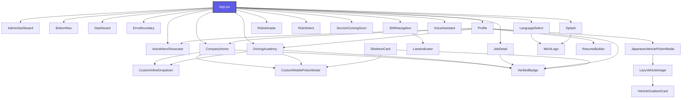
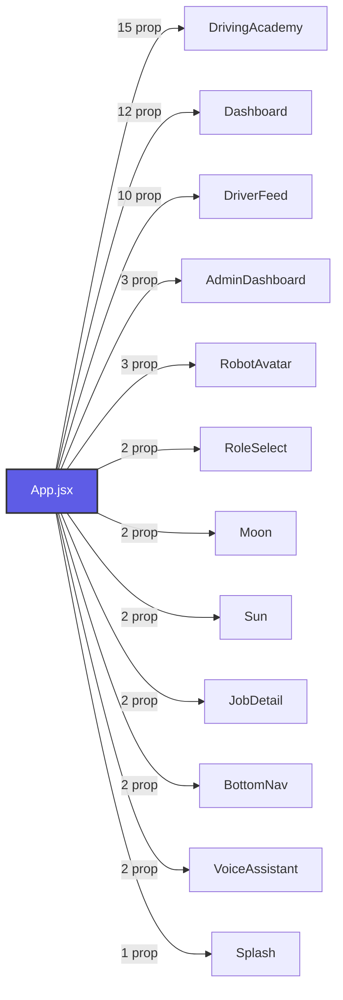

# Michi Ilovasi: Loyiha Arxitekturasi va Mundarija Xaritasi (Codebase Map)

> [!NOTE]
> Ushbu xarita loyihadagi barcha komponentlar bog'liqligi, ma'lumotlar bazalari, utilitlar va skriptlarni avtomatik skanerlash orqali yaratilgan. Oxirgi yangilangan vaqti: **08/09/2026, 19:02:30**.

---

## 📂 Loyiha Fayllari Statistikasi
* **Jami skanerlangan fayllar:** 137 ta
* **React Komponentlari:** 26 ta
* **Komponent Stillari (CSS):** 17 ta
* **Geografiya va Ma'lumotlar Bazalari (data):** 8 ta
* **Unit Testlar (Vitest):** 20 ta
* **Yordamchi Funksiyalar (utils):** 19 ta
* **Tashqi API va Xizmatlar (services):** 1 ta
* **Avtomatizatsiya Skriptlari (scripts):** 14 ta
* **Tizim va UI Qoidalari (.agents/rules):** 18 ta
* **Boshqa asosiy fayllar (src/ root):** 14 ta

---

## 📊 Komponentlar O'zaro Bog'liqlik Grafigi (Dependency Graph)

---

## 🧩 Asosiy React Komponentlari (Components)

### 📦 [AdminDashboard](file:///Users/kanoatovfarrux/.gemini/antigravity/scratch/michiappforjapan/src/components/AdminDashboard.jsx)
* **Fayl yo'li:** `src/components/AdminDashboard.jsx` (93 qator, 4884 bayt)
* **Komponent Stillari:** 🎨 [AdminDashboard.css](file:///Users/kanoatovfarrux/.gemini/antigravity/scratch/michiappforjapan/src/components/AdminDashboard.css)
* **Qabul qiladigan parametrlari (Props):**
  - `verifiedCompanies`
  - `onToggleVerify`
  - `onLogout`
  - `contractStatus`
  - `setContractStatus`
  - `profileData`
* **Import qilgan bog'liqliklari:**
  - `react`
  - `react-i18next`
  - `lucide-react`

### 📦 [AssistHeroShowcase](file:///Users/kanoatovfarrux/.gemini/antigravity/scratch/michiappforjapan/src/components/AssistHeroShowcase.jsx)
* **Fayl yo'li:** `src/components/AssistHeroShowcase.jsx` (366 qator, 15338 bayt)
* **Komponent Stillari:** 🎨 [AssistHeroShowcase.css](file:///Users/kanoatovfarrux/.gemini/antigravity/scratch/michiappforjapan/src/components/AssistHeroShowcase.css)
* **Qabul qiladigan parametrlari (Props):**
  - `onBack`
  - `isVoiceActive`
  - `onToggleVoice`
  - `onActivateVoice`
  - `darkMode`
* **Import qilgan bog'liqliklari:**
  - `react`
  - `react-i18next`
  - `lucide-react`

### 📦 [BottomNav](file:///Users/kanoatovfarrux/.gemini/antigravity/scratch/michiappforjapan/src/components/BottomNav.jsx)
* **Fayl yo'li:** `src/components/BottomNav.jsx` (172 qator, 6055 bayt)
* **Komponent Stillari:** 🎨 [BottomNav.css](file:///Users/kanoatovfarrux/.gemini/antigravity/scratch/michiappforjapan/src/components/BottomNav.css)
* **Qabul qiladigan parametrlari (Props):**
  - `activeTab`
  - `setActiveTab`
  - `unreadCount`
  - `userRole`
  - `isVoiceStandby`
  - `isVoiceActive`
  - `voiceStatus`
* **Import qilgan bog'liqliklari:**
  - `react`
  - `react-i18next`
  - `lucide-react`
  - `../utils/haptics`

### 📦 [CompanyHome](file:///Users/kanoatovfarrux/.gemini/antigravity/scratch/michiappforjapan/src/components/CompanyHome.jsx)
* **Fayl yo'li:** `src/components/CompanyHome.jsx` (1963 qator, 87706 bayt)
* **Unit Testlari:** 🧪 [CompanyHome.test.jsx](file:///Users/kanoatovfarrux/.gemini/antigravity/scratch/michiappforjapan/src/components/CompanyHome.test.jsx)
* **Qabul qiladigan parametrlari (Props):**
  - `onJobClick`
  - `onSchoolClick`
  - `jobs`
  - `setJobs`
  - `schools`
  - `setSchools`
  - `profileData`
  - `jobToEdit`
  - `setJobToEdit`
  - `onFormToggle`
  - `onApply`
  - `onApplySchool`
  - `onShoukai`
  - `applications`
  - `schoolApplications`
* **Import qilgan bog'liqliklari:**
  - `react`
  - `react-i18next`
  - `lucide-react`
  - `./VerifiedBadge`
  - `./CustomMobilePickerModal`
  - `./CustomInlineDropdown`
  - `../utils/imageCompressor`
  - `../utils/japaneseZipcodeLookup`
  - `../data/japanRegions.js`
  - `../data/japanCities.js`
  - `../data/japanStations.js`
  - `../data/jobCategories`

### 📦 [CustomInlineDropdown](file:///Users/kanoatovfarrux/.gemini/antigravity/scratch/michiappforjapan/src/components/CustomInlineDropdown.jsx)
* **Fayl yo'li:** `src/components/CustomInlineDropdown.jsx` (268 qator, 9689 bayt)
* **Unit Testlari:** 🧪 [CustomInlineDropdown.test.jsx](file:///Users/kanoatovfarrux/.gemini/antigravity/scratch/michiappforjapan/src/components/CustomInlineDropdown.test.jsx)
* **Qabul qiladigan parametrlari (Props):**
  - `label`
  - `required`
  - `value`
  - `options`
  - `placeholder`
  - `onChange`
  - `error`
  - `allowCustom`
  - `customPlaceholder`
* **Import qilgan bog'liqliklari:**
  - `react`
  - `react-dom`
  - `lucide-react`

### 📦 [CustomMobilePickerModal](file:///Users/kanoatovfarrux/.gemini/antigravity/scratch/michiappforjapan/src/components/CustomMobilePickerModal.jsx)
* **Fayl yo'li:** `src/components/CustomMobilePickerModal.jsx` (292 qator, 11041 bayt)
* **Unit Testlari:** 🧪 [CustomMobilePickerModal.test.jsx](file:///Users/kanoatovfarrux/.gemini/antigravity/scratch/michiappforjapan/src/components/CustomMobilePickerModal.test.jsx)
* **Qabul qiladigan parametrlari (Props):**
  - `isOpen`
  - `onClose`
  - `title`
  - `items`
  - `options`
  - `selectedValue`
  - `onSelect`
  - `allowCustom`
* **Import qilgan bog'liqliklari:**
  - `react`
  - `react-i18next`
  - `lucide-react`

### 📦 [Dashboard](file:///Users/kanoatovfarrux/.gemini/antigravity/scratch/michiappforjapan/src/components/Dashboard.jsx)
* **Fayl yo'li:** `src/components/Dashboard.jsx` (637 qator, 27745 bayt)
* **Komponent Stillari:** 🎨 [Dashboard.css](file:///Users/kanoatovfarrux/.gemini/antigravity/scratch/michiappforjapan/src/components/Dashboard.css)
* **Qabul qiladigan parametrlari (Props):**
  - `setActiveTab`
  - `profileData`
  - `musicPlayer`
  - `isVoiceStandby`
  - `isVoiceActive`
  - `onVoiceActivate`
  - `onVoiceToggle`
  - `setProfileActivePage`
  - `setProfileActivePageSource`
  - `userRole`
  - `onNavigateToInternational`
  - `onNavigateToJDM`
  - `onOpenAssistShowcase`
* **Import qilgan bog'liqliklari:**
  - `react`
  - `react-i18next`
  - `lucide-react`
  - `../utils/haptics`

### 📦 [SkeletonCard](file:///Users/kanoatovfarrux/.gemini/antigravity/scratch/michiappforjapan/src/components/DriverFeed.jsx)
* **Fayl yo'li:** `src/components/DriverFeed.jsx` (1968 qator, 94542 bayt)
* **Komponent Stillari:** 🎨 [DriverFeed.css](file:///Users/kanoatovfarrux/.gemini/antigravity/scratch/michiappforjapan/src/components/DriverFeed.css)
* **Unit Testlari:** 🧪 [DriverFeed.test.jsx](file:///Users/kanoatovfarrux/.gemini/antigravity/scratch/michiappforjapan/src/components/DriverFeed.test.jsx)
* **Qabul qiladigan parametrlari (Props):**
  - *Parametrlar mavjud emas*
* **Import qilgan bog'liqliklari:**
  - `react`
  - `react-dom`
  - `react-i18next`
  - `lucide-react`
  - `leaflet`
  - `./VerifiedBadge`
  - `./CustomMobilePickerModal`
  - `../data/japanLocationDB`
  - `../data/jobCategories`
  - `../data/jobFeatures`

### 📦 [DrivingAcademy](file:///Users/kanoatovfarrux/.gemini/antigravity/scratch/michiappforjapan/src/components/DrivingAcademy.jsx)
* **Fayl yo'li:** `src/components/DrivingAcademy.jsx` (1525 qator, 72212 bayt)
* **Komponent Stillari:** 🎨 [DrivingAcademy.css](file:///Users/kanoatovfarrux/.gemini/antigravity/scratch/michiappforjapan/src/components/DrivingAcademy.css)
* **Unit Testlari:** 🧪 [DrivingAcademy.test.jsx](file:///Users/kanoatovfarrux/.gemini/antigravity/scratch/michiappforjapan/src/components/DrivingAcademy.test.jsx)
* **Qabul qiladigan parametrlari (Props):**
  - `isContractActive`
  - `onApplySchool`
  - `schoolApplications`
  - `onShoukaiPaid`
  - `profileData`
  - `onShoukai`
  - `verifiedCompanies`
  - `onToggleSave`
  - `userRole`
  - `selectedSchool`
  - `setSelectedSchool`
  - `onBackPress`
  - `schools`
  - `setSchools`
  - `onEditJob`
  - `searchQuery`
  - `setSearchQuery`
* **Import qilgan bog'liqliklari:**
  - `react`
  - `react-dom`
  - `react-i18next`
  - `lucide-react`
  - `./VerifiedBadge`
  - `./CustomMobilePickerModal`
  - `../data/japanLocationDB`
  - `./CustomInlineDropdown`

### 📦 [ErrorBoundary](file:///Users/kanoatovfarrux/.gemini/antigravity/scratch/michiappforjapan/src/components/ErrorBoundary.jsx)
* **Fayl yo'li:** `src/components/ErrorBoundary.jsx` (78 qator, 2647 bayt)
* **Komponent Stillari:** 🎨 [ErrorBoundary.css](file:///Users/kanoatovfarrux/.gemini/antigravity/scratch/michiappforjapan/src/components/ErrorBoundary.css)
* **Qabul qiladigan parametrlari (Props):**
  - *Parametrlar mavjud emas*
* **Import qilgan bog'liqliklari:**
  - `react`
  - `lucide-react`

### 📦 [JDMNavigation](file:///Users/kanoatovfarrux/.gemini/antigravity/scratch/michiappforjapan/src/components/JDMNavigation.jsx)
* **Fayl yo'li:** `src/components/JDMNavigation.jsx` (4708 qator, 210672 bayt)
* **Komponent Stillari:** 🎨 [JDMNavigation.css](file:///Users/kanoatovfarrux/.gemini/antigravity/scratch/michiappforjapan/src/components/JDMNavigation.css)
* **Unit Testlari:** 🧪 [JDMNavigation.test.jsx](file:///Users/kanoatovfarrux/.gemini/antigravity/scratch/michiappforjapan/src/components/JDMNavigation.test.jsx)
* **Qabul qiladigan parametrlari (Props):**
  - `onBack`
  - `showJDMNavigation`
  - `darkMode`
* **Import qilgan bog'liqliklari:**
  - `react`
  - `react-i18next`
  - `lucide-react`
  - `../utils/haptics`
  - `maplibre-gl`
  - `react-map-gl/maplibre`
  - `../utils/mlitRestrictions`
  - `../utils/turnInstructions`
  - `../utils/overpassRestrictions`
  - `../utils/offlineTileDownloader`
  - `../utils/deadReckoning`
  - `../utils/voiceGuidance`
  - `./LaneIndicator`
  - `../utils/offlineManager`
  - `../utils/gpsMatching`
  - `../utils/bookmarkManager`
  - `../utils/poiSearch`

### 📦 [JapaneseVehiclePickerModal](file:///Users/kanoatovfarrux/.gemini/antigravity/scratch/michiappforjapan/src/components/JapaneseVehiclePickerModal.jsx)
* **Fayl yo'li:** `src/components/JapaneseVehiclePickerModal.jsx` (393 qator, 15952 bayt)
* **Qabul qiladigan parametrlari (Props):**
  - `isOpen`
  - `onClose`
  - `onSelectVehicle`
  - `selectedVehicleId`
* **Import qilgan bog'liqliklari:**
  - `react`
  - `react-i18next`
  - `lucide-react`
  - `../services/vehicleApiService`
  - `../data/japaneseVehiclesMaster`
  - `./LazyVehicleImage`

### 📦 [JobDetail](file:///Users/kanoatovfarrux/.gemini/antigravity/scratch/michiappforjapan/src/components/JobDetail.jsx)
* **Fayl yo'li:** `src/components/JobDetail.jsx` (406 qator, 20231 bayt)
* **Komponent Stillari:** 🎨 [JobDetail.css](file:///Users/kanoatovfarrux/.gemini/antigravity/scratch/michiappforjapan/src/components/JobDetail.css)
* **Qabul qiladigan parametrlari (Props):**
  - `job`
  - `onBack`
  - `onApply`
  - `onShoukai`
  - `applications`
  - `onToggleSave`
  - `profileData`
  - `userRole`
  - `onEditJob`
* **Import qilgan bog'liqliklari:**
  - `react`
  - `react-i18next`
  - `lucide-react`
  - `./VerifiedBadge`

### 📦 [LaneIndicator](file:///Users/kanoatovfarrux/.gemini/antigravity/scratch/michiappforjapan/src/components/LaneIndicator.jsx)
* **Fayl yo'li:** `src/components/LaneIndicator.jsx` (90 qator, 2830 bayt)
* **Qabul qiladigan parametrlari (Props):**
  - `lanes`
  - `theme`
* **Import qilgan bog'liqliklari:**
  - `react`
  - `../utils/laneGuidance`

### 📦 [LanguageSelect](file:///Users/kanoatovfarrux/.gemini/antigravity/scratch/michiappforjapan/src/components/LanguageSelect.jsx)
* **Fayl yo'li:** `src/components/LanguageSelect.jsx` (62 qator, 2318 bayt)
* **Komponent Stillari:** 🎨 [LanguageSelect.css](file:///Users/kanoatovfarrux/.gemini/antigravity/scratch/michiappforjapan/src/components/LanguageSelect.css)
* **Qabul qiladigan parametrlari (Props):**
  - `onFinish`
* **Import qilgan bog'liqliklari:**
  - `react`
  - `react-i18next`
  - `lucide-react`
  - `./MichiLogo`

### 📦 [LazyVehicleImage](file:///Users/kanoatovfarrux/.gemini/antigravity/scratch/michiappforjapan/src/components/LazyVehicleImage.jsx)
* **Fayl yo'li:** `src/components/LazyVehicleImage.jsx` (125 qator, 3738 bayt)
* **Unit Testlari:** 🧪 [LazyVehicleImage.test.jsx](file:///Users/kanoatovfarrux/.gemini/antigravity/scratch/michiappforjapan/src/components/LazyVehicleImage.test.jsx)
* **Qabul qiladigan parametrlari (Props):**
  - `make`
  - `model`
  - `photoUrl`
  - `bodyStyle`
  - `type`
  - `height`
  - `onPhotoLoaded`
* **Import qilgan bog'liqliklari:**
  - `react`
  - `../services/vehicleApiService`
  - `./VehicleGradientCard`

### 📦 [MichiLogo](file:///Users/kanoatovfarrux/.gemini/antigravity/scratch/michiappforjapan/src/components/MichiLogo.jsx)
* **Fayl yo'li:** `src/components/MichiLogo.jsx` (28 qator, 776 bayt)
* **Qabul qiladigan parametrlari (Props):**
  - `size`
  - `fontSize`
  - `borderRadius`
  - `className`
* **Import qilgan bog'liqliklari:**
  - `react`

### 📦 [Profile](file:///Users/kanoatovfarrux/.gemini/antigravity/scratch/michiappforjapan/src/components/Profile.jsx)
* **Fayl yo'li:** `src/components/Profile.jsx` (5938 qator, 305516 bayt)
* **Komponent Stillari:** 🎨 [Profile.css](file:///Users/kanoatovfarrux/.gemini/antigravity/scratch/michiappforjapan/src/components/Profile.css)
* **Qabul qiladigan parametrlari (Props):**
  - `onLogout`
  - `contractStatus`
  - `setContractStatus`
  - `profileData`
  - `userRole`
  - `onChangeLanguage`
  - `onUpdateProfile`
  - `applications`
  - `onChangeAppStatus`
  - `notifications`
  - `onMarkRead`
  - `onMarkAllRead`
  - `unreadCount`
  - `darkMode`
  - `setDarkMode`
  - `soundSettings`
  - `setSoundSettings`
  - `companyEmployees`
  - `onAddEmployee`
  - `onAcceptEmployeeRequest`
  - `setNotifications`
  - `schoolApplications`
  - `onShoukaiPaid`
  - `onNavigate`
  - `activePage`
  - `setActivePage`
  - `profileActivePageSource`
  - `setProfileActivePageSource`
  - `scrollToTopTrigger`
  - `onJobClick`
  - `onSchoolClick`
  - `showProfileBadges`
  - `setShowProfileBadges`
  - `notificationSound`
  - `setNotificationSound`
  - `jobs`
  - `schools`
  - `setJobs`
  - `setSchools`
  - `jobToEdit`
  - `setJobToEdit`
  - `onApply`
  - `onApplySchool`
  - `onShoukai`
  - `onTriggerRegister`
  - `isVoiceActive`
  - `setIsVoiceActive`
  - `isVoiceStandby`
  - `setIsVoiceStandby`
* **Import qilgan bog'liqliklari:**
  - `react`
  - `react-i18next`
  - `lucide-react`
  - `../utils/imageCompressor`
  - `./DriverFeed`
  - `./DrivingAcademy`
  - `./VerifiedBadge`
  - `./CompanyHome`
  - `./ResumeBuilder`
  - `./AssistHeroShowcase`
  - `./JapaneseVehiclePickerModal`
  - `../services/vehicleApiService`
  - `../data/japaneseVehiclesMaster`

### 📦 [ResumeBuilder](file:///Users/kanoatovfarrux/.gemini/antigravity/scratch/michiappforjapan/src/components/ResumeBuilder.jsx)
* **Fayl yo'li:** `src/components/ResumeBuilder.jsx` (1271 qator, 51913 bayt)
* **Komponent Stillari:** 🎨 [ResumeBuilder.css](file:///Users/kanoatovfarrux/.gemini/antigravity/scratch/michiappforjapan/src/components/ResumeBuilder.css)
* **Qabul qiladigan parametrlari (Props):**
  - `profileData`
  - `onUpdateProfile`
  - `onBack`
  - `isVoiceActive`
  - `setIsVoiceActive`
  - `isVoiceStandby`
  - `setIsVoiceStandby`
* **Import qilgan bog'liqliklari:**
  - `react`
  - `react-i18next`
  - `lucide-react`
  - `../utils/resumeGenerator`

### 📦 [RobotAvatar](file:///Users/kanoatovfarrux/.gemini/antigravity/scratch/michiappforjapan/src/components/RobotAvatar.jsx)
* **Fayl yo'li:** `src/components/RobotAvatar.jsx` (52 qator, 1941 bayt)
* **Komponent Stillari:** 🎨 [RobotAvatar.css](file:///Users/kanoatovfarrux/.gemini/antigravity/scratch/michiappforjapan/src/components/RobotAvatar.css)
* **Qabul qiladigan parametrlari (Props):**
  - `isVoiceActive`
  - `voiceStatus`
  - `onClick`
* **Import qilgan bog'liqliklari:**
  - `react`
  - `react-i18next`

### 📦 [RoleSelect](file:///Users/kanoatovfarrux/.gemini/antigravity/scratch/michiappforjapan/src/components/RoleSelect.jsx)
* **Fayl yo'li:** `src/components/RoleSelect.jsx` (1132 qator, 55242 bayt)
* **Komponent Stillari:** 🎨 [RoleSelect.css](file:///Users/kanoatovfarrux/.gemini/antigravity/scratch/michiappforjapan/src/components/RoleSelect.css)
* **Qabul qiladigan parametrlari (Props):**
  - `onSelectRole`
  - `onGuest`
  - `initialStep`
* **Import qilgan bog'liqliklari:**
  - `react`
  - `react-i18next`
  - `lucide-react`
  - `../utils/imageCompressor`

### 📦 [ServiceComingSoon](file:///Users/kanoatovfarrux/.gemini/antigravity/scratch/michiappforjapan/src/components/ServiceComingSoon.jsx)
* **Fayl yo'li:** `src/components/ServiceComingSoon.jsx` (21 qator, 615 bayt)
* **Komponent Stillari:** 🎨 [ServiceComingSoon.css](file:///Users/kanoatovfarrux/.gemini/antigravity/scratch/michiappforjapan/src/components/ServiceComingSoon.css)
* **Qabul qiladigan parametrlari (Props):**
  - *Parametrlar mavjud emas*
* **Import qilgan bog'liqliklari:**
  - `react`
  - `react-i18next`
  - `lucide-react`

### 📦 [Splash](file:///Users/kanoatovfarrux/.gemini/antigravity/scratch/michiappforjapan/src/components/Splash.jsx)
* **Fayl yo'li:** `src/components/Splash.jsx` (22 qator, 599 bayt)
* **Komponent Stillari:** 🎨 [Splash.css](file:///Users/kanoatovfarrux/.gemini/antigravity/scratch/michiappforjapan/src/components/Splash.css)
* **Qabul qiladigan parametrlari (Props):**
  - `onFinish`
* **Import qilgan bog'liqliklari:**
  - `react`
  - `./MichiLogo`

### 📦 [VehicleGradientCard](file:///Users/kanoatovfarrux/.gemini/antigravity/scratch/michiappforjapan/src/components/VehicleGradientCard.jsx)
* **Fayl yo'li:** `src/components/VehicleGradientCard.jsx` (130 qator, 4195 bayt)
* **Unit Testlari:** 🧪 [VehicleGradientCard.test.jsx](file:///Users/kanoatovfarrux/.gemini/antigravity/scratch/michiappforjapan/src/components/VehicleGradientCard.test.jsx)
* **Qabul qiladigan parametrlari (Props):**
  - `make`
  - `model`
  - `bodyStyle`
  - `type`
  - `height`
* **Import qilgan bog'liqliklari:**
  - `react`
  - `lucide-react`

### 📦 [VerifiedBadge](file:///Users/kanoatovfarrux/.gemini/antigravity/scratch/michiappforjapan/src/components/VerifiedBadge.jsx)
* **Fayl yo'li:** `src/components/VerifiedBadge.jsx` (29 qator, 830 bayt)
* **Qabul qiladigan parametrlari (Props):**
  - `size`
* **Import qilgan bog'liqliklari:**
  - `react`

### 📦 [VoiceAssistant](file:///Users/kanoatovfarrux/.gemini/antigravity/scratch/michiappforjapan/src/components/VoiceAssistant.jsx)
* **Fayl yo'li:** `src/components/VoiceAssistant.jsx` (3188 qator, 136058 bayt)
* **Komponent Stillari:** 🎨 [VoiceAssistant.css](file:///Users/kanoatovfarrux/.gemini/antigravity/scratch/michiappforjapan/src/components/VoiceAssistant.css)
* **Qabul qiladigan parametrlari (Props):**
  - `isActive`
  - `onClose`
  - `onStartVoice`
  - `isVoiceStandby`
  - `setIsVoiceStandby`
  - `setActiveTab`
  - `musicPlayer`
  - `onStatusChange`
  - `activeTab`
  - `jobs`
  - `schools`
  - `profileData`
  - `applications`
  - `selectedJob`
  - `selectedSchool`
  - `setSelectedJob`
  - `setSelectedSchool`
  - `setProfileActivePage`
  - `setJobSearchQuery`
  - `setJobActiveSegment`
  - `setAcademySearchQuery`
  - `handleApplyJob`
  - `handleApplySchool`
  - `handleShoukai`
  - `userRole`
  - `selectedLicenses`
  - `setSelectedLicenses`
  - `selectedLangLevel`
  - `setSelectedLangLevel`
  - `selectedBenefits`
  - `setSelectedBenefits`
  - `minSalary`
  - `setMinSalary`
  - `selectedPrefecture`
  - `setSelectedPrefecture`
  - `setApplications`
  - `toggleDarkMode`
* **Import qilgan bog'liqliklari:**
  - `react`
  - `react-i18next`
  - `lucide-react`
  - `../utils/voiceLexicon`

---

## 🗄️ Ma'lumotlar Bazalari va Modullar (Data Services)

### 🗄️ [japanCities.js](file:///Users/kanoatovfarrux/.gemini/antigravity/scratch/michiappforjapan/src/data/japanCities.js)
* **Yo'li:** `src/data/japanCities.js` (649 qator, 29703 bayt)
* **Eksport qilingan obyektlar/strukturalar:**
  - `getCitiesByPrefecture`
  - `JAPAN_CITIES_BY_PREFECTURE`

### 🗄️ [japanLocationDB.js](file:///Users/kanoatovfarrux/.gemini/antigravity/scratch/michiappforjapan/src/data/japanLocationDB.js)
* **Yo'li:** `src/data/japanLocationDB.js` (562 qator, 18190 bayt)
* **Eksport qilingan obyektlar/strukturalar:**
  - `getAllTrainLines`
  - `getAllCities`
  - `REGIONS`
  - `PREFECTURES`
  - `CITIES_BY_PREFECTURE`
  - `TRAIN_LINES_BY_PREFECTURE`

### 🗄️ [japanRegions.js](file:///Users/kanoatovfarrux/.gemini/antigravity/scratch/michiappforjapan/src/data/japanRegions.js)
* **Yo'li:** `src/data/japanRegions.js` (124 qator, 5306 bayt)
* **Eksport qilingan obyektlar/strukturalar:**
  - `JAPAN_REGIONS`
  - `ALL_47_PREFECTURES`

### 🗄️ [japanStations.js](file:///Users/kanoatovfarrux/.gemini/antigravity/scratch/michiappforjapan/src/data/japanStations.js)
* **Yo'li:** `src/data/japanStations.js` (266 qator, 12437 bayt)
* **Eksport qilingan obyektlar/strukturalar:**
  - `getAllTrainLineOptions`
  - `getStationsByLine`
  - `getStationsByPrefecture`
  - `JAPAN_STATIONS_BY_PREFECTURE`

### 🗄️ [japaneseVehiclesDb.js](file:///Users/kanoatovfarrux/.gemini/antigravity/scratch/michiappforjapan/src/data/japaneseVehiclesDb.js)
* **Yo'li:** `src/data/japaneseVehiclesDb.js` (306 qator, 9116 bayt)
* **Eksport qilingan obyektlar/strukturalar:**
  - `queryJapaneseVehicles`
  - `JAPANESE_AUTOMAKERS`
  - `HISTORICAL_ERAS`
  - `JAPANESE_VEHICLE_DATABASE`

### 🗄️ [japaneseVehiclesMaster.js](file:///Users/kanoatovfarrux/.gemini/antigravity/scratch/michiappforjapan/src/data/japaneseVehiclesMaster.js)
* **Yo'li:** `src/data/japaneseVehiclesMaster.js` (145 qator, 21452 bayt)
* **Eksport qilingan obyektlar/strukturalar:**
  - `queryMasterJapaneseVehicles`
  - `JAPANESE_AUTOMAKERS_MASTER`
  - `JAPANESE_HISTORICAL_ERAS`
  - `MASTER_VEHICLE_DATABASE`

### 🗄️ [jobCategories.js](file:///Users/kanoatovfarrux/.gemini/antigravity/scratch/michiappforjapan/src/data/jobCategories.js)
* **Yo'li:** `src/data/jobCategories.js` (39 qator, 3163 bayt)
* **Eksport qilingan obyektlar/strukturalar:**
  - `JOB_CATEGORIES`

### 🗄️ [jobFeatures.js](file:///Users/kanoatovfarrux/.gemini/antigravity/scratch/michiappforjapan/src/data/jobFeatures.js)
* **Yo'li:** `src/data/jobFeatures.js` (144 qator, 7026 bayt)
* **Eksport qilingan obyektlar/strukturalar:**
  - `JOB_FEATURES`

---

## 🛠️ Yordamchi Funksiyalar (Utils)

### ⚙️ [bookmarkManager.js](file:///Users/kanoatovfarrux/.gemini/antigravity/scratch/michiappforjapan/src/utils/bookmarkManager.js)
* **Yo'li:** `src/utils/bookmarkManager.js` (139 qator, 4281 bayt)
* **Eksport qilingan funksiyalari:**
  - `loadBookmarks()`
  - `addBookmark()`
  - `removeBookmark()`
  - `updateBookmark()`
  - `getBookmarksByCategory()`
  - `exportBookmarks()`
  - `importBookmarks()`
  - `BOOKMARK_CATEGORIES()`
* **Importlari:** *Yo'q*

### ⚙️ [deadReckoning.js](file:///Users/kanoatovfarrux/.gemini/antigravity/scratch/michiappforjapan/src/utils/deadReckoning.js)
* **Yo'li:** `src/utils/deadReckoning.js` (144 qator, 4734 bayt)
* **Eksport qilingan funksiyalari:**
  - `getDistanceMeters()`
  - `findClosestSegmentIndex()`
  - `extrapolatePositionAlongRoute()`
  - `isPositionInTunnel()`
* **Importlari:** *Yo'q*

### ⚙️ [gpsMatching.js](file:///Users/kanoatovfarrux/.gemini/antigravity/scratch/michiappforjapan/src/utils/gpsMatching.js)
* **Yo'li:** `src/utils/gpsMatching.js` (135 qator, 4698 bayt)
* **Eksport qilingan funksiyalari:**
  - `getDistance()`
  - `projectPointOnSegment()`
  - `snapToRoute()`
  - `smoothBearing()`
  - `isOffRoute()`
* **Importlari:** *Yo'q*

### ⚙️ [haptics.js](file:///Users/kanoatovfarrux/.gemini/antigravity/scratch/michiappforjapan/src/utils/haptics.js)
* **Yo'li:** `src/utils/haptics.js` (38 qator, 1142 bayt)
* **Eksport qilingan funksiyalari:**
  - `playHapticClick()`
* **Importlari:** *Yo'q*

### ⚙️ [imageCompressor.js](file:///Users/kanoatovfarrux/.gemini/antigravity/scratch/michiappforjapan/src/utils/imageCompressor.js)
* **Yo'li:** `src/utils/imageCompressor.js` (62 qator, 2198 bayt)
* **Eksport qilingan funksiyalari:**
  - `compressImage()`
* **Importlari:** *Yo'q*

### ⚙️ [japaneseEra.js](file:///Users/kanoatovfarrux/.gemini/antigravity/scratch/michiappforjapan/src/utils/japaneseEra.js)
* **Yo'li:** `src/utils/japaneseEra.js` (97 qator, 2477 bayt)
* **Eksport qilingan funksiyalari:**
  - `getEraInfo()`
  - `toJapaneseEra()`
  - `calculateAge()`
  - `toJapaneseEraYear()`
* **Importlari:** *Yo'q*

### ⚙️ [japaneseZipcodeLookup.js](file:///Users/kanoatovfarrux/.gemini/antigravity/scratch/michiappforjapan/src/utils/japaneseZipcodeLookup.js)
* **Yo'li:** `src/utils/japaneseZipcodeLookup.js` (205 qator, 8312 bayt)
* **Eksport qilingan funksiyalari:**
  - `getPrefectureByPostalPrefix()`
  - `cleanAddressKanji()`
  - `JAPAN_PREFECTURE_MAP()`
* **Importlari:** *Yo'q*

### ⚙️ [jobPostingNormalizer.js](file:///Users/kanoatovfarrux/.gemini/antigravity/scratch/michiappforjapan/src/utils/jobPostingNormalizer.js)
* **Yo'li:** `src/utils/jobPostingNormalizer.js` (71 qator, 3709 bayt)
* **Eksport qilingan funksiyalari:**
  - `normalizeJobPosting()`
* **Importlari:** *Yo'q*

### ⚙️ [laneGuidance.js](file:///Users/kanoatovfarrux/.gemini/antigravity/scratch/michiappforjapan/src/utils/laneGuidance.js)
* **Yo'li:** `src/utils/laneGuidance.js` (181 qator, 6488 bayt)
* **Eksport qilingan funksiyalari:**
  - `parseTurnLanes()`
  - `evaluateLaneValidity()`
  - `getLaneArrowPath()`
  - `getLaneGuidanceForStep()`
  - `estimateLanesFromStep()`
* **Importlari:** *Yo'q*

### ⚙️ [mlitRestrictions.js](file:///Users/kanoatovfarrux/.gemini/antigravity/scratch/michiappforjapan/src/utils/mlitRestrictions.js)
* **Yo'li:** `src/utils/mlitRestrictions.js` (157 qator, 4959 bayt)
* **Eksport qilingan funksiyalari:**
  - `checkClearanceLimits()`
  - `MLIT_RESTRICTIONS()`
* **Importlari:** *Yo'q*

### ⚙️ [offlineManager.js](file:///Users/kanoatovfarrux/.gemini/antigravity/scratch/michiappforjapan/src/utils/offlineManager.js)
* **Yo'li:** `src/utils/offlineManager.js` (120 qator, 3515 bayt)
* **Eksport qilingan funksiyalari:**
  - `generateRouteKey()`
  - `getPrefectureTilePresets()`
* **Importlari:** *Yo'q*

### ⚙️ [offlineTileDownloader.js](file:///Users/kanoatovfarrux/.gemini/antigravity/scratch/michiappforjapan/src/utils/offlineTileDownloader.js)
* **Yo'li:** `src/utils/offlineTileDownloader.js` (148 qator, 5032 bayt)
* **Eksport qilingan funksiyalari:**
  - `generateRegionTileUrls()`
  - `getPrefectureTilePresets()`
* **Importlari:** *Yo'q*

### ⚙️ [overpassRestrictions.js](file:///Users/kanoatovfarrux/.gemini/antigravity/scratch/michiappforjapan/src/utils/overpassRestrictions.js)
* **Yo'li:** `src/utils/overpassRestrictions.js` (469 qator, 15064 bayt)
* **Eksport qilingan funksiyalari:**
  - `checkOverpassRestrictions()`
  - `mergeRestrictionResults()`
* **Importlari:** *Yo'q*

### ⚙️ [poiSearch.js](file:///Users/kanoatovfarrux/.gemini/antigravity/scratch/michiappforjapan/src/utils/poiSearch.js)
* **Yo'li:** `src/utils/poiSearch.js` (134 qator, 3682 bayt)
* **Eksport qilingan funksiyalari:**
  - `getAvailablePOITypes()`
* **Importlari:** *Yo'q*

### ⚙️ [resumeGenerator.js](file:///Users/kanoatovfarrux/.gemini/antigravity/scratch/michiappforjapan/src/utils/resumeGenerator.js)
* **Yo'li:** `src/utils/resumeGenerator.js` (565 qator, 19537 bayt)
* **Eksport qilingan funksiyalari:**
  - *Eksportlar aniqlanmadi*
* **Importlari:** `pdfmake/build/pdfmake`, `./japaneseEra`

### ⚙️ [turnInstructions.js](file:///Users/kanoatovfarrux/.gemini/antigravity/scratch/michiappforjapan/src/utils/turnInstructions.js)
* **Yo'li:** `src/utils/turnInstructions.js` (698 qator, 23389 bayt)
* **Eksport qilingan funksiyalari:**
  - `translateJaInstructionToUz()`
  - `calculateBearing()`
  - `classifyTurnAngle()`
  - `formatDistanceJa()`
  - `parseOSRMSteps()`
  - `getRemainingMetrics()`
  - `getCountdownText()`
  - `mapValhallaTypeToOSRM()`
  - `parseValhallaSteps()`
  - `decodePolyline6()`
* **Importlari:** `./turnRadiusPhysics`, `./laneGuidance`

### ⚙️ [turnRadiusPhysics.js](file:///Users/kanoatovfarrux/.gemini/antigravity/scratch/michiappforjapan/src/utils/turnRadiusPhysics.js)
* **Yo'li:** `src/utils/turnRadiusPhysics.js` (410 qator, 12621 bayt)
* **Eksport qilingan funksiyalari:**
  - `calculateInnerWheelDiff()`
  - `calculateOutswing()`
  - `calculateSweptPathWidth()`
  - `evaluateTurnFeasibility()`
  - `VEHICLE_PHYSICS()`
* **Importlari:** *Yo'q*

### ⚙️ [voiceGuidance.js](file:///Users/kanoatovfarrux/.gemini/antigravity/scratch/michiappforjapan/src/utils/voiceGuidance.js)
* **Yo'li:** `src/utils/voiceGuidance.js` (274 qator, 6962 bayt)
* **Eksport qilingan funksiyalari:**
  - `setSpeechLanguage()`
  - `setSpeechVolume()`
  - `setSpeechRate()`
  - `setSpeechPitch()`
  - `setWarningOnlyMode()`
  - `initVoiceGuidance()`
  - `speak()`
  - `speakManeuver()`
  - `translateWarningToUz()`
  - `speakWarning()`
  - `speakArrival()`
  - `speakRerouting()`
  - `toggleMute()`
  - `isSpeechMuted()`
  - `stopSpeech()`
* **Importlari:** `./turnInstructions`

### ⚙️ [voiceLexicon.js](file:///Users/kanoatovfarrux/.gemini/antigravity/scratch/michiappforjapan/src/utils/voiceLexicon.js)
* **Yo'li:** `src/utils/voiceLexicon.js` (384 qator, 14149 bayt)
* **Eksport qilingan funksiyalari:**
  - `getSimilarity()`
  - `VOICE_LEXICON()`
  - `matchLexiconCommand()`
* **Importlari:** *Yo'q*

---

## 🔌 Tashqi API va Xizmatlar Modullari (Services)

### 🔌 [vehicleApiService.js](file:///Users/kanoatovfarrux/.gemini/antigravity/scratch/michiappforjapan/src/services/vehicleApiService.js)
* **Yo'li:** `src/services/vehicleApiService.js` (250 qator, 7978 bayt)
* **Eksport qilingan funksiyalari:**
  - `getCachedData()`
  - `setCachedData()`
  - `clearVehicleCache()`
  - `POPULAR_GLOBAL_BRANDS()`
* **Importlari:** *Yo'q*

---

## 🤖 Avtomatizatsiya va Tekshiruv Skriptlari (Scripts)

### 🛠️ [analyze_code_logic.mjs](file:///Users/kanoatovfarrux/.gemini/antigravity/scratch/michiappforjapan/scripts/analyze_code_logic.mjs)
* **Yo'li:** `scripts/analyze_code_logic.mjs` (166 qator, 5748 bayt)

### 🛠️ [analyze_impact.mjs](file:///Users/kanoatovfarrux/.gemini/antigravity/scratch/michiappforjapan/scripts/analyze_impact.mjs)
* **Yo'li:** `scripts/analyze_impact.mjs` (199 qator, 7921 bayt)

### 🛠️ [deep_ui_audit.mjs](file:///Users/kanoatovfarrux/.gemini/antigravity/scratch/michiappforjapan/scripts/deep_ui_audit.mjs)
* **Yo'li:** `scripts/deep_ui_audit.mjs` (176 qator, 6944 bayt)

### 🛠️ [fast_lookup.mjs](file:///Users/kanoatovfarrux/.gemini/antigravity/scratch/michiappforjapan/scripts/fast_lookup.mjs)
* **Yo'li:** `scripts/fast_lookup.mjs` (426 qator, 14814 bayt)

### 🛠️ [generate_codebase_map.js](file:///Users/kanoatovfarrux/.gemini/antigravity/scratch/michiappforjapan/scripts/generate_codebase_map.js)
* **Yo'li:** `scripts/generate_codebase_map.js` (787 qator, 28792 bayt)

### 🛠️ [generate_extra_role_screenshots.js](file:///Users/kanoatovfarrux/.gemini/antigravity/scratch/michiappforjapan/scripts/generate_extra_role_screenshots.js)
* **Yo'li:** `scripts/generate_extra_role_screenshots.js` (69 qator, 2380 bayt)

### 🛠️ [generate_pdf_report.js](file:///Users/kanoatovfarrux/.gemini/antigravity/scratch/michiappforjapan/scripts/generate_pdf_report.js)
* **Yo'li:** `scripts/generate_pdf_report.js` (445 qator, 16774 bayt)

### 🛠️ [generate_screenshots.js](file:///Users/kanoatovfarrux/.gemini/antigravity/scratch/michiappforjapan/scripts/generate_screenshots.js)
* **Yo'li:** `scripts/generate_screenshots.js` (222 qator, 7894 bayt)

### 🛠️ [health_check.mjs](file:///Users/kanoatovfarrux/.gemini/antigravity/scratch/michiappforjapan/scripts/health_check.mjs)
* **Yo'li:** `scripts/health_check.mjs` (271 qator, 8843 bayt)

### 🛠️ [validate_i18n.mjs](file:///Users/kanoatovfarrux/.gemini/antigravity/scratch/michiappforjapan/scripts/validate_i18n.mjs)
* **Yo'li:** `scripts/validate_i18n.mjs` (152 qator, 5301 bayt)

### 🛠️ [validate_layout.mjs](file:///Users/kanoatovfarrux/.gemini/antigravity/scratch/michiappforjapan/scripts/validate_layout.mjs)
* **Yo'li:** `scripts/validate_layout.mjs` (96 qator, 2818 bayt)

### 🛠️ [validate_vehicle_db.mjs](file:///Users/kanoatovfarrux/.gemini/antigravity/scratch/michiappforjapan/scripts/validate_vehicle_db.mjs)
* **Yo'li:** `scripts/validate_vehicle_db.mjs` (216 qator, 7368 bayt)

### 🛠️ [verify_all_47_cities.mjs](file:///Users/kanoatovfarrux/.gemini/antigravity/scratch/michiappforjapan/scripts/verify_all_47_cities.mjs)
* **Yo'li:** `scripts/verify_all_47_cities.mjs` (68 qator, 2326 bayt)

### 🛠️ [verify_all_47_stations.mjs](file:///Users/kanoatovfarrux/.gemini/antigravity/scratch/michiappforjapan/scripts/verify_all_47_stations.mjs)
* **Yo'li:** `scripts/verify_all_47_stations.mjs` (71 qator, 2703 bayt)

---

## 📜 Tizim va UI Invariant Qoidalari (.agents/rules)

### 📜 [01_dashboard.md](file:///Users/kanoatovfarrux/.gemini/antigravity/scratch/michiappforjapan/.agents/rules/pages/01_dashboard.md)
* **Yo'li:** `.agents/rules/pages/01_dashboard.md` (46 qator)

### 📜 [02_driver_feed.md](file:///Users/kanoatovfarrux/.gemini/antigravity/scratch/michiappforjapan/.agents/rules/pages/02_driver_feed.md)
* **Yo'li:** `.agents/rules/pages/02_driver_feed.md` (42 qator)

### 📜 [03_driving_academy.md](file:///Users/kanoatovfarrux/.gemini/antigravity/scratch/michiappforjapan/.agents/rules/pages/03_driving_academy.md)
* **Yo'li:** `.agents/rules/pages/03_driving_academy.md` (61 qator)

### 📜 [04_jdm_navigation.md](file:///Users/kanoatovfarrux/.gemini/antigravity/scratch/michiappforjapan/.agents/rules/pages/04_jdm_navigation.md)
* **Yo'li:** `.agents/rules/pages/04_jdm_navigation.md` (23 qator)

### 📜 [05_profile_main.md](file:///Users/kanoatovfarrux/.gemini/antigravity/scratch/michiappforjapan/.agents/rules/pages/05_profile_main.md)
* **Yo'li:** `.agents/rules/pages/05_profile_main.md` (43 qator)

### 📜 [06_my_ads.md](file:///Users/kanoatovfarrux/.gemini/antigravity/scratch/michiappforjapan/.agents/rules/pages/06_my_ads.md)
* **Yo'li:** `.agents/rules/pages/06_my_ads.md` (47 qator)

### 📜 [07_personal_info.md](file:///Users/kanoatovfarrux/.gemini/antigravity/scratch/michiappforjapan/.agents/rules/pages/07_personal_info.md)
* **Yo'li:** `.agents/rules/pages/07_personal_info.md` (29 qator)

### 📜 [08_applications.md](file:///Users/kanoatovfarrux/.gemini/antigravity/scratch/michiappforjapan/.agents/rules/pages/08_applications.md)
* **Yo'li:** `.agents/rules/pages/08_applications.md` (31 qator)

### 📜 [09_saved_items.md](file:///Users/kanoatovfarrux/.gemini/antigravity/scratch/michiappforjapan/.agents/rules/pages/09_saved_items.md)
* **Yo'li:** `.agents/rules/pages/09_saved_items.md` (22 qator)

### 📜 [10_notifications.md](file:///Users/kanoatovfarrux/.gemini/antigravity/scratch/michiappforjapan/.agents/rules/pages/10_notifications.md)
* **Yo'li:** `.agents/rules/pages/10_notifications.md` (22 qator)

### 📜 [11_settings.md](file:///Users/kanoatovfarrux/.gemini/antigravity/scratch/michiappforjapan/.agents/rules/pages/11_settings.md)
* **Yo'li:** `.agents/rules/pages/11_settings.md` (23 qator)

### 📜 [12_platform_about.md](file:///Users/kanoatovfarrux/.gemini/antigravity/scratch/michiappforjapan/.agents/rules/pages/12_platform_about.md)
* **Yo'li:** `.agents/rules/pages/12_platform_about.md` (24 qator)

### 📜 [13_shoukai_referrals.md](file:///Users/kanoatovfarrux/.gemini/antigravity/scratch/michiappforjapan/.agents/rules/pages/13_shoukai_referrals.md)
* **Yo'li:** `.agents/rules/pages/13_shoukai_referrals.md` (22 qator)

### 📜 [14_employee_management.md](file:///Users/kanoatovfarrux/.gemini/antigravity/scratch/michiappforjapan/.agents/rules/pages/14_employee_management.md)
* **Yo'li:** `.agents/rules/pages/14_employee_management.md` (22 qator)

### 📜 [15_filter_drawer.md](file:///Users/kanoatovfarrux/.gemini/antigravity/scratch/michiappforjapan/.agents/rules/pages/15_filter_drawer.md)
* **Yo'li:** `.agents/rules/pages/15_filter_drawer.md` (35 qator)

### 📜 [16_assist_showcase.md](file:///Users/kanoatovfarrux/.gemini/antigravity/scratch/michiappforjapan/.agents/rules/pages/16_assist_showcase.md)
* **Yo'li:** `.agents/rules/pages/16_assist_showcase.md` (40 qator)

### 📜 [michi_ui_constraints.md](file:///Users/kanoatovfarrux/.gemini/antigravity/scratch/michiappforjapan/.agents/rules/michi_ui_constraints.md)
* **Yo'li:** `.agents/rules/michi_ui_constraints.md` (69 qator)

### 📜 [past_mistakes.md](file:///Users/kanoatovfarrux/.gemini/antigravity/scratch/michiappforjapan/.agents/rules/past_mistakes.md)
* **Yo'li:** `.agents/rules/past_mistakes.md` (291 qator)

---

## 🔄 State & Data-Flow Xaritasi (App.jsx Global State Registry)

### Global State Ro'yxati

| # | State Nomi | Setter | Default | Satr | localStorage Sync |
|---|---|---|---|---|---|
| 1 | `showSplash` | `setShowSplash` | `true` | L140 | — |
| 2 | `languageSelected` | `setLanguageSelected` | `false` | L141 | — |
| 3 | `userRole` | `setUserRole` | `null` | L142 | — |
| 4 | `activeTab` | `setActiveTab` | `'home'` | L143 | — |
| 5 | `showJDMNavigation` | `setShowJDMNavigation` | `false` | L144 | — |
| 6 | `showAssistHeroShowcase` | `setShowAssistHeroShowcase` | `false` | L145 | — |
| 7 | `hasOpenedJDM` | `setHasOpenedJDM` | `false` | L146 | — |
| 8 | `isVoiceStandby` | `setIsVoiceStandby` | `(` | L148 | ✅ |
| 9 | `isVoiceActive` | `setIsVoiceActive` | `(` | L152 | — |
| 10 | `voiceStatus` | `setVoiceStatus` | `'idle'` | L156 | — |
| 11 | `selectedJob` | `setSelectedJob` | `null` | L192 | — |
| 12 | `selectedSchool` | `setSelectedSchool` | `null` | L196 | — |
| 13 | `profileActivePage` | `setProfileActivePage` | `'main'` | L200 | — |
| 14 | `profileActivePageSource` | `setProfileActivePageSource` | `'profile'` | L201 | — |
| 15 | `profileScrollToTopTrigger` | `setProfileScrollToTopTrigger` | `0` | L202 | — |
| 16 | `backTab` | `setBackTab` | `null` | L205 | — |
| 17 | `pendingApply` | `setPendingApply` | `null` | L208 | — |
| 18 | `authInitialStep` | `setAuthInitialStep` | `'role'` | L209 | — |
| 19 | `showCompleteProfileModal` | `setShowCompleteProfileModal` | `false` | L210 | — |
| 20 | `isPlaying` | `setIsPlaying` | `false` | L213 | — |
| 21 | `currentTrackIndex` | `setCurrentTrackIndex` | `0` | L214 | — |
| 22 | `currentTime` | `setCurrentTime` | `0` | L215 | — |
| 23 | `duration` | `setDuration` | `0` | L216 | — |
| 24 | `volume` | `setVolume` | `0.7` | L217 | — |
| 25 | `clockTime` | `setClockTime` | `(` | L221 | — |
| 26 | `jobSearchQuery` | `setJobSearchQuery` | `''` | L228 | — |
| 27 | `jobActiveSegment` | `setJobActiveSegment` | `'all'` | L229 | — |
| 28 | `academySearchQuery` | `setAcademySearchQuery` | `''` | L230 | — |
| 29 | `selectedLicenses` | `setSelectedLicenses` | `[]` | L233 | — |
| 30 | `selectedLangLevel` | `setSelectedLangLevel` | `'all'` | L234 | — |
| 31 | `selectedBenefits` | `setSelectedBenefits` | `[]` | L235 | — |
| 32 | `minSalary` | `setMinSalary` | `0` | L236 | — |
| 33 | `selectedPrefecture` | `setSelectedPrefecture` | `'all'` | L237 | — |
| 34 | `selectedCity` | `setSelectedCity` | `'all'` | L238 | — |
| 35 | `stationQuery` | `setStationQuery` | `''` | L239 | — |
| 36 | `onlyNearStation` | `setOnlyNearStation` | `false` | L240 | — |
| 37 | `contractStatus` | `setContractStatus` | `'none'` | L256 | — |
| 38 | `verifiedCompanies` | `setVerifiedCompanies` | `['Sagawa Express', 'Yamato Transport']` | L257 | — |
| 39 | `darkMode` | `setDarkMode` | `(` | L296 | ✅ |
| 40 | `soundSettings` | `setSoundSettings` | `(` | L302 | ✅ |
| 41 | `showProfileBadges` | `setShowProfileBadges` | `(` | L319 | ✅ |
| 42 | `notificationSound` | `setNotificationSound` | `(` | L325 | ✅ |
| 43 | `jobs` | `setJobs` | `MOCK_JOBS` | L410 | — |
| 44 | `schools` | `setSchools` | `MOCK_SCHOOLS` | L411 | — |
| 45 | `applications` | `setApplications` | `[]` | L414 | — |
| 46 | `companyEmployees` | `setCompanyEmployees` | `[]` | L417 | — |
| 47 | `notifications` | `setNotifications` | `[]` | L420 | — |
| 48 | `jobToEdit` | `setJobToEdit` | `null` | L423 | — |
| 49 | `schoolApplications` | `setSchoolApplications` | `[]` | L547 | — |

### Prop-Drilling Zanjiri (App.jsx → Komponentlar)

| Komponent | Qabul qilgan Proplar soni | Asosiy Proplar |
|---|---|---|
| **DrivingAcademy** | 15 | `isContractActive`, `onApplySchool`, `schoolApplications`, `onShoukaiPaid`, `profileData`, `onShoukai` +9 ta |
| **Dashboard** | 12 | `setActiveTab`, `profileData`, `musicPlayer`, `isVoiceStandby`, `isVoiceActive`, `onVoiceActivate` +6 ta |
| **DriverFeed** | 10 | `onJobClick`, `jobs`, `isContractActive`, `verifiedCompanies`, `onShoukai`, `onApply` +4 ta |
| **AdminDashboard** | 3 | `verifiedCompanies`, `onToggleVerify`, `onLogout` |
| **RobotAvatar** | 3 | `isVoiceActive`, `voiceStatus`, `onClick` |
| **RoleSelect** | 2 | `onSelectRole`, `onGuest` |
| **Moon** | 2 | `size`, `strokeWidth` |
| **Sun** | 2 | `size`, `strokeWidth` |
| **JobDetail** | 2 | `job`, `onBack` |
| **BottomNav** | 2 | `activeTab`, `setActiveTab` |
| **VoiceAssistant** | 2 | `isActive`, `onClose` |
| **Splash** | 1 | `onFinish` |
| **LanguageSelect** | 1 | `onFinish` |
| **ServiceComingSoon** | 1 | `onOpenAssistShowcase` |
| **Profile** | 1 | `onLogout` |
| **JDMNavigation** | 1 | `onBack` |
| **AssistHeroShowcase** | 1 | `onBack` |
| **FileText** | 1 | `size` |

#### Prop-Drilling Mermaid Grafik

---

## 🔤 Reverse i18n Index — Ekran Matni → Kod Xaritasi

> Ushbu bo'lim har bir i18n kalitining 3 tildagi tarjimasini va aynan qaysi komponentda ishlatilishini ko'rsatadi.

**Jami ishlatilgan i18n kalitlar:** 617 ta, **16** ta komponentda tarqalgan

### 📄 AdminDashboard (9 ta kalit)

| i18n Key | 🇯🇵 Yapon | 🇬🇧 English | 🇺🇿 O'zbek | Satr |
|---|---|---|---|---|
| `adminPanel` | 管理パネル | Admin Panel | Admin Panel | L23 |
| `logout` | ログアウト | Logout | Tizimdan chiqish | L26 |
| `adminPanelDesc` | 企業や学校に「信頼のパートナー ⭐」ステータスを付 | Grant or revoke "Trusted  | Kompaniyalar va maktablar | L32 |
| `adminPendingContract` | 署名済み（承認待ち） | Contract Signed (Pending  | Shartnoma imzolangan (Tas | L42 |
| `typeLogistics` | 物流・運送 | Logistics / Transport | Logistika / Yuk tashish | L53 |
| `typeDrivingSchool` | 自動車学校 | Driving School | Avtomaktab | L55 |
| `verified` | 承認済み | Verified | Tasdiqlangan | L78 |
| `adminApproveContract` | 契約を承認する | Approve Contract | Shartnomani tasdiqlash | L80 |
| `verify` | 承認する | Verify | Tasdiqlash | L82 |

### 📄 App (6 ta kalit)

| i18n Key | 🇯🇵 Yapon | 🇬🇧 English | 🇺🇿 O'zbek | Satr |
|---|---|---|---|---|
| `referralPrompt` | 紹介リンクからアクセスしましたか？その場合は、紹介 | Did you join via a referr | Havola orqali kirdingizmi | L445 |
| `roleGuest` | ゲスト | Guest | Mehmon | L628 |
| `completeResumeModalTitle` | 履歴書を完成させてください | Please Complete Your Resu | Rezyumeni to'ldiring | L1304 |
| `completeResumeModalDesc` | この求人に応募するには履歴書の入力が必要です。 | Filling out your resume i | Ushbu vakansiyaga ariza t | L1307 |
| `completeResumeBtn` | 履歴書を入力する | Fill Resume Now | Rezyumeni to'ldirish | L1330 |
| `cancelEdit` | キャンセル | Cancel | Bekor qilish | L1347 |

### 📄 BottomNav (5 ta kalit)

| i18n Key | 🇯🇵 Yapon | 🇬🇧 English | 🇺🇿 O'zbek | Satr |
|---|---|---|---|---|
| `navHome` | ホーム | Home | Asosiy | L11 |
| `navJobs` | 求人 | Jobs | Ishlar | L12 |
| `navService` | サービス | Service | Servis | L13 |
| `navAcademy` | 教習所 | Academy | Avtomaktablar | L14 |
| `navProfile` | マイページ | Profile | Profil | L15 |

### 📄 CompanyHome (134 ta kalit)

| i18n Key | 🇯🇵 Yapon | 🇬🇧 English | 🇺🇿 O'zbek | Satr |
|---|---|---|---|---|
| `reqTitle` | タイトルを入力してください | Title is required | Sarlavha kiritilishi shar | L506 |
| `reqSalary` | 給与・受講料を入力してください | Salary/Fee is required | Narx/Maosh kiritilishi sh | L507 |
| `reqJobType` | — | — | — | L508 |
| `reqBonus` | — | — | — | L509 |
| `reqSubcategory` | — | — | — | L510 |
| `reqTrainLine` | — | — | — | L511 |
| `reqNearestStation` | — | — | — | L512 |
| `reqPhone` | 電話番号を入力してください | Phone number is required | Telefon raqam kiritilishi | L513 |
| `reqEmail` | メールアドレスを入力してください | Email address is required | Email kiritilishi shart | L514 |
| `reqDesc` | 詳細説明を入力してください | Description is required | Batafsil ma'lumot kiritil | L515 |
| `reqShoukai` | 紹介金の有無を選択してください | Please select referral st | Shoukai holatini belgilas | L516 |
| `reqShoukaiSum` | 紹介金額を入力してください | Referral fee is required | Shoukai summasini kiritis | L517 |
| `reqPostalCode` | 郵便番号を入力してください | Postal code is required | Pochta indeksi kiritilish | L521 |
| `invalidPostalCode` | 郵便番号は xxx-xxxx 形式で入力してくださ | Postal code must be in xx | Pochta indeksi xxx-xxxx f | L523 |
| `reqPrefecture` | 都道府県を選択してください | Prefecture is required | Prefektura tanlanishi sha | L526 |
| `reqDetailAddress` | 詳細住所を入力してください | Detailed address is requi | Batafsil manzil kiritilis | L529 |
| `reqTownAddress` | — | — | — | L532 |
| `schoolTypeLabel` | 教習免許区分・カテゴリー | License Category / Class | Toifalar / Kategoriya | L540 |
| `jobTitleLabel` | 求人タイトル（職種） | Job Title | Sarlavha (Vakansiya) | L540 |
| `schoolPriceLabel` | 基本受講料金 | Base Course Tuition | Boshlang'ich o'qish narxi | L541 |
| `salaryLabel` | 月給（平均） | Monthly Salary (Average) | Oylik maosh (O'rtacha) | L541 |
| `jobTypeLabel` | 雇用形態 | Employment Type | Bandlik shakli | L542 |
| `schoolDiscountLabel` | 受講割引・特典 | Course Discount & Benefit | O'quv chegirmasi va imtiy | L543 |
| `bonusLabel` | 賞与・割引特典 | Bonus & Benefits | Mukofot va Imtiyozlar | L543 |
| `jobSubcategoryLabel` | 職種・免許 | Job Category & License | Ish yo'nalishi va litsenz | L544 |
| `trainLineLabel` | — | — | — | L545 |
| `nearestStationLabel` | 最寄り駅 | Nearest Station | Eng yaqin stansiya | L546 |
| `postalCodeLabel` | 郵便番号 | Postal Code | Pochta indeksi | L547 |
| `prefectureLabel` | 都道府県 | Prefecture | Prefektura | L548 |
| `detailAddressLabel` | 詳細住所 | Detailed Address | Batafsil manzil | L549 |
| ... | *+104 ta kalit* | | | |

### 📄 CustomMobilePickerModal (5 ta kalit)

| i18n Key | 🇯🇵 Yapon | 🇬🇧 English | 🇺🇿 O'zbek | Satr |
|---|---|---|---|---|
| `searchPlaceholder` | 市区町村名や会社名で探す | Search by city or company | Shahar yoki kompaniya nom | L143 |
| `noResultsFound` | — | — | — | L227 |
| `otherCustomInput` | — | — | — | L243 |
| `customInputPlaceholder` | — | — | — | L248 |
| `selectBtn` | — | — | — | L282 |

### 📄 Dashboard (38 ta kalit)

| i18n Key | 🇯🇵 Yapon | 🇬🇧 English | 🇺🇿 O'zbek | Satr |
|---|---|---|---|---|
| `navJobs` | 求人 | Jobs | Ishlar | L276 |
| `navService` | サービス | Service | Servis | L296 |
| `navAcademy` | 教習所 | Academy | Avtomaktablar | L286 |
| `heroSlide1Badge` | 🔥 ボーナス | 🔥 Bonus | 🔥 Bonus | L34 |
| `heroSlide1Title` | 紹介ボーナスをゲット | Get Shoukai Bonus | Shoukai Pulini Oling | L35 |
| `heroSlide1Desc` | 友達を仕事に紹介して、特別な紹介ボーナスを受け取り | Invite your friends to wo | Tanishlaringizni ishga ta | L36 |
| `heroSlide2Badge` | ⏳ 近日公開 | ⏳ Coming Soon | ⏳ Tez kunda | L42 |
| `heroSlide2Title` | 待ち時間なしのサービス | Queue-free Service | Navbatlarsiz Servis | L43 |
| `heroSlide2Desc` | 事前にカーサービスを予約して支払いを済ませましょう | Book car services and pay | Avtoservislarga oldindan  | L44 |
| `heroSlide3Badge` | 💼 求人 | 💼 Vacancies | 💼 Vakansiyalar | L50 |
| `heroSlide3Title` | 理想の仕事 | Your Dream Job | Orzuingizdagi Ish | L51 |
| `heroSlide3Desc` | 最新の高時給求人をいち早く見つけましょう。 | Be the first to find the  | Eng so'nggi va yuqori mao | L52 |
| `welcomeTitle` | ようこそ | Welcome | Xush kelibsiz | L226 |
| `voiceAssistantTitle` | 音声AIアシスタント | Voice AI Assistant | Ovozli yordamchi | L243 |
| `voiceAssistantDesc` | アプリを日本語の音声でリモートコントロール | Control the app using Jap | Ilovani yapon tilida maso | L244 |
| `bentoView` | 見る | View | Ko'rish | L277 |
| `bentoStudy` | 学ぶ | Study | O'qish | L287 |
| `bentoServices` | サービス | Services | Xizmatlar | L297 |
| `bentoInternationalTitle` | 国際採用 | International Recruitment | Xalqaro Ishlar | L323 |
| `bentoInternationalSub` | 特定技能ビザサポート求人 | Tokutei Ginou visa suppor | Tokutei Ginou viza beruvc | L327 |
| `bentoHousingAvailable` | 🏠 寮・社宅あり | 🏠 Housing Available | 🏠 Uy-joy bor | L336 |
| `bentoMinN4` | 最小 N4 | Min N4 | Minimal N4 | L339 |
| `playingBackgroundMusic` | BGM再生中 | Playing Background Music | Fon musiqasi ijro etilmoq | L363 |
| `musicPaused` | BGM一時停止 | Music Paused | Musiqa pauzada | L363 |
| `manageAdsSub` | 掲載の管理 | Manage Ads | E'lonlarni boshqarish | L438 |
| `myAdsMenu` | マイ掲載一覧 | My Announcements | Mening e'lonlarim | L439 |
| `myAdsDesc` | 新しい求人票 of 作成や応募ドライバーを管理しま | Create new job openings a | Yangi vakansiyalar e'lon  | L440 |
| `manageAppsSub` | 応募ステータスの確認 | Check Application Status | Arizalar holatini tekshir | L457 |
| `myApplications` | 応募履歴 | My Applications | Mening arizalarim | L458 |
| `myApplicationsDesc` | 送った応募の一覧や企業からの返信状況を確認します。 | Track submitted applicati | Yuborilgan arizalar va ja | L459 |
| ... | *+8 ta kalit* | | | |

### 📄 DriverFeed (37 ta kalit)

| i18n Key | 🇯🇵 Yapon | 🇬🇧 English | 🇺🇿 O'zbek | Satr |
|---|---|---|---|---|
| `selectPrefecture` | 都道府県を選択 | Select Prefecture | Prefekturani tanlang | L1381 |
| `perMonth` | 月額 | per month | oyiga | L1620 |
| `shiftWork` | シフト制 | Shift System | Smena bo'yicha | L1639 |
| `shoukaiAvailable` | 紹介金対象 | Referral Reward Available | Shoukai mavjud | L1947 |
| `editJob` | 求人を編集 | Edit Job | E'lonni tahrirlash | L1676 |
| `applyJob` | 応募する | Apply Now | Topshirish | L1731 |
| `shoukaiAvailableLabel` | 紹介金対象 | Referral Bonus | Shoukai bodi | L1699 |
| `searchPlaceholder` | 市区町村名や会社名で探す | Search by city or company | Shahar yoki kompaniya nom | L1409 |
| `advancedFilters` | 詳細検索 | Advanced Search | Kengaytirilgan filtrlar | L757 |
| `clearAll` | リセット | Reset | Tozalash | L776 |
| `searchByCities` | 都道府県・市区町村から探す | Search by Prefecture & Ci | 都道府県・市区町村から探す | L806 |
| `allPrefectures` | 全ての地域 | All Prefectures | Barcha hududlar | L854 |
| `searchByStations` | 沿線・駅から探す | Search by Train Line & St | 沿線・駅から探す | L970 |
| `searchByRadius` | 現在地からの距離 | Search by Current Locatio | 現在地からの距離 | L1087 |
| `searchByJobCategory` | 職種から探す | Search by Job Category | Ish turi bo'yicha qidiruv | L1164 |
| `searchByFeatures` | 特徴・条件から探す | Search by Features & Cond | Xususiyat va shartlar bo' | L1261 |
| `searchCountBtn` | — | — | — | L1372 |
| `jobMapTitle` | 求人マップ検索 | Interactive Job Map Searc | Interaktiv e'lonlar xarit | L1419 |
| `allJobs` | すべて | All Jobs | Barcha e'lonlar | L1451 |
| `tokuteiGinouSegment` | 特定技能 | Tokutei Ginou | Tokutei Ginou | L1457 |
| `fullTime` | 正社員 | Full-Time | Doimiy ish (Seishain) | L1463 |
| `partTime` | アルバイト・パート | Part-Time / Hourly | Soatbay / Part-time | L1469 |
| `nearStationChip` | 駅から徒歩10分 | 10 min walk to station | Bekatgacha 10 min piyoda | L1538 |
| `jobsCountResult` | — | — | — | L1549 |
| `newest` | 新着順 | Newest | Yangi e'lonlar | L1551 |
| `salary_high` | 給与が高い順 | Salary: High to Low | Maosh: Yuqoridan pastga | L1552 |
| `salary_low` | 給与が低い順 | Salary: Low to High | Maosh: Pastdan yuqoriga | L1553 |
| `noJobsFound` | 該当する求人が見つかりませんでした | No jobs found matching th | Mos e'lonlar topilmadi | L1568 |
| `foreigners_visa` | 特定技能 • 国際採用 | Tokutei Ginou • Internati | Tokutei Ginou • Xalqaro I | L1594 |
| `foreigners_visa_renew` | ビザ更新支援 | Visa Renewal Support | Vizani Uzaytirish Ko'magi | L1599 |
| ... | *+7 ta kalit* | | | |

### 📄 DrivingAcademy (71 ta kalit)

| i18n Key | 🇯🇵 Yapon | 🇬🇧 English | 🇺🇿 O'zbek | Satr |
|---|---|---|---|---|
| `emailLabel` | メールアドレス | Email | Email | L490 |
| `defaultSchoolShoukaiConditions` | 教習所への入校および受講開始が確認された時点で紹介 | Referral reward is paid o | O'qishni boshlagandan so' | L521 |
| `selectPrefecture` | 都道府県を選択 | Select Prefecture | Prefekturani tanlang | L862 |
| `shoukaiAvailable` | 紹介金対象 | Referral Reward Available | Shoukai mavjud | L515 |
| `editJob` | 求人を編集 | Edit Job | E'lonni tahrirlash | L605 |
| `clearAll` | リセット | Reset | Tozalash | L771 |
| `allPrefectures` | 全ての地域 | All Prefectures | Barcha hududlar | L1261 |
| `callSchool` | 電話する | Call | Qo'ng'iroq | L614 |
| `shoukai` | 紹介 | Referral | Shoukai | L620 |
| `loadMore` | もっと見る | Load More | Ko'proq yuklash | L1511 |
| `addressMaskedNotice` | 詳細な住所は面接設定時に開示されます | Detailed address will be  | Aniq manzil faqat suhbatg | L245 |
| `courseOffered` | 提供コース | Courses Offered | Taklif qilinadigan kursla | L456 |
| `memberDiscount` | 会員割引あり | Member discount | A'zolar uchun chegirma | L470 |
| `schoolDesc` | 学校について | About this school | Maktab haqida | L477 |
| `schoolPhone` | 電話番号 | Phone | Telefon | L486 |
| `fullAddress` | 住所（詳細） | Full Address | To'liq manzil | L494 |
| `shoukaiShare` | シェア / 紹介 | Share / Shoukai | Ulashish / Shoukai | L509 |
| `shoukaiDesc` | 友達を紹介して報酬を獲得 | Refer a friend and earn r | Do'stingizni taklif qilin | L511 |
| `shoukaiConditionsTitle` | 紹介の条件と注記 | Referral Terms and Notes | Shoukai shartlari va izoh | L519 |
| `shoukaiBy` | 紹介者 | Referred by | Taklif qilgan | L535 |
| `recommendEmployee` | 社員を推薦する | Recommend Employee | Xodimni tavsiya etish | L546 |
| `applyToSchool` | 学校に応募 | Apply to School | Maktabga topshirish | L546 |
| `shoukaiPaid` | 支払済み | Paid | To'langan | L568 |
| `appliedToSchool` | 出願済み | Applied | Topshirilgan | L635 |
| `lic_futsu` | 普通自動車 | Standard Motor Vehicle (F | Futsu yengil avtomobili | L665 |
| `lic_oogata` | 大型自動車 | Heavy Truck (Oogata) | Oogata katta yuk avtomobi | L666 |
| `lic_chugata` | 中型自動車 | Medium Truck (Chugata) | Chugata o'rta yuk avtomob | L667 |
| `lic_junchugata` | 準中型自動車 | Semi-Medium Truck (Jun-Ch | Jun-Chugata yuk avtomobil | L668 |
| `lic_futsunishu` | 普通二種 (タクシー) | Commercial Class 2 Taxi L | Taksi guvohnomasi (Futsu  | L669 |
| `lic_oogatanishu` | 大型二種 (バス) | Commercial Bus License | Avtobus guvohnomasi (Ooga | L670 |
| ... | *+41 ta kalit* | | | |

### 📄 JDMNavigation (1 ta kalit)

| i18n Key | 🇯🇵 Yapon | 🇬🇧 English | 🇺🇿 O'zbek | Satr |
|---|---|---|---|---|
| `comingSoonTag` | 近日公開 | Coming Soon | Tez orada | L2886 |

### 📄 JapaneseVehiclePickerModal (4 ta kalit)

| i18n Key | 🇯🇵 Yapon | 🇬🇧 English | 🇺🇿 O'zbek | Satr |
|---|---|---|---|---|
| `vehicleCatalogTitle` | 自動車カタログ | Vehicle Catalog | Avtomobil Katalogi | L132 |
| `vehicleCatalogSub` | 12,340+ グローバルブランド & リアルHD | 12,340+ Global Brands & R | 12,340+ Global Brendlar & | L147 |
| `noVehiclesFound` | 該当する車両が見つかりません。 | No vehicles found for thi | Ushbu filtr boʻyicha avto | L353 |
| `closeBtn` | 閉じる | Close | Yopish | L386 |

### 📄 JobDetail (37 ta kalit)

| i18n Key | 🇯🇵 Yapon | 🇬🇧 English | 🇺🇿 O'zbek | Satr |
|---|---|---|---|---|
| `nearestStationLabel` | 最寄り駅 | Nearest Station | Eng yaqin stansiya | L223 |
| `defaultJobShoukaiConditions` | 推薦された応募者が採用され、3ヶ月以上勤務を継続し | Referral reward is paid w | Tavsiya qilingan nomzod i | L314 |
| `minutesUnit` | 分 | mins | daqiqa | L227 |
| `foreignersLabel` | 外国人採用実績 | Foreign Hiring Record | Chet elliklarni ishga oli | L46 |
| `housingLabel` | 寮・社宅サポート | Dormitory & Housing Suppo | Yotoqxona / Uy-joy yordam | L47 |
| `perMonth` | 月額 | per month | oyiga | L41 |
| `shiftWork` | シフト制 | Shift System | Smena bo'yicha | L42 |
| `shoukaiAvailable` | 紹介金対象 | Referral Reward Available | Shoukai mavjud | L308 |
| `editJob` | 求人を編集 | Edit Job | E'lonni tahrirlash | L329 |
| `applyJob` | 応募する | Apply Now | Topshirish | L369 |
| `shoukaiAvailableLabel` | 紹介金対象 | Referral Bonus | Shoukai bodi | L358 |
| `foreigners_visa` | 特定技能 • 国際採用 | Tokutei Ginou • Internati | Tokutei Ginou • Xalqaro I | L87 |
| `foreigners_visa_renew` | ビザ更新支援 | Visa Renewal Support | Vizani Uzaytirish Ko'magi | L92 |
| `foreigners_ok` | 外国籍歓迎（ビザ不要） | Foreigners Welcome (No Vi | Chet elliklar ochiq (Viza | L97 |
| `shoukai` | 紹介 | Referral | Shoukai | L358 |
| `addressMaskedNotice` | 詳細な住所は面接設定時に開示されます | Detailed address will be  | Aniq manzil faqat suhbatg | L21 |
| `shoukaiShare` | シェア / 紹介 | Share / Shoukai | Ulashish / Shoukai | L302 |
| `shoukaiDesc` | 友達を紹介して報酬を獲得 | Refer a friend and earn r | Do'stingizni taklif qilin | L305 |
| `shoukaiConditionsTitle` | 紹介の条件と注記 | Referral Terms and Notes | Shoukai shartlari va izoh | L312 |
| `callBtn` | 電話する | Call | Qo'ng'iroq qilish | L340 |
| `salary` | 給与 | Salary | Maosh | L41 |
| `workHours` | 勤務時間 | Work Hours | Ish vaqti | L42 |
| `dayOff` | 休日 | Days Off | Dam olish | L43 |
| `bonusDetail` | 賞与 | Bonus | 賞与 | L44 |
| `insurance` | 社会保険 | Social Insurance | Sug'urta | L45 |
| `licenseRequired` | 必要免許 | License Requirement | Litsenziya talabi | L48 |
| `trustedPartner` | 信頼のパートナー | Trusted Partner | Ishonchli Hamkor | L105 |
| `jobConditions` | 労働条件 | Working Conditions | Ish sharoitlari | L173 |
| `sswRequirementsTitle` | 特定技能（SSW）試験・ビザ要件 | Tokutei Ginou (SSW) Visa  | Tokutei Ginou (SSW) Imtih | L253 |
| `sswLanguageReq` | 🇯🇵 日本語要件：JLPT N4またはJFT- | 🇯🇵 Japanese: JLPT N4 or | 🇯🇵 Yapon Tili: JLPT N4  | L258 |
| ... | *+7 ta kalit* | | | |

### 📄 Profile (187 ta kalit)

| i18n Key | 🇯🇵 Yapon | 🇬🇧 English | 🇺🇿 O'zbek | Satr |
|---|---|---|---|---|
| `roleGuest` | ゲスト | Guest | Mehmon | L2103 |
| `cancelEdit` | キャンセル | Cancel | Bekor qilish | L2748 |
| `logout` | ログアウト | Logout | Tizimdan chiqish | L5886 |
| `typeLogistics` | 物流・運送 | Logistics / Transport | Logistika / Yuk tashish | L3045 |
| `typeDrivingSchool` | 自動車学校 | Driving School | Avtomaktab | L3046 |
| `emailLabel` | メールアドレス | Email | Email | L3372 |
| `shoukaiAvailableLabel` | 紹介金対象 | Referral Bonus | Shoukai bodi | L3785 |
| `myAdsMenu` | マイ掲載一覧 | My Announcements | Mening e'lonlarim | L2701 |
| `myApplications` | 応募履歴 | My Applications | Mening arizalarim | L3227 |
| `roleDriver` | ドライバー (求職者) | Driver (Job Seeker) | Haydovchi (Ish izlovchi) | L2100 |
| `roleCompanyLabel` | 企業 | Company | Kompaniya | L2101 |
| `roleSchool` | 自動車学校 | Driving School | AvtoMaktab | L2102 |
| `currentAddressLabel` | 現住所 | My current residence | Hozirgi yashash joyim | L2142 |
| `currentlyStudyingLabel` | 在学中 | Currently studying | Hozir ham o'qiyman | L2143 |
| `notifications` | 通知 | Notifications | Bildirishnomalar | L2241 |
| `markAllRead` | すべて既読にする | Mark all read | Hammasini o'qilgan deb be | L2246 |
| `noNotifications` | 通知はまだありません | No notifications yet | Hali bildirishnomalar yo' | L2255 |
| `acceptedNotifTitle` | 応募が採用されました！ | Application Accepted! | Ariza qabul qilindi! | L2272 |
| `interviewNotifTitle` | 面接のご招待 | Interview Invitation | Suhbatga taklif | L2273 |
| `reviewedNotifTitle` | 応募が確認されました | Application Reviewed | Ariza ko'rib chiqildi | L2274 |
| `rejectedNotifTitle` | 応募が却下されました | Application Rejected | Ariza rad etildi | L2275 |
| `shoukaiPaidNotif` | 紹介報酬が支払われました | Shoukai reward paid | Shoukai mukofoti to'landi | L2276 |
| `newNotification` | 新着 | New | Yangi | L2279 |
| `acceptedNotifMsg` | あなたの応募が採用されました： | Your application has been | Arizangiz qabul qilindi: | L2282 |
| `interviewNotifMsg` | 面接にご招待されました： | You are invited for an in | Siz suhbatga taklif qilin | L2283 |
| `reviewedNotifMsg` | あなたの応募が確認されました： | Your application was revi | Arizangiz ko'rib chiqildi | L2284 |
| `rejectedNotifMsg` | あなたの応募が却下されました： | Your application was reje | Arizangiz rad etildi: | L2285 |
| `shoukaiPaidMsg` | 紹介報酬が支払われました： | paid shoukai reward of | shoukai mukofoti to'landi | L2286 |
| `employeeRequestMsg` | 従業員リクエストメッセージ | Employee Request Message | Xodim so'rov xabari | L2287 |
| `employeeConfirmed` | 従業員として確認されました！ | Employment confirmed! | Xodimlik tasdiqlandi! | L2299 |
| ... | *+157 ta kalit* | | | |

### 📄 ResumeBuilder (70 ta kalit)

| i18n Key | 🇯🇵 Yapon | 🇬🇧 English | 🇺🇿 O'zbek | Satr |
|---|---|---|---|---|
| `postalCodeLabel` | 郵便番号 | Postal Code | Pochta indeksi | L728 |
| `phoneLabel` | 電話番号 | Phone Number | Telefon | L754 |
| `birthPlaceLabel` | 出生地 | Place of Birth | Tug'ilgan joyi | L687 |
| `nationalityLabel` | 国籍 | Nationality | Millati | L703 |
| `livingAddressTitle` | 現住所履歴 | Living Address History | Yashash manzillari | L741 |
| `educationTitle` | 学歴履歴 | Education History | Ta'lim ma'lumotlari | L783 |
| `workExperience` | 職歴 | Work Experience | Ish tajribasi | L889 |
| `fullNameLabel` | 氏名（漢字またはローマ字） | Full Name | Ism va familiya | L581 |
| `company` | 企業 | Company | Kompaniya | L897 |
| `pdfError` | PDFの作成中にエラーが発生しました | An error occurred while g | PDF yaratishda xatolik yu | L501 |
| `popupBlocked` | ポップアップがブロックされました。ブラウザの設定か | Pop-up window was blocked | Pop-up oyna bloklandi. Br | L525 |
| `previewNotReady` | PDFの準備中です... | PDF preview is being prep | PDF hali tayyor emas. Ilt | L528 |
| `resumeBuilderTitle` | 履歴書作成ツール | Japanese Resume Builder | Yapon Rezyumesi Generator | L570 |
| `personalInfo` | 個人情報 | Personal Information | Shaxsiy Ma'lumotlar | L576 |
| `step1Desc` | 履歴書に必要な個人情報を入力してください。お名前の | Please fill in your perso | Rirekisho rezyumesi uchun | L577 |
| `fullNameHint` | ローマ字（例: YAMADA TARO）または漢字 | Enter in English letters  | Yapon tilida to'ldirish u | L583 |
| `katakanaNameLabel` | ふりがな（カタカナ） | Katakana Pronunciation | Katakanada yozilishi | L597 |
| `furiganaHint` | お名前のカタカナ読みを入力してください（例: ヤマ | Enter your name pronuncia | Ismingizning yaponcha kat | L599 |
| `genderLabel` | 性別 | Gender | Jins | L613 |
| `male` | 男 | Male | Erkak | L620 |
| `female` | 女 | Female | Ayol | L627 |
| `dobLabel` | 生年月日 | Date of Birth | Tug'ilgan sana (Kun, Oy,  | L633 |
| `dobHint` | 生年月日を日、月、和暦（年）の順で選択してください | Select your birth date in | Tug'ilgan kuningizni kun, | L635 |
| `daySuffix` | 日 | day | kun | L649 |
| `monthSuffix` | 月 | month | oy | L662 |
| `yearSuffix` | 年 | year | yil | L675 |
| `birthPlaceHint` | 出生国または出身地を入力してください（例：日本、東 | Enter your country or pla | Tug'ilgan mamlakatingiz y | L689 |
| `birthPlacePlaceholder` | 例：日本 | e.g., United Kingdom | Masalan: O'zbekiston | L697 |
| `nationalityHint` | 国籍を入力してください（例：日本）。 | Enter your nationality (e | Fuqaroligingiz yoki milla | L705 |
| `nationalityPlaceholder` | 例：日本 | e.g., British | Masalan: O'zbekistonlik | L713 |
| ... | *+40 ta kalit* | | | |

### 📄 RoleSelect (86 ta kalit)

| i18n Key | 🇯🇵 Yapon | 🇬🇧 English | 🇺🇿 O'zbek | Satr |
|---|---|---|---|---|
| `typeLogistics` | 物流・運送 | Logistics / Transport | Logistika / Yuk tashish | L920 |
| `typeDrivingSchool` | 自動車学校 | Driving School | Avtomaktab | L921 |
| `welcomeTitle` | ようこそ | Welcome | Xush kelibsiz | L1098 |
| `currentAddressLabel` | 現住所 | My current residence | Hozirgi yashash joyim | L143 |
| `currentlyStudyingLabel` | 在学中 | Currently studying | Hozir ham o'qiyman | L144 |
| `namePlaceholder` | 氏名 (ローマ字) ✱ | Full Name (Latin alphabet | Ism Familya (Lotin alifbo | L615 |
| `livingAddressTitle` | 現住所履歴 | Living Address History | Yashash manzillari | L651 |
| `livingAddressPlaceholder` | 現住所を入力してください（都道府県、市区町村、番地 | Current address (Prefectu | Hozirgi manzilingiz (Pref | L669 |
| `addAddressBtn` | 住所を追加 | Add Living Address | Yashash manzili qo'shish | L691 |
| `educationTitle` | 学歴履歴 | Education History | Ta'lim ma'lumotlari | L697 |
| `educationSchoolPlaceholder` | 学校名（高校・専門・大学など） | Educational institution n | O'quv muassasasi nomi | L715 |
| `educationMajorPlaceholder` | 学部・学科・専攻 | Field of Study / Major | Yo'nalishi / Mutaxassisli | L724 |
| `startDateLabel` | 入社日 | Start Date | Kirgan vaqti | L732 |
| `endDateLabel` | 退社日 | End Date | Ketgan vaqti | L741 |
| `addEducationBtn` | 学歴を追加 | Add School/College | O'qish joyi qo'shish | L766 |
| `driverLicensesLabel` | 運転免許証 | Driver Licenses | Haydovchilik guvohnomalar | L774 |
| `techCertsLabel` | 特殊技術・資格証明書 | Specialized Vehicles & Ce | Maxsus texnika va malaka  | L794 |
| `workExperience` | 職歴 | Work Experience | Ish tajribasi | L817 |
| `companyTypeLabel` | 事業種別 | Business Type | Faoliyat turi | L914 |
| `typeTaxiCompany` | タクシー会社 | Taxi Company / Service | Taksi xizmati / Kompaniya | L922 |
| `typeBusCompany` | バス会社 | Bus Company / Service | Avtobus xizmati / Yo'nali | L923 |
| `typeSpecialMachinery` | 特殊車両・建設重機 | Special Machinery / Const | Maxsus texnika / Qurilish | L924 |
| `typeOther` | その他 | Other | Boshqa | L925 |
| `companyAddressPlaceholder` | 住所（都道府県、市区町村） | Address (Prefecture, City | Manzil (Prefektura, Shaha | L931 |
| `contactPersonPlaceholder` | 担当者名 | Contact Person Name | Mas'ul shaxs ismi | L973 |
| `companyPhonePlaceholder` | 電話番号 | Phone Number | Telefon raqam | L982 |
| `websitePlaceholder` | 企業のウェブサイト（任意） | Company Website (Optional | Kompaniya veb-sayti (ixti | L951 |
| `employeeCountPlaceholder` | 従業員数 | Number of Employees | Xodimlar soni | L991 |
| `companyDescPlaceholder` | 組織の簡単な説明（任意） | Brief description (Option | Tashkilot haqida qisqacha | L999 |
| `registerTitle` | 登録 | Registration | Ro'yxatdan o'tish | L551 |
| ... | *+56 ta kalit* | | | |

### 📄 ServiceComingSoon (2 ta kalit)

| i18n Key | 🇯🇵 Yapon | 🇬🇧 English | 🇺🇿 O'zbek | Satr |
|---|---|---|---|---|
| `comingSoon` | 近日公開 | Coming Soon | Tez Kunda | L15 |
| `comingSoonDesc` | 自動車サービスセクションは間もなく開始されます。最 | The auto service section  | Avtoservislar bo'limi tez | L16 |

### 📄 VoiceAssistant (22 ta kalit)

| i18n Key | 🇯🇵 Yapon | 🇬🇧 English | 🇺🇿 O'zbek | Satr |
|---|---|---|---|---|
| `noInternetWait` | インターネット接続がありません。接続の再開を待って | No internet connection. W | Internet aloqasi yo'q. Ta | L227 |
| `screenContextHome` | — | — | — | L668 |
| `screenContextJobs` | — | — | — | L669 |
| `screenContextAcademy` | — | — | — | L670 |
| `screenContextProfile` | — | — | — | L671 |
| `screenContextService` | — | — | — | L672 |
| `offlineSpeechNotSupported` | — | — | — | L686 |
| `offlineWarningMsg` | — | — | — | L779 |
| `speechError` | 音声認識エラーが発生しました。もう一度お試しくださ | Speech recognition error  | Ovozni eshitishda xatolik | L807 |
| `aiError` | 申し訳ありません、リクエストを処理できませんでした | Sorry, could not process  | 申し訳ありません、リクエストを処理できませんでした | L2222 |
| `micDeniedTitle` | — | — | — | L2553 |
| `aiSystemBusy` | システムが混雑しています。少々お待ちください。 | System is busy. Please tr | システムが混雑しています。少々お待ちください。 | L2682 |
| `apiRequiredDesc` | — | — | — | L3057 |
| `saveKeyBtn` | — | — | — | L3082 |
| `getFreeKey` | — | — | — | L3091 |
| `howToEnable` | — | — | — | L3103 |
| `step1` | — | — | — | L3105 |
| `step2` | — | — | — | L3106 |
| `step3` | — | — | — | L3107 |
| `checkPermissionBtn` | — | — | — | L3122 |
| `userSaid` | — | — | — | L3144 |
| `aiThinking` | — | — | — | L3158 |

---

## ⚠️ Impact & Risk Matrix — O'zgartirish Ta'sir Doirasi

> Har bir fayl uchun avtomatik hisoblangan xavf darajasi: kimlar import qiladi + bug tarixi + fayl hajmi asosida.

### 🔴 CRITICAL Risk (O'zgartirishdan oldin ALBATTA past_mistakes.md o'qing)

| Fayl | Turi | Qatorlar | Ishlatilgan joylar | Bug tarixi | Importerlar |
|---|---|---|---|---|---|
| **VerifiedBadge** | component | 29 | 5x | 0 ta bug | CompanyHome.jsx, DriverFeed.jsx, DrivingAcademy.jsx, JobDetail.jsx, Profile.jsx |
| **CompanyHome** | component | 1963 | 3x | 1 ta bug | App.jsx, CompanyHome.test.jsx, Profile.jsx |
| **DriverFeed** | component | 1968 | 3x | 5 ta bug | App.jsx, DriverFeed.test.jsx, Profile.jsx |
| **DrivingAcademy** | component | 1525 | 3x | 3 ta bug | App.jsx, DrivingAcademy.test.jsx, Profile.jsx |
| **JDMNavigation** | component | 4708 | 3x | 0 ta bug | App.jsx, JDMNavigation.test.jsx, JDMNavigationSearch.test.jsx |
| **BottomNav** | component | 172 | 1x | 16 ta bug | App.jsx |
| **ErrorBoundary** | component | 78 | 1x | 3 ta bug | App.jsx |
| **Profile** | component | 5938 | 1x | 5 ta bug | App.jsx |
| **VoiceAssistant** | component | 3188 | 1x | 1 ta bug | App.jsx |

### 🟡 HIGH Risk

| Fayl | Turi | Qatorlar | Ishlatilgan joylar | Bug tarixi | Importerlar |
|---|---|---|---|---|---|
| **CustomInlineDropdown** | component | 268 | 3x | 1 ta bug | CompanyHome.jsx, CustomInlineDropdown.test.jsx, DrivingAcademy.jsx |
| **CustomMobilePickerModal** | component | 292 | 3x | 0 ta bug | CompanyHome.jsx, DriverFeed.jsx, DrivingAcademy.jsx |
| **haptics** | util | 38 | 3x | 0 ta bug | BottomNav.jsx, Dashboard.jsx, JDMNavigation.jsx |
| **imageCompressor** | util | 62 | 3x | 0 ta bug | CompanyHome.jsx, Profile.jsx, RoleSelect.jsx |
| **vehicleApiService** | service | 250 | 3x | 0 ta bug | JapaneseVehiclePickerModal.jsx, LazyVehicleImage.jsx, Profile.jsx |
| **japanLocationDB** | data | 562 | 3x | 0 ta bug | DriverFeed.jsx, DrivingAcademy.jsx, japanStations.js |
| **JobDetail** | component | 406 | 1x | 2 ta bug | App.jsx |
| **ResumeBuilder** | component | 1271 | 1x | 0 ta bug | Profile.jsx |
| **RoleSelect** | component | 1132 | 1x | 0 ta bug | App.jsx |

### 🟢 MEDIUM Risk

| Fayl | Turi | Ishlatilgan joylar | Importerlar |
|---|---|---|---|
| AssistHeroShowcase | component | 2x | App.jsx, Profile.jsx |
| MichiLogo | component | 2x | LanguageSelect.jsx, Splash.jsx |
| laneGuidance | util | 2x | LaneIndicator.jsx, turnInstructions.js |
| turnInstructions | util | 2x | JDMNavigation.jsx, voiceGuidance.js |
| japanRegions | data | 2x | CompanyHome.jsx, japanCities.js |
| japaneseVehiclesMaster | data | 2x | JapaneseVehiclePickerModal.jsx, Profile.jsx |
| jobCategories | data | 2x | CompanyHome.jsx, DriverFeed.jsx |

### ⚪ LOW Risk

| Fayl | Turi | Ishlatilgan joylar |
|---|---|---|
| AdminDashboard | component | 1x |
| Dashboard | component | 1x |
| JapaneseVehiclePickerModal | component | 1x |
| LaneIndicator | component | 1x |
| LanguageSelect | component | 1x |
| LazyVehicleImage | component | 1x |
| RobotAvatar | component | 1x |
| ServiceComingSoon | component | 1x |
| Splash | component | 1x |
| VehicleGradientCard | component | 1x |
| bookmarkManager | util | 1x |
| deadReckoning | util | 1x |
| gpsMatching | util | 1x |
| japaneseEra | util | 1x |
| japaneseZipcodeLookup | util | 1x |
| mlitRestrictions | util | 1x |
| offlineManager | util | 1x |
| offlineTileDownloader | util | 1x |
| overpassRestrictions | util | 1x |
| poiSearch | util | 1x |
| resumeGenerator | util | 1x |
| turnRadiusPhysics | util | 1x |
| voiceGuidance | util | 1x |
| voiceLexicon | util | 1x |
| japanCities | data | 1x |
| japanStations | data | 1x |
| jobFeatures | data | 1x |
| jobPostingNormalizer | util | 0x |
| japaneseVehiclesDb | data | 0x |

### 📊 Risk Xulosasi

| Daraja | Soni |
|---|---|
| 🔴 CRITICAL | 9 |
| 🟡 HIGH | 9 |
| 🟢 MEDIUM | 7 |
| ⚪ LOW | 29 |
| **JAMI** | **54** |

